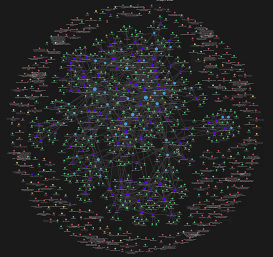

# llm-wiki

<div align="center">



**📖 [Read the docs → vietbui.mintlify.app](https://vietbui.mintlify.app/)**

[](https://vietbui.mintlify.app/)
[](https://github.com/vietbui1999ru/llm-wiki/actions/workflows/quality.yml)
[](https://github.com/vietbui1999ru/llm-wiki/commits/main)
[](https://claude.com/claude-code)

</div>

A personal knowledge base on AI and agent engineering, maintained collaboratively by a human and an LLM. The human curates sources. The LLM writes, links, and maintains wiki pages. Both sides query and build on the accumulated knowledge over time.

This is not a static documentation site. It is a **compounding knowledge system**: each source ingested enriches existing pages, surfaces contradictions, and creates new cross-links. Over time it becomes a queryable second brain on its domain.

> **New here?** Read [`ONBOARDING.md`](ONBOARDING.md) — a step-by-step guide to adopting this repo as your own *agent-first* knowledge harness. To publish the wiki as a hosted docs site (with a per-page local knowledge graph), see [`docs/publishing-mintlify.md`](docs/publishing-mintlify.md).

---

## Purpose

Most people who read about AI engineering forget 90% of it. This wiki makes forgetting structurally harder:

- Every source is summarized in a format designed for retrieval, not archiving
- Concepts are linked across sources so patterns become visible
- The LLM is the maintainer — it knows the schema, enforces cross-links, catches contradictions
- A mistakes log prevents the same errors from recurring across sessions
- A graph-aware RAG system (LightRAG) enables synthesis queries across the knowledge graph 
  + **❗❗❗ Note: this script and workflow should be used with moderation and care to not burn through your tokens and accrue costs from AI providers (My first synthesis cost me $15 for building the full graph, but now the cost is managable ~$1-2. Use sparingly and cautiously.**


**Primary domain:** AI agent engineering — orchestration, context management, harness design, multi-model coordination, memory systems, tool design.

---

## Architecture

```
llm-wiki/
│
├── raw/                  # Source documents (web-scraped markdown, notes)
├── pdfs/                 # PDF sources (research papers)
│
├── wiki/                 # LLM-maintained knowledge pages
│   ├── summaries/        # One page per ingested source
│   ├── entities/         # Named things: tools, projects, people
│   ├── concepts/         # Ideas and patterns
│   ├── comparisons/      # Side-by-side analyses
│   └── syntheses/        # Cross-source conclusions
│
├── .lightrag/            # LightRAG graph index (gitignored, rebuilt per machine)
│
├── index.md              # Catalog of all pages (auto-updated on every ingest)
├── log.md                # Append-only history of all operations
│
├── mistakes/             # Error log and prevention system
│   ├── raw-log.md        # Hook-captured raw entries
│   ├── YYYY-MM-DD-*.md   # Structured mistake entries
│   └── global-prevention-rules.md  # Distilled rules loaded every session
│
├── templates/            # Installable scripts and workflow tools
│   ├── wiki-index        # Build/update LightRAG graph index (incremental)
│   ├── wiki-chat         # Interactive graph-aware Q&A TUI (local, ollama)
│   ├── wiki-mcp          # MCP server exposing wiki_query to OpenCode/Claude Code
│   ├── AGENTS.md         # Cross-provider agent rules (copy to your projects)
│   ├── council.py        # Multi-model deliberation script
│   ├── env-model-routing.sh         # Model routing env vars
│   ├── lean-compaction-plugin.ts    # OpenCode compaction + checkpoint plugin
│   └── install-agents-md.sh        # Script to install AGENTS.md to a project
│
├── claude-setup/
│   ├── scripts/
│   │   ├── install.sh    # One-command machine setup (binaries + deps + models)
│   │   └── post-commit   # Hook: runs qmd + wiki-index after wiki commits
│   ├── skills/           # Custom skills (wiki-context, pdf-ingest, etc.)
│   ├── rules/            # CLAUDE.md rule files (@-imported)
│   └── plugins/          # Installed plugins (superpowers, caveman, qmd, etc.)
│
├── CLAUDE.md             # Claude Code operating instructions for this repo
├── GUIDE.md              # User reference: skills, MCP tools, scenario playbooks
└── README.md             # This file
```

### Data flow

```
Source (URL, PDF, note)
    │
    ▼
raw/ or pdfs/              ← human drops file here
    │
    ▼
ingest operation           ← human says "ingest <filename>"
    │
    ├─→ wiki/summaries/<source>.md
    ├─→ wiki/entities/<tool>.md
    ├─→ wiki/concepts/<pattern>.md
    ├─→ index.md + log.md
    │
    ▼
git commit
    │
    ├─→ qmd index          ← BM25 + vector (fast, synchronous)
    └─→ wiki-index         ← LightRAG graph extraction (background, incremental)
              │
              ▼
         .lightrag/        ← entity/relation graph persists on disk
              │
    ┌─────────┴──────────────────────┐
    ▼                                ▼
wiki-chat (local TUI)        wiki-mcp (MCP server)
qwen2.5:3b synthesis         Haiku or qwen2.5:3b synthesis
                                     │
                             OpenCode / Claude Code
```

---

## Prerequisites

### Required

| Tool | Purpose | Install |
|---|---|---|
| [Claude Code](https://claude.ai/code) | LLM interface — runs wiki operations | Download from claude.ai |
| [qmd](https://github.com/antiloger/qmd) | Hybrid search (BM25 + vector) — `post-commit` hook calls it | `cargo install qmd` or [binary release](https://github.com/antiloger/qmd/releases) |
| [ollama](https://ollama.com) | Local LLM inference (graph index + TUI) | Download from ollama.com |
| [uv](https://docs.astral.sh/uv/) | Python script runner (install.sh handles this) | `curl -LsSf https://astral.sh/uv/install.sh \| sh` |
| [Node.js](https://nodejs.org) | Runs `docs-site/` generator + `pre-push` hook | `nvm install --lts` or distro package |
| [zsh](https://www.zsh.org) | `post-commit` and `pre-push` hooks use `#!/bin/zsh` | `sudo apt install zsh` (or change hook shebang to `bash`) |
| Git | Version control | Standard |

> **`install.sh` does not install `qmd`, `node`, or `zsh`.** It handles `uv` and the ollama model pull, then copies the wiki binaries + git hooks. The five items above must be present before you run it.

### Optional

| Tool | Purpose |
|---|---|
| `ANTHROPIC_API_KEY` in `.env` | Claude Haiku for entity extraction (`wiki-index`) and OpenCode synthesis (`wiki-mcp`). Without it everything runs locally for free. |
| `OPENROUTER_API_KEY` in `.env` | OpenRouter as alternative extraction backend for `wiki-index` / `wiki-mcp` (stub — not yet implemented; set `ANTHROPIC_API_KEY` or leave unset for local). |
| [OpenCode](https://opencode.ai) | AFK agent orchestration; connects to `wiki-mcp` for in-session wiki queries |
| GitHub PAT | Cross-vendor council via GitHub Models API |

---

## Setup

### 1. Clone and run install.sh

```bash
git clone git@github.com:vietbui1999ru/llm-wiki.git ~/repos/llm-wiki
cd ~/repos/llm-wiki
bash claude-setup/scripts/install.sh
```

`install.sh` handles: `uv` (if missing), copies `wiki-index`/`wiki-chat`/`wiki-mcp` to `~/.local/bin`, pulls `qwen2.5:3b` and `nomic-embed-text` via ollama, installs the `post-commit` and `pre-push` git hooks. **It does not install `qmd`, `node`, or `zsh`** — see Prerequisites above.

Make sure `~/.local/bin` is on your `$PATH`:
```bash
echo 'export PATH="$HOME/.local/bin:$PATH"' >> ~/.zshrc
```

### 2. Configure the Anthropic key (optional, but decide before step 3)

```bash
cp .env.example .env
# edit .env — paste ANTHROPIC_API_KEY=sk-ant-...
# or leave unset to use qwen2.5:3b locally (free)
```

Without a key: all tools use `qwen2.5:3b` locally. Free, but lower extraction quality.

### 3. Build the graph index (one-time)

```bash
# Test the LLM backend first
wiki-index --test

# Then build (~30–60 min for ~150 pages with local qwen2.5:3b)
wiki-index --full
```

> **Cost warning:** `--full` with `ANTHROPIC_API_KEY` set costs **$10–30+** for ~150 pages. LightRAG runs 3 extraction phases per page (entity → relation → community), each with multiple LLM calls. Use `qwen2.5:3b` (unset API keys) for full rebuilds. If you want to use Haiku anyway, pass `--yes` to confirm: `wiki-index --full --yes`. Decide on step 2 first.

After the initial build, the post-commit hook keeps the index current automatically — no manual re-runs needed after ingests. The indexer prepends Obsidian wikilink structure as extraction hints, reducing LLM token cost ~40–55% per page.

### 4. Link Claude Code configuration

```bash
bash ~/repos/llm-wiki/claude-setup/scripts/install-claude-symlink.sh
```

This symlinks `~/.claude` → `~/repos/llm-wiki/claude-setup`. If `~/.claude` is an existing
real directory, it is moved to `~/.claude.bak-<timestamp>` first. Re-running the script is a
no-op. If `~/.claude` is already a symlink to a different path, the script refuses and tells
you to remove it.

### 5. Wire wiki-mcp into OpenCode (optional)

Add to `~/.config/opencode/opencode.json` under `"mcp"`:
```json
"wiki-rag": {
  "type": "local",
  "command": ["/home/<user>/.local/bin/wiki-mcp"],
  "enabled": true
}
```

With `ANTHROPIC_API_KEY` in `.env`, OpenCode queries use Claude Haiku for synthesis. Without it, qwen2.5:3b is used.

---

## Main Use Cases

### 1. Add a source to the wiki

```bash
cp ~/Downloads/article.md ~/repos/llm-wiki/raw/
```

In Claude Code:
```
ingest article.md
```

Claude asks 3–5 comprehension questions, then writes summary/entity/concept pages, updates `index.md` and `log.md`, and commits. The post-commit hook automatically runs `wiki-index` in the background — new pages are in the graph within a few minutes.

Skip the comprehension check: `"skip review"` or `"just ingest it"`.

### 2. Search the wiki (in Claude Code / OpenCode)

```
search the wiki for context degradation strategies
```

The `wiki-context` skill searches qmd (BM25 + vector) → loads relevant pages → Claude synthesizes with `[[page]]` citations.

### 3. Query the wiki interactively (terminal TUI)

```bash
wiki-chat                  # hybrid mode (default)
wiki-chat --mode local     # entity/concept-focused
wiki-chat --mode global    # cross-concept big picture
```

Graph-aware retrieval via LightRAG. Always uses qwen2.5:3b locally — no API cost.

Inside the TUI: `/mode local|global|hybrid|naive`, `/reindex`, `/status`, `q` to quit.

### 4. Ingest a PDF (research paper)

```bash
cp ~/Downloads/paper.pdf ~/repos/llm-wiki/pdfs/
```

In Claude Code: `ingest paper.pdf` → `pdf-ingest` skill (Docling parse → comprehension → wiki pages).

### 5. Ask a question and file the answer as a wiki page

```
query: what are the trade-offs between worktree isolation and container sandboxing for AI agents?
```

If the answer is non-trivial and reusable, Claude offers to file it as a new synthesis page.

### 6. Lint the wiki

```
lint the wiki
```

Scans for orphan pages, stale claims, missing concept pages, and suggests 3–5 next sources.

### 7. Run a council on a design decision

```bash
council "should we use worktrees or containers for agent isolation?"
council --chairman "what's the right memory architecture for a long-horizon agent?"
```

---

## RAG Search Tools

Three tools, different trade-offs:

| Tool | When to use | Backend | Cost |
|---|---|---|---|
| `search the wiki for X` (Claude Code) | Quick lookup, in-session | qmd BM25+vector → Claude synthesis | API (Claude) |
| `wiki-chat` | Deep exploration, standalone terminal | LightRAG graph → qwen2.5:3b | Free |
| `wiki-mcp` (OpenCode) | In-session wiki queries without Claude API | LightRAG graph → Haiku or qwen2.5:3b | Optional |

Index maintenance:

```bash
wiki-index --test          # verify LLM backend
wiki-index                 # incremental (new/changed pages only) — safe to run anytime
wiki-index --status        # show manifest stats without indexing
wiki-index --full          # wipe and rebuild — free with local LLM (no API key)
wiki-index --full --yes    # rebuild with API key (skip cost confirmation; expect $10–30+)
```

The post-commit hook runs `wiki-index` (incremental) in the background automatically after every commit touching `wiki/`. Check progress:
```bash
tail -f ~/repos/llm-wiki/.lightrag/last-index.log
```

---

## Wiki Page Schema

Every wiki page requires this frontmatter:

```yaml
---
title: "Page Title"
type: entity | concept | summary | comparison | synthesis
tags: [tag1, tag2]
sources: ["raw/filename.md"]
created: YYYY-MM-DD
updated: YYYY-MM-DD
---
```

Optional: `status: stub` for thin pages awaiting expansion.

### Page types

| Type | Location | Purpose |
|---|---|---|
| `summary` | `wiki/summaries/` | One page per ingested source |
| `entity` | `wiki/entities/` | Named things: tools, projects, people |
| `concept` | `wiki/concepts/` | Ideas, patterns, techniques |
| `comparison` | `wiki/comparisons/` | Side-by-side analysis |
| `synthesis` | `wiki/syntheses/` | Cross-source conclusions |

---

## Mistakes System

Every error is logged to prevent recurrence:

```
mistakes/
├── raw-log.md              # Hook-captured raw entries
├── YYYY-MM-DD-<topic>.md   # Structured entry per incident
└── global-prevention-rules.md  # Max 30 lines of distilled rules, loaded every session
```

`global-prevention-rules.md` is @-imported into `CLAUDE.md` and active every session. `capture-mistake` skill files new entries; `synthesize-mistakes` distills them into the global file.

---

## Adapting to Your Own Workflow

### Minimal adoption (wiki only)

1. Fork, clear `raw/`, `wiki/`, `index.md`, `log.md`
2. Keep `CLAUDE.md`, `claude-setup/`, `mistakes/global-prevention-rules.md`
3. Run `bash claude-setup/scripts/install.sh`
4. Start ingesting sources in your domain

### Change the domain

Edit `CLAUDE.md` to describe your domain. The wiki taxonomy (summaries/entities/concepts/comparisons/syntheses) is domain-agnostic.

### Add the lean workflow to an existing project

```bash
~/repos/llm-wiki/templates/install-agents-md.sh /path/to/project
```

### Use council standalone

```bash
export GITHUB_TOKEN=<your PAT with models:read>
pip install openai
council "your question here"
```

---

## Key Concepts (Quick Reference)

| Concept | Wiki page |
|---|---|
| Graph-aware RAG (LightRAG) | `syntheses/local-rag-wiki` |
| LightRAG indexing cost reduction | `concepts/wikilink-graph-extraction` |
| Lean workflow | `syntheses/lean-agentic-workflow` |
| Council pattern | `concepts/council-pattern` |
| Worktree isolation | `concepts/worktree-isolation` |
| Clear-over-compact | `concepts/context-compression` |
| Agent self-correction | `concepts/agent-self-correction` |
| Multi-vendor review | `concepts/multi-vendor-adversarial-review` |
| Worker coordination (partial results) | `concepts/worker-coordination` |
| AI + OWASP security | `concepts/owasp-security-checklist` |

---

## Authoring Rules (for the LLM)

- **Model tier auto-selection.** Before any task, classify complexity: Haiku for bounded mechanical work, Sonnet (default) for most tasks, Opus for architecture/security/irreversible decisions/cross-source synthesis. When spawning agents, always set the `model` param explicitly. If a task warrants Opus but the session runs on Sonnet, flag it before proceeding.
- **Default stance: uncertain.** All answers, analysis, and reviews are provisional unless backed by a wiki page with a cited source or context7-verified current documentation. Training data alone is not sufficient — prefix unsourced claims with `(training data — verify)`.
- **Cite sources precisely.** Self-reported README claims are not benchmarks. Write `(claimed, unverified)` for unverified numbers.
- **Verify model names.** Check against a public provider catalog before adding to routing tables.
- **Keep index.md in sync.** After updating a page's core claim, grep for all cross-references and check for drift.
- **Respect status flags.** `documented-not-adopted` patterns must be labeled and never described as "preferred."
- **One thing per page.** Split when scope creeps.
- **Never modify `raw/` or `pdfs/`.** Immutable source records.

Full rules in `mistakes/global-prevention-rules.md`.

---

## License

This repo structure and tooling is open. The wiki content itself is personal knowledge — adapt freely, attribute if you reproduce wholesale.
