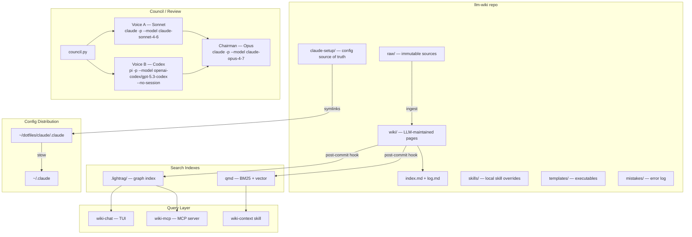
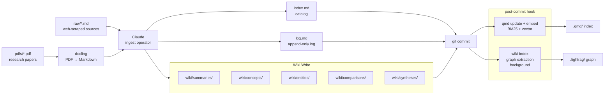
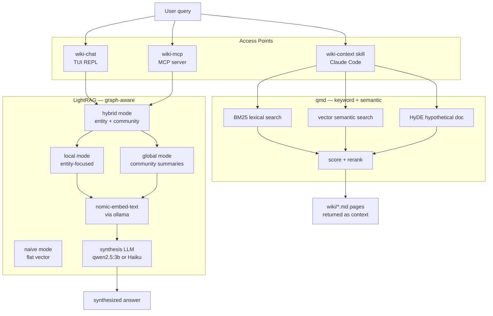
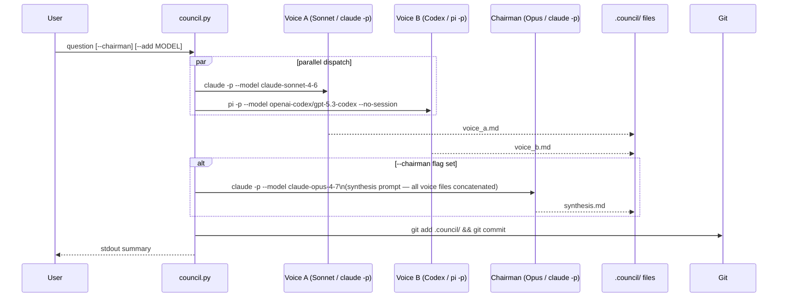
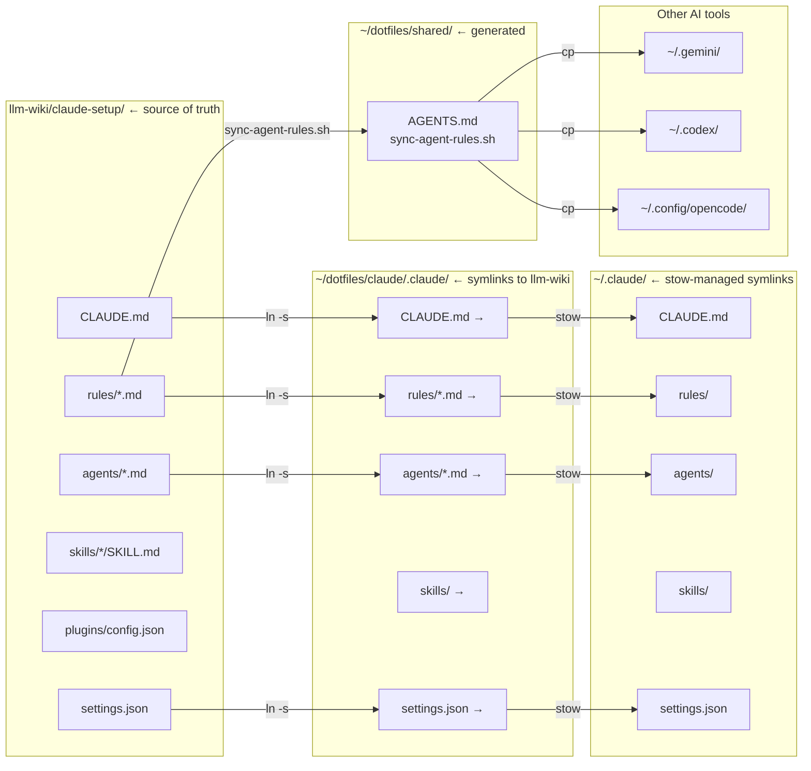
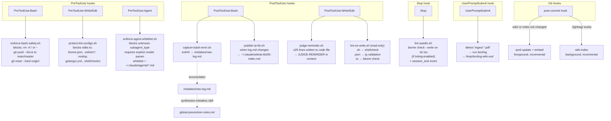
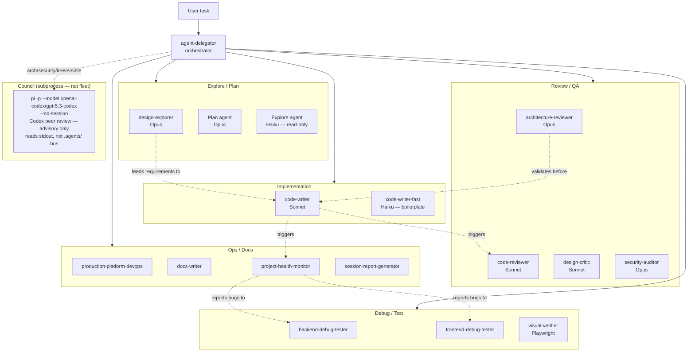
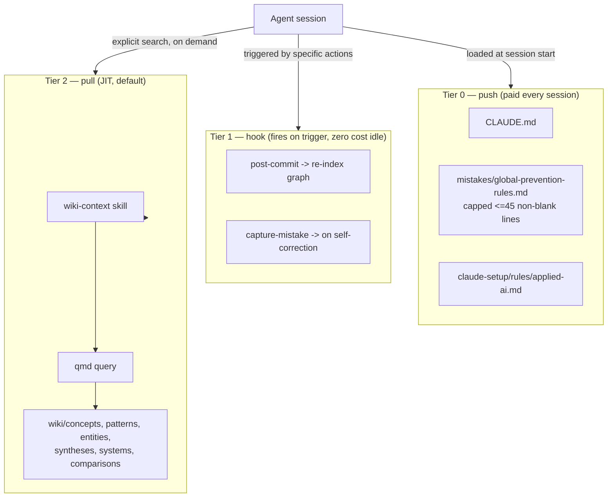

# llm-wiki Architecture

## Chart 1 — System Overview



---

## Chart 2 — Knowledge Ingestion Pipeline



---

## Chart 3 — Retrieval Stack



---

## Chart 4 — Council System



**Voice B is a Pi subprocess** — `pi -p --no-session` produces clean stdout. `opencode run` also writes response to stdout but with a 3-line ANSI header; strip it with:
```bash
opencode run "question" -m github-copilot/gpt-5.2-codex 2>/dev/null \
  | sed 's/\x1b\[[0-9;]*m//g' | grep -v "^>" | grep -v "^[[:space:]]*$"
```

**Quick council (no council.py):**
```bash
# Voice B — Pi (GPT-5.3-codex, clean stdout)
pi -p "peer review: [question]" --model openai-codex/gpt-5.3-codex --no-session --no-extensions --no-skills

# Voice C — OpenCode run (GPT-5.2-codex via Copilot, filterable stdout)
opencode run "peer review: [question]" -m github-copilot/gpt-5.2-codex 2>/dev/null \
  | sed 's/\x1b\[[0-9;]*m//g' | grep -v "^>" | grep -v "^[[:space:]]*$"
```

**Provider status (validated):**
- `openai-codex/` via Pi → ✅ clean stdout (ChatGPT Team subscription)
- `github-copilot/gpt-5.2-codex` via `opencode run` → ✅ filterable stdout (Copilot subscription)
- `github-copilot/claude-sonnet-4.5` via `opencode run` → ❌ model_not_supported (Claude via Copilot unsupported in run mode)
- `opencode/` via Pi → ⏳ add payment method at opencode.ai/workspace billing to unlock

---

## Chart 5 — Config Distribution (Source of Truth)



---

## Chart 6 — Hooks / Automation



**Hook enforcement layer** (deterministic — shell exit code, not model reasoning):
- `exit 2` = block the tool call entirely (bash safety, agent whitelist, lint protection)
- `exit 0` = allow, with optional stdout message to model context (judge reminder, lint report)
- Stop hook fires at end of every turn regardless of tool calls

---

## Chart 7 — Agent Fleet



**Pi is not in the agent fleet.** It is a thin subprocess called via Bash when a Codex second opinion is needed. It does not share the Claude Code hooks system, `.agents/` coordination bus, or skill invocation contract.

---

## Chart 8 — Tiered Knowledge Delivery (Push / Hook / Pull)

The retrieval stack in Chart 3 is the **pull** tier only. It's one third of the model that
makes this repo "agent-first": full detail in [Tiered Knowledge Delivery (Push / Hook / Pull)](/concepts/tiered-knowledge-delivery).



Promotion between tiers: **frequency × cost-of-violation**, decided 2026-06-12 by a 4-lens
agent council audit (`docs/wiki-dual-use-audit-2026-06.md`). Hard constraint: Tier 2 stays the
default — nothing large gets pushed into Tier 0 (the 32KB wiki-index-at-startup removal, which
reclaimed ~8,400 tokens/session, stands as the reference case for what NOT to push).


<iframe srcDoc="<!doctype html><html><head><meta charset=&quot;utf-8&quot;><style>
html,body{margin:0;height:100%;background:#0f1117;overflow:hidden;font-family:ui-sans-serif,system-ui,-apple-system,sans-serif}
#g{width:100%;height:100%}
#hd{position:absolute;top:0;left:0;right:30px;height:22px;display:flex;align-items:center;gap:6px;padding:0 10px;color:#aeb3c2;font-size:10px;letter-spacing:.08em;text-transform:uppercase;z-index:6;cursor:move;user-select:none;touch-action:none;background:linear-gradient(#0f1117cc,#0f111700)}
#gear{position:absolute;top:5px;right:7px;z-index:7;cursor:pointer;color:#aeb3c2;background:#1b1e27;border:1px solid #2b2f3a;border-radius:6px;width:22px;height:22px;display:flex;align-items:center;justify-content:center;font-size:12px;user-select:none}
#panel{position:absolute;top:31px;right:7px;z-index:7;background:rgba(22,25,34,.96);border:1px solid #2b2f3a;border-radius:8px;padding:6px 9px 9px;display:none;width:150px;color:#c9cdd8;font-size:10px}
#panel.open{display:block}
#panel label{display:flex;justify-content:space-between;margin:7px 0 1px;color:#9aa0b0}
#panel input[type=range]{width:100%;margin:0}
#panel .row{display:flex;align-items:center;gap:6px;margin-top:8px;color:#c9cdd8}
</style><script src=&quot;https://cdn.jsdelivr.net/npm/force-graph@1.51.4/dist/force-graph.min.js&quot; integrity=&quot;sha384-Hm6GpQcTNI5VqGgGS7lLxTGtEFcxu/kOVV0B7ozIZRu9blWVvigv5httJQZ2qZmY&quot; crossorigin=&quot;anonymous&quot;></script></head>
<body><div id=&quot;hd&quot;>Graph</div><div id=&quot;gear&quot;>⚙</div>
<div id=&quot;panel&quot;>
<label>Node size<span id=&quot;vns&quot;></span></label><input id=&quot;ns&quot; type=&quot;range&quot; min=&quot;0.6&quot; max=&quot;6&quot; step=&quot;0.2&quot;>
<label>Link width<span id=&quot;vlw&quot;></span></label><input id=&quot;lw&quot; type=&quot;range&quot; min=&quot;0&quot; max=&quot;3&quot; step=&quot;0.1&quot;>
<label>Label size<span id=&quot;vts&quot;></span></label><input id=&quot;ts&quot; type=&quot;range&quot; min=&quot;0&quot; max=&quot;8&quot; step=&quot;0.5&quot;>
<label>Label opacity<span id=&quot;vto&quot;></span></label><input id=&quot;to&quot; type=&quot;range&quot; min=&quot;0&quot; max=&quot;1&quot; step=&quot;0.05&quot;>
<div id=&quot;depthRow&quot;><label>Depth<span id=&quot;vd&quot;></span></label><input id=&quot;dp&quot; type=&quot;range&quot; min=&quot;1&quot; max=&quot;5&quot; step=&quot;1&quot;></div>
<div class=&quot;row&quot;><input id=&quot;ar&quot; type=&quot;checkbox&quot;><span>Directional arrows</span></div>
</div>
<div id=&quot;g&quot;></div>
<script>
const NODES=[{&quot;id&quot;:&quot;guides/architecture&quot;,&quot;label&quot;:&quot;llm-wiki Architecture&quot;,&quot;group&quot;:&quot;guides&quot;,&quot;val&quot;:2},{&quot;id&quot;:&quot;concepts/tiered-knowledge-delivery&quot;,&quot;label&quot;:&quot;Tiered Knowledge Delivery (Push / Hook / Pull)&quot;,&quot;group&quot;:&quot;concepts&quot;,&quot;val&quot;:3.8284271247461903},{&quot;id&quot;:&quot;concepts/context-compression&quot;,&quot;label&quot;:&quot;Context Compression Strategies&quot;,&quot;group&quot;:&quot;concepts&quot;,&quot;val&quot;:6.0990195135927845},{&quot;id&quot;:&quot;concepts/agent-self-correction&quot;,&quot;label&quot;:&quot;Agent Self-Correction&quot;,&quot;group&quot;:&quot;concepts&quot;,&quot;val&quot;:5.358898943540674},{&quot;id&quot;:&quot;concepts/nurture-first-development&quot;,&quot;label&quot;:&quot;Nurture-First Development (NFD)&quot;,&quot;group&quot;:&quot;concepts&quot;,&quot;val&quot;:4},{&quot;id&quot;:&quot;concepts/instinct-clustering&quot;,&quot;label&quot;:&quot;Instinct Clustering (Homunculus Pattern)&quot;,&quot;group&quot;:&quot;concepts&quot;,&quot;val&quot;:3.6457513110645907},{&quot;id&quot;:&quot;concepts/knowledge-crystallization-cycle&quot;,&quot;label&quot;:&quot;Knowledge Crystallization Cycle (KCC)&quot;,&quot;group&quot;:&quot;concepts&quot;,&quot;val&quot;:3.449489742783178},{&quot;id&quot;:&quot;concepts/compounding-knowledge-base&quot;,&quot;label&quot;:&quot;Compounding Knowledge Base&quot;,&quot;group&quot;:&quot;concepts&quot;,&quot;val&quot;:3.449489742783178},{&quot;id&quot;:&quot;guides/onboarding&quot;,&quot;label&quot;:&quot;Onboarding: Run llm-wiki as an Agent-First Harness&quot;,&quot;group&quot;:&quot;guides&quot;,&quot;val&quot;:3.23606797749979},{&quot;id&quot;:&quot;concepts/agent-harness&quot;,&quot;label&quot;:&quot;Agent Harness&quot;,&quot;group&quot;:&quot;concepts&quot;,&quot;val&quot;:7.48074069840786},{&quot;id&quot;:&quot;concepts/agent-skills&quot;,&quot;label&quot;:&quot;Agent Skills&quot;,&quot;group&quot;:&quot;concepts&quot;,&quot;val&quot;:5.795831523312719},{&quot;id&quot;:&quot;syntheses/lean-agentic-workflow&quot;,&quot;label&quot;:&quot;Lean Agentic Coding Workflow&quot;,&quot;group&quot;:&quot;syntheses&quot;,&quot;val&quot;:5.795831523312719},{&quot;id&quot;:&quot;entities/opencode&quot;,&quot;label&quot;:&quot;OpenCode&quot;,&quot;group&quot;:&quot;entities&quot;,&quot;val&quot;:5.358898943540674},{&quot;id&quot;:&quot;concepts/verification-pipeline&quot;,&quot;label&quot;:&quot;Verification Pipeline&quot;,&quot;group&quot;:&quot;concepts&quot;,&quot;val&quot;:5.358898943540674},{&quot;id&quot;:&quot;entities/pi-agent&quot;,&quot;label&quot;:&quot;Pi Agent (pi-mono)&quot;,&quot;group&quot;:&quot;entities&quot;,&quot;val&quot;:5.123105625617661},{&quot;id&quot;:&quot;concepts/ralph-loop&quot;,&quot;label&quot;:&quot;Ralph Loop&quot;,&quot;group&quot;:&quot;concepts&quot;,&quot;val&quot;:4.872983346207417},{&quot;id&quot;:&quot;concepts/multi-vendor-adversarial-review&quot;,&quot;label&quot;:&quot;Multi-Vendor Adversarial Review&quot;,&quot;group&quot;:&quot;concepts&quot;,&quot;val&quot;:4.872983346207417},{&quot;id&quot;:&quot;concepts/agent-subagents&quot;,&quot;label&quot;:&quot;Agent Subagents&quot;,&quot;group&quot;:&quot;concepts&quot;,&quot;val&quot;:4.741657386773941},{&quot;id&quot;:&quot;concepts/context-degradation&quot;,&quot;label&quot;:&quot;Context Degradation Patterns&quot;,&quot;group&quot;:&quot;concepts&quot;,&quot;val&quot;:4.60555127546399},{&quot;id&quot;:&quot;concepts/worktree-isolation&quot;,&quot;label&quot;:&quot;Worktree Isolation&quot;,&quot;group&quot;:&quot;concepts&quot;,&quot;val&quot;:4.60555127546399},{&quot;id&quot;:&quot;concepts/context-engineering&quot;,&quot;label&quot;:&quot;Context Engineering&quot;,&quot;group&quot;:&quot;concepts&quot;,&quot;val&quot;:4.464101615137754},{&quot;id&quot;:&quot;syntheses/agent-primitive-selection&quot;,&quot;label&quot;:&quot;Agent Primitive Selection&quot;,&quot;group&quot;:&quot;syntheses&quot;,&quot;val&quot;:4.464101615137754},{&quot;id&quot;:&quot;comparisons/spec-driven-frameworks-vs-native&quot;,&quot;label&quot;:&quot;Spec-Driven Frameworks vs Native Claude Code&quot;,&quot;group&quot;:&quot;comparisons&quot;,&quot;val&quot;:4.3166247903554},{&quot;id&quot;:&quot;concepts/contextual-retrieval&quot;,&quot;label&quot;:&quot;Contextual Retrieval&quot;,&quot;group&quot;:&quot;concepts&quot;,&quot;val&quot;:4.16227766016838},{&quot;id&quot;:&quot;concepts/agentic-memory-tool&quot;,&quot;label&quot;:&quot;Agentic Memory Tool&quot;,&quot;group&quot;:&quot;concepts&quot;,&quot;val&quot;:4},{&quot;id&quot;:&quot;concepts/memory-bank-pattern&quot;,&quot;label&quot;:&quot;Memory Bank Pattern&quot;,&quot;group&quot;:&quot;concepts&quot;,&quot;val&quot;:4},{&quot;id&quot;:&quot;concepts/rules-vs-hooks&quot;,&quot;label&quot;:&quot;Rules vs. Hooks&quot;,&quot;group&quot;:&quot;concepts&quot;,&quot;val&quot;:4},{&quot;id&quot;:&quot;comparisons/claude-code-vs-opencode-plugins&quot;,&quot;label&quot;:&quot;Claude Code vs OpenCode Plugin Systems&quot;,&quot;group&quot;:&quot;comparisons&quot;,&quot;val&quot;:3.8284271247461903},{&quot;id&quot;:&quot;concepts/branch-strategy-for-agents&quot;,&quot;label&quot;:&quot;Branch Strategy for Agents&quot;,&quot;group&quot;:&quot;concepts&quot;,&quot;val&quot;:3.8284271247461903},{&quot;id&quot;:&quot;concepts/llm-as-judge&quot;,&quot;label&quot;:&quot;LLM-as-Judge&quot;,&quot;group&quot;:&quot;concepts&quot;,&quot;val&quot;:3.8284271247461903},{&quot;id&quot;:&quot;entities/qmd&quot;,&quot;label&quot;:&quot;qmd&quot;,&quot;group&quot;:&quot;entities&quot;,&quot;val&quot;:3.6457513110645907},{&quot;id&quot;:&quot;concepts/model-tier-routing&quot;,&quot;label&quot;:&quot;Model Tier Routing&quot;,&quot;group&quot;:&quot;concepts&quot;,&quot;val&quot;:3.6457513110645907},{&quot;id&quot;:&quot;syntheses/local-rag-wiki&quot;,&quot;label&quot;:&quot;Local Wiki RAG: LightRAG Graph Stack&quot;,&quot;group&quot;:&quot;syntheses&quot;,&quot;val&quot;:3.6457513110645907},{&quot;id&quot;:&quot;entities/everything-claude-code&quot;,&quot;label&quot;:&quot;Everything Claude Code (ECC)&quot;,&quot;group&quot;:&quot;entities&quot;,&quot;val&quot;:3.449489742783178},{&quot;id&quot;:&quot;entities/mnemory&quot;,&quot;label&quot;:&quot;Mnemory&quot;,&quot;group&quot;:&quot;entities&quot;,&quot;val&quot;:3.449489742783178},{&quot;id&quot;:&quot;concepts/unit-testing&quot;,&quot;label&quot;:&quot;Unit Testing&quot;,&quot;group&quot;:&quot;concepts&quot;,&quot;val&quot;:3.449489742783178},{&quot;id&quot;:&quot;concepts/preference-feedback-loop&quot;,&quot;label&quot;:&quot;Preference Feedback Loop&quot;,&quot;group&quot;:&quot;concepts&quot;,&quot;val&quot;:3.449489742783178},{&quot;id&quot;:&quot;concepts/compound-engineering&quot;,&quot;label&quot;:&quot;Compound Engineering&quot;,&quot;group&quot;:&quot;concepts&quot;,&quot;val&quot;:3.23606797749979},{&quot;id&quot;:&quot;entities/headroom&quot;,&quot;label&quot;:&quot;Headroom&quot;,&quot;group&quot;:&quot;entities&quot;,&quot;val&quot;:3.23606797749979},{&quot;id&quot;:&quot;concepts/dynamic-context-pruning&quot;,&quot;label&quot;:&quot;Dynamic Context Pruning (DCP)&quot;,&quot;group&quot;:&quot;concepts&quot;,&quot;val&quot;:3.23606797749979},{&quot;id&quot;:&quot;concepts/context-window&quot;,&quot;label&quot;:&quot;Context Window&quot;,&quot;group&quot;:&quot;concepts&quot;,&quot;val&quot;:3.23606797749979},{&quot;id&quot;:&quot;entities/lean-session&quot;,&quot;label&quot;:&quot;lean-session plugin&quot;,&quot;group&quot;:&quot;entities&quot;,&quot;val&quot;:3.23606797749979},{&quot;id&quot;:&quot;concepts/cicd-testing&quot;,&quot;label&quot;:&quot;CI/CD Testing&quot;,&quot;group&quot;:&quot;concepts&quot;,&quot;val&quot;:3.23606797749979},{&quot;id&quot;:&quot;concepts/software-documentation&quot;,&quot;label&quot;:&quot;Software Documentation&quot;,&quot;group&quot;:&quot;concepts&quot;,&quot;val&quot;:3.23606797749979}],LINKS=[{&quot;source&quot;:&quot;concepts/agent-harness&quot;,&quot;target&quot;:&quot;concepts/ralph-loop&quot;},{&quot;source&quot;:&quot;concepts/agent-harness&quot;,&quot;target&quot;:&quot;concepts/context-degradation&quot;},{&quot;source&quot;:&quot;concepts/agent-harness&quot;,&quot;target&quot;:&quot;concepts/context-compression&quot;},{&quot;source&quot;:&quot;concepts/agent-self-correction&quot;,&quot;target&quot;:&quot;concepts/instinct-clustering&quot;},{&quot;source&quot;:&quot;concepts/agent-self-correction&quot;,&quot;target&quot;:&quot;concepts/verification-pipeline&quot;},{&quot;source&quot;:&quot;concepts/agent-self-correction&quot;,&quot;target&quot;:&quot;concepts/unit-testing&quot;},{&quot;source&quot;:&quot;concepts/agent-self-correction&quot;,&quot;target&quot;:&quot;concepts/cicd-testing&quot;},{&quot;source&quot;:&quot;concepts/agent-self-correction&quot;,&quot;target&quot;:&quot;concepts/agent-harness&quot;},{&quot;source&quot;:&quot;concepts/agent-self-correction&quot;,&quot;target&quot;:&quot;concepts/model-tier-routing&quot;},{&quot;source&quot;:&quot;concepts/agent-self-correction&quot;,&quot;target&quot;:&quot;syntheses/agent-primitive-selection&quot;},{&quot;source&quot;:&quot;concepts/agent-self-correction&quot;,&quot;target&quot;:&quot;concepts/context-compression&quot;},{&quot;source&quot;:&quot;concepts/agent-self-correction&quot;,&quot;target&quot;:&quot;syntheses/lean-agentic-workflow&quot;},{&quot;source&quot;:&quot;concepts/agent-self-correction&quot;,&quot;target&quot;:&quot;concepts/multi-vendor-adversarial-review&quot;},{&quot;source&quot;:&quot;concepts/agent-self-correction&quot;,&quot;target&quot;:&quot;concepts/branch-strategy-for-agents&quot;},{&quot;source&quot;:&quot;concepts/agent-self-correction&quot;,&quot;target&quot;:&quot;entities/opencode&quot;},{&quot;source&quot;:&quot;concepts/agent-self-correction&quot;,&quot;target&quot;:&quot;concepts/context-engineering&quot;},{&quot;source&quot;:&quot;concepts/agent-self-correction&quot;,&quot;target&quot;:&quot;concepts/llm-as-judge&quot;},{&quot;source&quot;:&quot;concepts/agent-self-correction&quot;,&quot;target&quot;:&quot;concepts/rules-vs-hooks&quot;},{&quot;source&quot;:&quot;concepts/agent-self-correction&quot;,&quot;target&quot;:&quot;concepts/preference-feedback-loop&quot;},{&quot;source&quot;:&quot;concepts/agent-skills&quot;,&quot;target&quot;:&quot;concepts/compound-engineering&quot;},{&quot;source&quot;:&quot;concepts/agent-skills&quot;,&quot;target&quot;:&quot;concepts/multi-vendor-adversarial-review&quot;},{&quot;source&quot;:&quot;concepts/agent-skills&quot;,&quot;target&quot;:&quot;concepts/model-tier-routing&quot;},{&quot;source&quot;:&quot;concepts/agent-skills&quot;,&quot;target&quot;:&quot;concepts/agent-harness&quot;},{&quot;source&quot;:&quot;concepts/agent-skills&quot;,&quot;target&quot;:&quot;concepts/agent-subagents&quot;},{&quot;source&quot;:&quot;concepts/agent-subagents&quot;,&quot;target&quot;:&quot;concepts/agent-skills&quot;},{&quot;source&quot;:&quot;concepts/agent-subagents&quot;,&quot;target&quot;:&quot;concepts/agent-harness&quot;},{&quot;source&quot;:&quot;concepts/agent-subagents&quot;,&quot;target&quot;:&quot;concepts/context-compression&quot;},{&quot;source&quot;:&quot;concepts/agent-subagents&quot;,&quot;target&quot;:&quot;concepts/context-degradation&quot;},{&quot;source&quot;:&quot;concepts/agent-subagents&quot;,&quot;target&quot;:&quot;syntheses/agent-primitive-selection&quot;},{&quot;source&quot;:&quot;concepts/agentic-memory-tool&quot;,&quot;target&quot;:&quot;entities/mnemory&quot;},{&quot;source&quot;:&quot;concepts/agentic-memory-tool&quot;,&quot;target&quot;:&quot;concepts/context-engineering&quot;},{&quot;source&quot;:&quot;concepts/agentic-memory-tool&quot;,&quot;target&quot;:&quot;concepts/context-window&quot;},{&quot;source&quot;:&quot;concepts/agentic-memory-tool&quot;,&quot;target&quot;:&quot;concepts/context-compression&quot;},{&quot;source&quot;:&quot;concepts/branch-strategy-for-agents&quot;,&quot;target&quot;:&quot;concepts/agent-harness&quot;},{&quot;source&quot;:&quot;concepts/branch-strategy-for-agents&quot;,&quot;target&quot;:&quot;concepts/ralph-loop&quot;},{&quot;source&quot;:&quot;concepts/branch-strategy-for-agents&quot;,&quot;target&quot;:&quot;concepts/verification-pipeline&quot;},{&quot;source&quot;:&quot;concepts/cicd-testing&quot;,&quot;target&quot;:&quot;concepts/verification-pipeline&quot;},{&quot;source&quot;:&quot;concepts/cicd-testing&quot;,&quot;target&quot;:&quot;concepts/unit-testing&quot;},{&quot;source&quot;:&quot;concepts/compound-engineering&quot;,&quot;target&quot;:&quot;concepts/compounding-knowledge-base&quot;},{&quot;source&quot;:&quot;concepts/compound-engineering&quot;,&quot;target&quot;:&quot;concepts/agent-harness&quot;},{&quot;source&quot;:&quot;concepts/compound-engineering&quot;,&quot;target&quot;:&quot;concepts/verification-pipeline&quot;},{&quot;source&quot;:&quot;concepts/compounding-knowledge-base&quot;,&quot;target&quot;:&quot;concepts/compound-engineering&quot;},{&quot;source&quot;:&quot;concepts/compounding-knowledge-base&quot;,&quot;target&quot;:&quot;concepts/contextual-retrieval&quot;},{&quot;source&quot;:&quot;concepts/compounding-knowledge-base&quot;,&quot;target&quot;:&quot;entities/qmd&quot;},{&quot;source&quot;:&quot;concepts/context-compression&quot;,&quot;target&quot;:&quot;entities/headroom&quot;},{&quot;source&quot;:&quot;concepts/context-compression&quot;,&quot;target&quot;:&quot;comparisons/claude-code-vs-opencode-plugins&quot;},{&quot;source&quot;:&quot;concepts/context-compression&quot;,&quot;target&quot;:&quot;entities/everything-claude-code&quot;},{&quot;source&quot;:&quot;concepts/context-compression&quot;,&quot;target&quot;:&quot;concepts/context-degradation&quot;},{&quot;source&quot;:&quot;concepts/context-compression&quot;,&quot;target&quot;:&quot;concepts/agent-harness&quot;},{&quot;source&quot;:&quot;concepts/context-compression&quot;,&quot;target&quot;:&quot;concepts/ralph-loop&quot;},{&quot;source&quot;:&quot;concepts/context-compression&quot;,&quot;target&quot;:&quot;concepts/dynamic-context-pruning&quot;},{&quot;source&quot;:&quot;concepts/context-degradation&quot;,&quot;target&quot;:&quot;concepts/context-compression&quot;},{&quot;source&quot;:&quot;concepts/context-degradation&quot;,&quot;target&quot;:&quot;concepts/agent-harness&quot;},{&quot;source&quot;:&quot;concepts/context-degradation&quot;,&quot;target&quot;:&quot;concepts/ralph-loop&quot;},{&quot;source&quot;:&quot;concepts/context-engineering&quot;,&quot;target&quot;:&quot;concepts/agent-subagents&quot;},{&quot;source&quot;:&quot;concepts/context-engineering&quot;,&quot;target&quot;:&quot;concepts/agentic-memory-tool&quot;},{&quot;source&quot;:&quot;concepts/context-engineering&quot;,&quot;target&quot;:&quot;concepts/agent-harness&quot;},{&quot;source&quot;:&quot;concepts/context-engineering&quot;,&quot;target&quot;:&quot;concepts/context-window&quot;},{&quot;source&quot;:&quot;concepts/context-engineering&quot;,&quot;target&quot;:&quot;concepts/context-degradation&quot;},{&quot;source&quot;:&quot;concepts/context-engineering&quot;,&quot;target&quot;:&quot;concepts/context-compression&quot;},{&quot;source&quot;:&quot;concepts/context-window&quot;,&quot;target&quot;:&quot;concepts/context-engineering&quot;},{&quot;source&quot;:&quot;concepts/context-window&quot;,&quot;target&quot;:&quot;concepts/context-degradation&quot;},{&quot;source&quot;:&quot;concepts/context-window&quot;,&quot;target&quot;:&quot;concepts/context-compression&quot;},{&quot;source&quot;:&quot;concepts/context-window&quot;,&quot;target&quot;:&quot;concepts/agentic-memory-tool&quot;},{&quot;source&quot;:&quot;concepts/context-window&quot;,&quot;target&quot;:&quot;entities/everything-claude-code&quot;},{&quot;source&quot;:&quot;concepts/contextual-retrieval&quot;,&quot;target&quot;:&quot;concepts/compounding-knowledge-base&quot;},{&quot;source&quot;:&quot;concepts/contextual-retrieval&quot;,&quot;target&quot;:&quot;entities/qmd&quot;},{&quot;source&quot;:&quot;concepts/dynamic-context-pruning&quot;,&quot;target&quot;:&quot;entities/opencode&quot;},{&quot;source&quot;:&quot;concepts/dynamic-context-pruning&quot;,&quot;target&quot;:&quot;concepts/context-compression&quot;},{&quot;source&quot;:&quot;concepts/dynamic-context-pruning&quot;,&quot;target&quot;:&quot;concepts/context-degradation&quot;},{&quot;source&quot;:&quot;concepts/dynamic-context-pruning&quot;,&quot;target&quot;:&quot;comparisons/claude-code-vs-opencode-plugins&quot;},{&quot;source&quot;:&quot;concepts/instinct-clustering&quot;,&quot;target&quot;:&quot;concepts/agentic-memory-tool&quot;},{&quot;source&quot;:&quot;concepts/instinct-clustering&quot;,&quot;target&quot;:&quot;concepts/agent-self-correction&quot;},{&quot;source&quot;:&quot;concepts/instinct-clustering&quot;,&quot;target&quot;:&quot;entities/mnemory&quot;},{&quot;source&quot;:&quot;concepts/instinct-clustering&quot;,&quot;target&quot;:&quot;entities/everything-claude-code&quot;},{&quot;source&quot;:&quot;concepts/instinct-clustering&quot;,&quot;target&quot;:&quot;entities/opencode&quot;},{&quot;source&quot;:&quot;concepts/instinct-clustering&quot;,&quot;target&quot;:&quot;concepts/context-compression&quot;},{&quot;source&quot;:&quot;concepts/knowledge-crystallization-cycle&quot;,&quot;target&quot;:&quot;concepts/nurture-first-development&quot;},{&quot;source&quot;:&quot;concepts/knowledge-crystallization-cycle&quot;,&quot;target&quot;:&quot;concepts/compounding-knowledge-base&quot;},{&quot;source&quot;:&quot;concepts/knowledge-crystallization-cycle&quot;,&quot;target&quot;:&quot;concepts/agent-self-correction&quot;},{&quot;source&quot;:&quot;concepts/knowledge-crystallization-cycle&quot;,&quot;target&quot;:&quot;concepts/agent-skills&quot;},{&quot;source&quot;:&quot;concepts/knowledge-crystallization-cycle&quot;,&quot;target&quot;:&quot;concepts/agentic-memory-tool&quot;},{&quot;source&quot;:&quot;concepts/llm-as-judge&quot;,&quot;target&quot;:&quot;concepts/multi-vendor-adversarial-review&quot;},{&quot;source&quot;:&quot;concepts/llm-as-judge&quot;,&quot;target&quot;:&quot;concepts/verification-pipeline&quot;},{&quot;source&quot;:&quot;concepts/memory-bank-pattern&quot;,&quot;target&quot;:&quot;concepts/agentic-memory-tool&quot;},{&quot;source&quot;:&quot;concepts/memory-bank-pattern&quot;,&quot;target&quot;:&quot;entities/mnemory&quot;},{&quot;source&quot;:&quot;concepts/memory-bank-pattern&quot;,&quot;target&quot;:&quot;concepts/rules-vs-hooks&quot;},{&quot;source&quot;:&quot;concepts/memory-bank-pattern&quot;,&quot;target&quot;:&quot;concepts/context-compression&quot;},{&quot;source&quot;:&quot;concepts/model-tier-routing&quot;,&quot;target&quot;:&quot;syntheses/agent-primitive-selection&quot;},{&quot;source&quot;:&quot;concepts/model-tier-routing&quot;,&quot;target&quot;:&quot;concepts/agent-subagents&quot;},{&quot;source&quot;:&quot;concepts/model-tier-routing&quot;,&quot;target&quot;:&quot;concepts/agent-self-correction&quot;},{&quot;source&quot;:&quot;concepts/multi-vendor-adversarial-review&quot;,&quot;target&quot;:&quot;entities/pi-agent&quot;},{&quot;source&quot;:&quot;concepts/multi-vendor-adversarial-review&quot;,&quot;target&quot;:&quot;concepts/llm-as-judge&quot;},{&quot;source&quot;:&quot;concepts/multi-vendor-adversarial-review&quot;,&quot;target&quot;:&quot;concepts/verification-pipeline&quot;},{&quot;source&quot;:&quot;concepts/multi-vendor-adversarial-review&quot;,&quot;target&quot;:&quot;syntheses/agent-primitive-selection&quot;},{&quot;source&quot;:&quot;concepts/nurture-first-development&quot;,&quot;target&quot;:&quot;concepts/agent-skills&quot;},{&quot;source&quot;:&quot;concepts/nurture-first-development&quot;,&quot;target&quot;:&quot;concepts/memory-bank-pattern&quot;},{&quot;source&quot;:&quot;concepts/nurture-first-development&quot;,&quot;target&quot;:&quot;concepts/agentic-memory-tool&quot;},{&quot;source&quot;:&quot;concepts/nurture-first-development&quot;,&quot;target&quot;:&quot;concepts/preference-feedback-loop&quot;},{&quot;source&quot;:&quot;concepts/nurture-first-development&quot;,&quot;target&quot;:&quot;concepts/compounding-knowledge-base&quot;},{&quot;source&quot;:&quot;concepts/nurture-first-development&quot;,&quot;target&quot;:&quot;concepts/context-compression&quot;},{&quot;source&quot;:&quot;concepts/preference-feedback-loop&quot;,&quot;target&quot;:&quot;concepts/llm-as-judge&quot;},{&quot;source&quot;:&quot;concepts/preference-feedback-loop&quot;,&quot;target&quot;:&quot;concepts/multi-vendor-adversarial-review&quot;},{&quot;source&quot;:&quot;concepts/preference-feedback-loop&quot;,&quot;target&quot;:&quot;concepts/agent-self-correction&quot;},{&quot;source&quot;:&quot;concepts/ralph-loop&quot;,&quot;target&quot;:&quot;concepts/agent-harness&quot;},{&quot;source&quot;:&quot;concepts/rules-vs-hooks&quot;,&quot;target&quot;:&quot;concepts/memory-bank-pattern&quot;},{&quot;source&quot;:&quot;concepts/rules-vs-hooks&quot;,&quot;target&quot;:&quot;concepts/agent-self-correction&quot;},{&quot;source&quot;:&quot;concepts/rules-vs-hooks&quot;,&quot;target&quot;:&quot;entities/opencode&quot;},{&quot;source&quot;:&quot;concepts/software-documentation&quot;,&quot;target&quot;:&quot;concepts/contextual-retrieval&quot;},{&quot;source&quot;:&quot;concepts/tiered-knowledge-delivery&quot;,&quot;target&quot;:&quot;concepts/knowledge-crystallization-cycle&quot;},{&quot;source&quot;:&quot;concepts/tiered-knowledge-delivery&quot;,&quot;target&quot;:&quot;concepts/compounding-knowledge-base&quot;},{&quot;source&quot;:&quot;concepts/tiered-knowledge-delivery&quot;,&quot;target&quot;:&quot;concepts/context-compression&quot;},{&quot;source&quot;:&quot;concepts/tiered-knowledge-delivery&quot;,&quot;target&quot;:&quot;concepts/agent-self-correction&quot;},{&quot;source&quot;:&quot;concepts/tiered-knowledge-delivery&quot;,&quot;target&quot;:&quot;concepts/instinct-clustering&quot;},{&quot;source&quot;:&quot;concepts/tiered-knowledge-delivery&quot;,&quot;target&quot;:&quot;concepts/nurture-first-development&quot;},{&quot;source&quot;:&quot;concepts/unit-testing&quot;,&quot;target&quot;:&quot;concepts/cicd-testing&quot;},{&quot;source&quot;:&quot;concepts/unit-testing&quot;,&quot;target&quot;:&quot;concepts/verification-pipeline&quot;},{&quot;source&quot;:&quot;concepts/verification-pipeline&quot;,&quot;target&quot;:&quot;concepts/agent-harness&quot;},{&quot;source&quot;:&quot;concepts/verification-pipeline&quot;,&quot;target&quot;:&quot;concepts/ralph-loop&quot;},{&quot;source&quot;:&quot;concepts/verification-pipeline&quot;,&quot;target&quot;:&quot;concepts/cicd-testing&quot;},{&quot;source&quot;:&quot;concepts/verification-pipeline&quot;,&quot;target&quot;:&quot;concepts/unit-testing&quot;},{&quot;source&quot;:&quot;concepts/worktree-isolation&quot;,&quot;target&quot;:&quot;concepts/context-compression&quot;},{&quot;source&quot;:&quot;concepts/worktree-isolation&quot;,&quot;target&quot;:&quot;concepts/branch-strategy-for-agents&quot;},{&quot;source&quot;:&quot;concepts/worktree-isolation&quot;,&quot;target&quot;:&quot;concepts/agent-subagents&quot;},{&quot;source&quot;:&quot;syntheses/agent-primitive-selection&quot;,&quot;target&quot;:&quot;concepts/agent-skills&quot;},{&quot;source&quot;:&quot;syntheses/agent-primitive-selection&quot;,&quot;target&quot;:&quot;concepts/agent-subagents&quot;},{&quot;source&quot;:&quot;syntheses/agent-primitive-selection&quot;,&quot;target&quot;:&quot;concepts/multi-vendor-adversarial-review&quot;},{&quot;source&quot;:&quot;syntheses/agent-primitive-selection&quot;,&quot;target&quot;:&quot;concepts/agent-harness&quot;},{&quot;source&quot;:&quot;syntheses/agent-primitive-selection&quot;,&quot;target&quot;:&quot;concepts/verification-pipeline&quot;},{&quot;source&quot;:&quot;syntheses/lean-agentic-workflow&quot;,&quot;target&quot;:&quot;concepts/verification-pipeline&quot;},{&quot;source&quot;:&quot;syntheses/lean-agentic-workflow&quot;,&quot;target&quot;:&quot;concepts/agent-skills&quot;},{&quot;source&quot;:&quot;syntheses/lean-agentic-workflow&quot;,&quot;target&quot;:&quot;comparisons/spec-driven-frameworks-vs-native&quot;},{&quot;source&quot;:&quot;syntheses/lean-agentic-workflow&quot;,&quot;target&quot;:&quot;concepts/worktree-isolation&quot;},{&quot;source&quot;:&quot;syntheses/lean-agentic-workflow&quot;,&quot;target&quot;:&quot;concepts/multi-vendor-adversarial-review&quot;},{&quot;source&quot;:&quot;syntheses/lean-agentic-workflow&quot;,&quot;target&quot;:&quot;entities/lean-session&quot;},{&quot;source&quot;:&quot;syntheses/lean-agentic-workflow&quot;,&quot;target&quot;:&quot;entities/opencode&quot;},{&quot;source&quot;:&quot;syntheses/lean-agentic-workflow&quot;,&quot;target&quot;:&quot;concepts/context-compression&quot;},{&quot;source&quot;:&quot;syntheses/lean-agentic-workflow&quot;,&quot;target&quot;:&quot;concepts/agent-self-correction&quot;},{&quot;source&quot;:&quot;syntheses/lean-agentic-workflow&quot;,&quot;target&quot;:&quot;concepts/rules-vs-hooks&quot;},{&quot;source&quot;:&quot;syntheses/lean-agentic-workflow&quot;,&quot;target&quot;:&quot;concepts/memory-bank-pattern&quot;},{&quot;source&quot;:&quot;syntheses/lean-agentic-workflow&quot;,&quot;target&quot;:&quot;syntheses/agent-primitive-selection&quot;},{&quot;source&quot;:&quot;syntheses/local-rag-wiki&quot;,&quot;target&quot;:&quot;concepts/contextual-retrieval&quot;},{&quot;source&quot;:&quot;syntheses/local-rag-wiki&quot;,&quot;target&quot;:&quot;entities/qmd&quot;},{&quot;source&quot;:&quot;comparisons/claude-code-vs-opencode-plugins&quot;,&quot;target&quot;:&quot;concepts/context-compression&quot;},{&quot;source&quot;:&quot;comparisons/claude-code-vs-opencode-plugins&quot;,&quot;target&quot;:&quot;entities/opencode&quot;},{&quot;source&quot;:&quot;comparisons/claude-code-vs-opencode-plugins&quot;,&quot;target&quot;:&quot;concepts/agent-harness&quot;},{&quot;source&quot;:&quot;comparisons/spec-driven-frameworks-vs-native&quot;,&quot;target&quot;:&quot;concepts/agent-harness&quot;},{&quot;source&quot;:&quot;comparisons/spec-driven-frameworks-vs-native&quot;,&quot;target&quot;:&quot;concepts/context-compression&quot;},{&quot;source&quot;:&quot;comparisons/spec-driven-frameworks-vs-native&quot;,&quot;target&quot;:&quot;concepts/memory-bank-pattern&quot;},{&quot;source&quot;:&quot;comparisons/spec-driven-frameworks-vs-native&quot;,&quot;target&quot;:&quot;concepts/rules-vs-hooks&quot;},{&quot;source&quot;:&quot;comparisons/spec-driven-frameworks-vs-native&quot;,&quot;target&quot;:&quot;concepts/multi-vendor-adversarial-review&quot;},{&quot;source&quot;:&quot;comparisons/spec-driven-frameworks-vs-native&quot;,&quot;target&quot;:&quot;concepts/branch-strategy-for-agents&quot;},{&quot;source&quot;:&quot;entities/everything-claude-code&quot;,&quot;target&quot;:&quot;concepts/instinct-clustering&quot;},{&quot;source&quot;:&quot;entities/everything-claude-code&quot;,&quot;target&quot;:&quot;concepts/agent-harness&quot;},{&quot;source&quot;:&quot;entities/everything-claude-code&quot;,&quot;target&quot;:&quot;concepts/context-compression&quot;},{&quot;source&quot;:&quot;entities/headroom&quot;,&quot;target&quot;:&quot;concepts/context-compression&quot;},{&quot;source&quot;:&quot;entities/headroom&quot;,&quot;target&quot;:&quot;concepts/preference-feedback-loop&quot;},{&quot;source&quot;:&quot;entities/headroom&quot;,&quot;target&quot;:&quot;concepts/agent-harness&quot;},{&quot;source&quot;:&quot;entities/lean-session&quot;,&quot;target&quot;:&quot;concepts/context-compression&quot;},{&quot;source&quot;:&quot;entities/lean-session&quot;,&quot;target&quot;:&quot;syntheses/lean-agentic-workflow&quot;},{&quot;source&quot;:&quot;entities/lean-session&quot;,&quot;target&quot;:&quot;entities/opencode&quot;},{&quot;source&quot;:&quot;entities/lean-session&quot;,&quot;target&quot;:&quot;concepts/ralph-loop&quot;},{&quot;source&quot;:&quot;entities/mnemory&quot;,&quot;target&quot;:&quot;concepts/context-compression&quot;},{&quot;source&quot;:&quot;entities/mnemory&quot;,&quot;target&quot;:&quot;concepts/agentic-memory-tool&quot;},{&quot;source&quot;:&quot;entities/mnemory&quot;,&quot;target&quot;:&quot;concepts/context-engineering&quot;},{&quot;source&quot;:&quot;entities/opencode&quot;,&quot;target&quot;:&quot;comparisons/claude-code-vs-opencode-plugins&quot;},{&quot;source&quot;:&quot;entities/opencode&quot;,&quot;target&quot;:&quot;concepts/instinct-clustering&quot;},{&quot;source&quot;:&quot;entities/opencode&quot;,&quot;target&quot;:&quot;concepts/context-compression&quot;},{&quot;source&quot;:&quot;entities/opencode&quot;,&quot;target&quot;:&quot;concepts/agent-harness&quot;},{&quot;source&quot;:&quot;entities/pi-agent&quot;,&quot;target&quot;:&quot;concepts/model-tier-routing&quot;},{&quot;source&quot;:&quot;entities/pi-agent&quot;,&quot;target&quot;:&quot;concepts/multi-vendor-adversarial-review&quot;},{&quot;source&quot;:&quot;entities/pi-agent&quot;,&quot;target&quot;:&quot;comparisons/claude-code-vs-opencode-plugins&quot;},{&quot;source&quot;:&quot;entities/pi-agent&quot;,&quot;target&quot;:&quot;entities/opencode&quot;},{&quot;source&quot;:&quot;entities/pi-agent&quot;,&quot;target&quot;:&quot;concepts/agent-self-correction&quot;},{&quot;source&quot;:&quot;guides/onboarding&quot;,&quot;target&quot;:&quot;concepts/software-documentation&quot;},{&quot;source&quot;:&quot;guides/onboarding&quot;,&quot;target&quot;:&quot;concepts/agent-skills&quot;},{&quot;source&quot;:&quot;guides/onboarding&quot;,&quot;target&quot;:&quot;syntheses/local-rag-wiki&quot;},{&quot;source&quot;:&quot;guides/onboarding&quot;,&quot;target&quot;:&quot;concepts/tiered-knowledge-delivery&quot;},{&quot;source&quot;:&quot;guides/onboarding&quot;,&quot;target&quot;:&quot;concepts/model-tier-routing&quot;},{&quot;source&quot;:&quot;guides/architecture&quot;,&quot;target&quot;:&quot;concepts/tiered-knowledge-delivery&quot;}],CUR=&quot;guides/architecture&quot;,MAXD=3;
const C={concepts:'#8B7CF6',patterns:'#0D9373',systems:'#E0567C',syntheses:'#E2A03F',comparisons:'#3B82F6',entities:'#14B8A6',guides:'#9CA3AF'};
function lid(x){return (x&amp;&amp;x.id!==undefined)?x.id:x;}
const ADJ=new Map(NODES.map(function(n){return [n.id,new Set()];}));
LINKS.forEach(function(l){var s=lid(l.source),t=lid(l.target);if(ADJ.has(s)&amp;&amp;ADJ.has(t)){ADJ.get(s).add(t);ADJ.get(t).add(s);}});
var opt={ns:1.8,lw:0.6,ts:3.5,to:0.75,dp:2,ar:false};
function visible(){
 if(!CUR)return {nodes:NODES,links:LINKS};
 var dist=new Map([[CUR,0]]),fr=[CUR];
 for(var d=1;d<=opt.dp;d++){var nx=[];fr.forEach(function(u){(ADJ.get(u)||[]).forEach(function(v){if(!dist.has(v)){dist.set(v,d);nx.push(v);}});});fr=nx;}
 var keep=new Set(dist.keys());
 return {nodes:NODES.filter(function(n){return keep.has(n.id);}),links:LINKS.filter(function(l){return keep.has(lid(l.source))&amp;&amp;keep.has(lid(l.target));})};
}
var el=document.getElementById('g');
var G=ForceGraph()(el).backgroundColor('#0f1117').nodeId('id')
 .warmupTicks(24).cooldownTicks(70).autoPauseRedraw(true)
 .nodeColor(function(n){return C[n.group]||'#9CA3AF';}).nodeLabel('label').nodeVal(function(n){return n.val;})
 .linkColor(function(){return 'rgba(255,255,255,0.12)';})
 .nodeRelSize(opt.ns).linkWidth(opt.lw)
 .linkDirectionalArrowLength(0).linkDirectionalArrowRelPos(1).linkDirectionalArrowColor(function(){return 'rgba(255,255,255,0.4)';})
 .nodeCanvasObjectMode(function(){return 'after';})
 .nodeCanvasObject(function(n,ctx,scale){var r=opt.ns*Math.sqrt(n.val||1);
  if(n.id===CUR){ctx.beginPath();ctx.arc(n.x,n.y,r+1.6,0,6.283);ctx.strokeStyle='#fff';ctx.lineWidth=1.2/scale;ctx.stroke();}
  if(opt.to>0&amp;&amp;opt.ts>0){var t=n.label.length>28?n.label.slice(0,26)+'…':n.label;ctx.globalAlpha=opt.to;ctx.font=((n.id===CUR?opt.ts+1:opt.ts))+'px ui-sans-serif,sans-serif';ctx.fillStyle=(n.id===CUR)?'#ffffff':'#aab0c0';ctx.textAlign='center';ctx.textBaseline='top';ctx.fillText(t,n.x,n.y+r+1.5);ctx.globalAlpha=1;}})
 .onNodeClick(function(n){if(window.top){window.top.location.href='/'+n.id;}});
G.graphData(visible());G.d3VelocityDecay(0.4);
function fit(){G.zoomToFit(400,20);}
setTimeout(fit,350);setTimeout(fit,1100);
// Stop the render/sim loop while idle so the fixed widget never repaints during
// parent-page scroll; resume only while the pointer is over the widget.
var pt;function pause(){G.pauseAnimation();}function resume(){G.resumeAnimation();}
function idle(ms){clearTimeout(pt);pt=setTimeout(pause,ms);}
document.body.addEventListener('pointerenter',function(){clearTimeout(pt);resume();});
document.body.addEventListener('pointerleave',function(){idle(250);});
addEventListener('resize',function(){resume();G.zoomToFit(0,20);idle(700);});
idle(2000);
function apply(re){resume();G.nodeRelSize(opt.ns).linkWidth(opt.lw).linkDirectionalArrowLength(opt.ar?2.6:0);if(re){G.graphData(visible());setTimeout(fit,450);}idle(re?2200:1400);}
function bind(id,key,fmt,re){var e=document.getElementById(id),o=document.getElementById('v'+id);e.value=opt[key];if(o)o.textContent=fmt(opt[key]);e.addEventListener('input',function(){opt[key]=parseFloat(e.value);if(o)o.textContent=fmt(opt[key]);apply(re);});}
bind('ns','ns',function(v){return v.toFixed(1);},false);
bind('lw','lw',function(v){return v.toFixed(1);},false);
bind('ts','ts',function(v){return v.toFixed(1);},false);
bind('to','to',function(v){return v.toFixed(2);},false);
var dE=document.getElementById('dp'),dO=document.getElementById('vd');dE.max=MAXD;dE.value=opt.dp;dO.textContent=opt.dp;dE.addEventListener('input',function(){opt.dp=parseInt(dE.value,10);dO.textContent=opt.dp;apply(true);});
if(!CUR)document.getElementById('depthRow').style.display='none';
var aE=document.getElementById('ar');aE.checked=opt.ar;aE.addEventListener('change',function(){opt.ar=aE.checked;apply(false);});
document.getElementById('gear').addEventListener('click',function(){document.getElementById('panel').classList.toggle('open');});
var hd=document.getElementById('hd');hd.textContent='⠿  '+(CUR?'Local graph':'Knowledge graph');
// free-form placement: drag by the header. Default is bottom-right (inline style);
// a moved position is saved per parent-origin and restored on every page.
function clampPos(fe,l,t){var TW=(window.top||window),r=fe.getBoundingClientRect();return [Math.min(Math.max(0,l),Math.max(0,TW.innerWidth-r.width)),Math.min(Math.max(0,t),Math.max(0,TW.innerHeight-r.height))];}
function place(fe,l,t){var p=clampPos(fe,l,t);fe.style.left=p[0]+'px';fe.style.top=p[1]+'px';fe.style.right='auto';fe.style.bottom='auto';}
try{var sp=JSON.parse(localStorage.getItem('llmwiki_graph_pos'));if(sp&amp;&amp;window.frameElement)place(window.frameElement,sp.l,sp.t);}catch(e){if(window.console)console.debug('graph: saved position unavailable',e);}
hd.addEventListener('pointerdown',function(e){var fe=window.frameElement;if(!fe)return;var rect=fe.getBoundingClientRect();var sx=e.screenX,sy=e.screenY,L=rect.left,T=rect.top;place(fe,L,T);hd.setPointerCapture(e.pointerId);
 function mv(ev){place(fe,L+ev.screenX-sx,T+ev.screenY-sy);}
 function up(){if(hd.hasPointerCapture(e.pointerId))hd.releasePointerCapture(e.pointerId);hd.removeEventListener('pointermove',mv);hd.removeEventListener('pointerup',up);try{localStorage.setItem('llmwiki_graph_pos',JSON.stringify({l:parseFloat(fe.style.left),t:parseFloat(fe.style.top)}));}catch(e2){if(window.console)console.debug('graph: could not persist position',e2);}}
 hd.addEventListener('pointermove',mv);hd.addEventListener('pointerup',up);e.preventDefault();});
</script></body></html>" title="Knowledge graph" loading="lazy" style={{position:"fixed",right:"18px",bottom:"18px",width:"320px",height:"340px",border:0,borderRadius:"14px",boxShadow:"0 6px 28px rgba(0,0,0,0.38)",zIndex:50,background:"#0f1117"}} />
