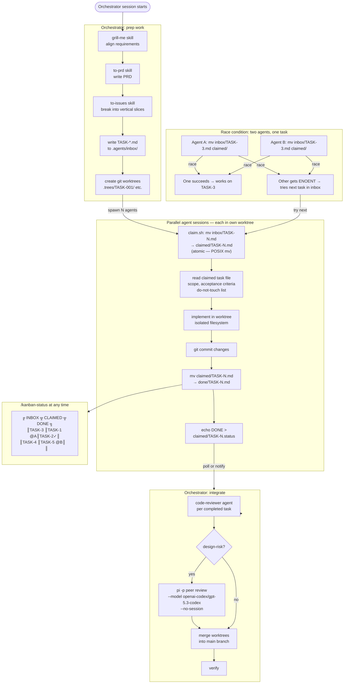
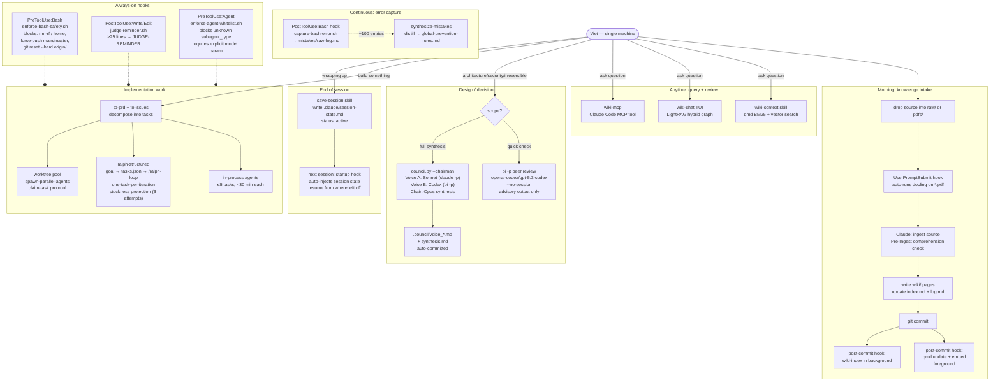

# Workflows

## Chart 1 — Claim Task Flow (Local Worktree Pool)

---

## Chart 2 — Single Machine Day-to-Day Workflow

**Council trigger conditions** (use DESIGN path, not IMPL):
- New service, inter-system protocol, or data model design
- Auth, permissions, secrets, trust boundary changes
- Schema migrations or destructive git ops
- Use quick `pi -p` for a single advisory check; full `council.py` when synthesis across voices is needed

---

## Chart 3 — Multi-Machine Future Architecture (Planned)

```mermaid
flowchart TD
    subgraph M1["Machine A — primary (design + orchestration)"]
        VIET_A[Viet / orchestrator session]
        GRILL_A["grill-me + to-prd"]
        ISSUE_CREATE["gh issue create<br>--label ready-for-agent<br>(handoff body format)"]
        COUNCIL_A["council.py<br>design decisions"]
        SESSION_A["save-session<br>→ .claude/session-state.md"]
    end

    subgraph GH["GitHub — shared coordination layer"]
        ISSUES_DB["GitHub Issues<br>task queue + handoff artifacts"]
        LABEL_GATE{"label?<br>ready-for-agent"}
        ACTIONS["GH Actions<br>self-hosted runner dispatch"]
        COMMENTS["issue comments<br>return-handoff per hop"]
    end

    subgraph M2["Machine B — worker (AFK implementation)"]
        RUNNER["self-hosted runner<br>claude CLI + gh CLI"]
        CLAIM_GH["gh issue list<br>--label ready-for-agent<br>claim by re-labeling"]
        IMPL_B[implement in worktree]
        PUSH_B["push branch<br>comment result on issue"]
    end

    subgraph M3["Machine C — worker (parallel)"]
        RUNNER_C[self-hosted runner]
        CLAIM_C[claim different issue]
        IMPL_C[implement]
        PUSH_C[push + comment]
    end

    subgraph MERGE_FLOW["Back on Machine A — integrate"]
        PR_REVIEW["review PRs<br>code-reviewer agent"]
        HUMAN_GATE{"human merge<br>approval"}
        SHIP[merge to main]
        WIKI_UPDATE["ingest learnings<br>back to wiki"]
    end

    VIET_A --> GRILL_A --> ISSUE_CREATE --> ISSUES_DB
    VIET_A --> COUNCIL_A
    VIET_A --> SESSION_A

    ISSUES_DB --> LABEL_GATE
    LABEL_GATE -->|auto-dispatch| ACTIONS --> RUNNER
    LABEL_GATE -->|manual| RUNNER_C

    RUNNER --> CLAIM_GH --> IMPL_B --> PUSH_B --> COMMENTS
    RUNNER_C --> CLAIM_C --> IMPL_C --> PUSH_C --> COMMENTS

    COMMENTS -->|notify| VIET_A
    VIET_A --> PR_REVIEW --> HUMAN_GATE -->|approve| SHIP
    SHIP --> WIKI_UPDATE --> ISSUES_DB

    style GH fill:#1a1a2e,stroke:#4a4aff
    style M2 fill:#1a2e1a,stroke:#4aff4a
    style M3 fill:#1a2e1a,stroke:#4aff4a
    style MERGE_FLOW fill:#2e1a1a,stroke:#ff4a4a
```

### Multi-machine gap analysis (what needs building)

| Component                         | Status              | Blocker                                          |
| --------------------------------- | ------------------- | ------------------------------------------------ |
| GitHub issue as task queue        | concept/stub        | needs impl + label convention finalized          |
| Self-hosted runner + CC CLI auth  | not built           | `ANTHROPIC_API_KEY` secret + runner setup        |
| Atomic claim via label (not `mv`) | not designed        | GitHub label race condition less clean than `mv` |
| Return-handoff via issue comment  | designed, not built | polling model undefined                          |
| Wiki sync across machines         | git push/pull       | already works — wiki is a git repo               |
| Session state sync                | not designed        | `.claude/session-state.md` is local-only         |

<iframe srcDoc="<!doctype html><html><head><meta charset=&quot;utf-8&quot;></head>
<body>
Graph

⚙

<label>Node size</label><input id=&quot;ns&quot; type=&quot;range&quot; min=&quot;0.6&quot; max=&quot;6&quot; step=&quot;0.2&quot;>
<label>Link width</label><input id=&quot;lw&quot; type=&quot;range&quot; min=&quot;0&quot; max=&quot;3&quot; step=&quot;0.1&quot;>
<label>Label size</label><input id=&quot;ts&quot; type=&quot;range&quot; min=&quot;0&quot; max=&quot;8&quot; step=&quot;0.5&quot;>
<label>Label opacity</label><input id=&quot;to&quot; type=&quot;range&quot; min=&quot;0&quot; max=&quot;1&quot; step=&quot;0.05&quot;>

<label>Depth</label><input id=&quot;dp&quot; type=&quot;range&quot; min=&quot;1&quot; max=&quot;5&quot; step=&quot;1&quot;>

<input id=&quot;ar&quot; type=&quot;checkbox&quot;>Directional arrows

</body></html>" title="Knowledge graph" loading="lazy" style={{position:"fixed",right:"18px",bottom:"18px",width:"320px",height:"340px",border:0,borderRadius:"14px",boxShadow:"0 6px 28px rgba(0,0,0,0.38)",zIndex:50,background:"#0f1117"}} />
