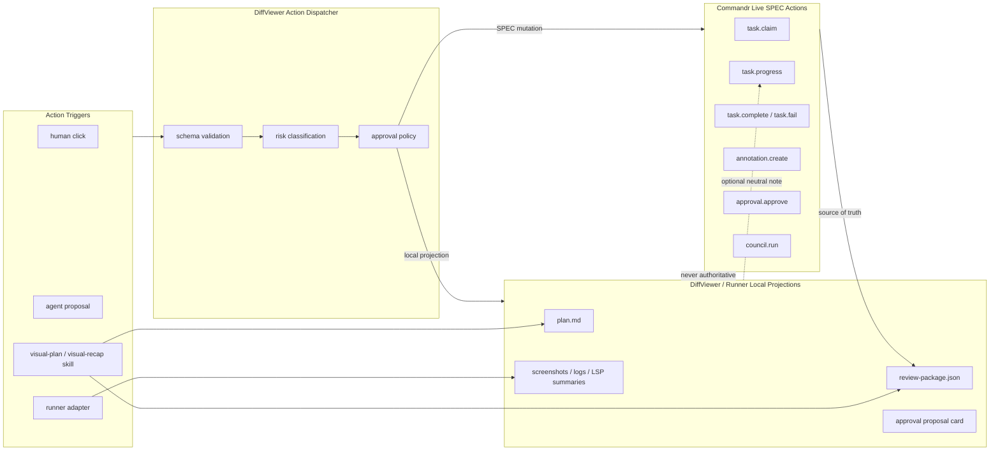
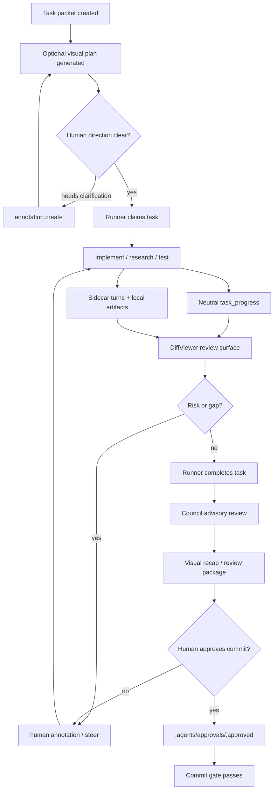

# Builder.io Patterns for Commandr + DiffViewer

Builder.io's Agent-Native and Skills repos help our workflow in two concrete ways:

1. **Shared action vocabulary** — humans and agents should invoke the same validated actions, whether the trigger is a UI click, tool call, CLI command, MCP call, or runner adapter.
2. **Inspectable visual artifacts** — plans and recaps should become durable review packages, not chat walls.

They do **not** replace [Commandr](/entities/commandr) or its `.agents/` bus. Commandr remains L3 source of truth. DiffViewer remains L5 projection and action UI. Builder.io patterns shape the seams between them.



---

## Layer Mapping

| Builder.io idea | Our layer | Concrete use |
|---|---|---|
| Agent-Native `defineAction` | L5 action registry + L3 command wrappers | Define one action schema for UI clicks and agent proposals. Route lifecycle actions to Commandr commands. |
| Shared SQL-backed state | DiffViewer/Tauri local cache only | Use SQLite for fast UI state and audit projection, but rebuild from `.agents/` and artifacts. |
| `/visual-plan` | L4/L5 planning artifact | Generate a pre-code plan package with file map, diagrams, open questions, approval checklist. |
| `/visual-recap` | L5 review package | Generate end-of-task recap with diffs, screenshots, tests, council verdict, risks. |
| `/agent-watchdog` | Review workflow | Audit another runner/session from bus events, sidecars, artifacts, and git diff. |
| `/plan-arbiter` | Multi-agent planning gate | Compare competing plans, choose one, write the decision into the task packet or plan artifact. |
| `/efficient-frontier` | Model routing | Keep expensive models on judgment; use cheaper runners for scans, edits, logs, and artifact generation. |
| `/read-the-damn-docs` | L4 retrieval discipline | Require qmd/context7/raw-source pass before implementing external integrations. |

---

## Commandr Contract

Commandr should expose action-like verbs, but every bus mutation must still map to SPEC v0.3 or a future conformance-backed SPEC change.

| Action | Current Commandr side effect | Status |
|---|---|---|
| `task.claim` | `bin/claim`; move `inbox/` → `claimed/`; append `task_claimed` | Live SPEC |
| `task.progress` | `bin/progress`; append neutral `task_progress` | Live SPEC |
| `task.complete` | `bin/complete`; move `claimed/` → `done/`; append `task_complete` | Live SPEC |
| `task.fail` | Supervisor appends `task_failed`; normal completion with unmet criteria uses `bin/complete <claimed-path> fail` | Live SPEC |
| `annotation.create` | `bin/annotate-write`; write `.agents/annotations/...`; append `task_annotation` | Live SPEC |
| `approval.approve` | Write `.agents/approvals/<task>.approved` | Live SPEC |
| `approval.deny` | Write nothing; optional neutral `task_progress` note | Live SPEC behavior |
| `council.run` | `bin/council`; write `.agents/council/<task>.json`; append `council_verdict` | Live SPEC |
| `approval.request` | DiffViewer/local runner artifact only; no `.pending` file | Non-SPEC local projection |
| `artifact.create` | `.diffviewer/artifacts/<task>/...` or runner workspace artifact | Non-SPEC local projection |
| `review.generate` | DiffViewer creates review package from bus + sidecars + git diff | Non-SPEC local projection |
| `runner.start` | Runner adapter creates session/worktree and then uses bus commands | Non-SPEC adapter action |

Rule: `approval_requested`, `artifact_created`, `.agents/approvals/*.pending`, `.denied`, and runner workspace paths stay outside SPEC until DiffViewer has a real consumer and Commandr adds conformance checks.

---

## DiffViewer Contract

DiffViewer should implement the Builder.io pattern as a local action dispatcher:

```ts
type CockpitAction = {
  name: string;
  schema: unknown;
  actor: "human" | "agent" | "system";
  risk: "low" | "medium" | "high";
  requiresApproval: boolean;
  handler: "commandr" | "diffviewer" | "runner";
  auditEvent: "local" | "commandr" | "none";
};
```

Human clicks and agent proposals enter the same dispatcher. The dispatcher validates input, classifies risk, checks approval policy, then calls the right handler. Agent text never jumps directly to side effects.

DiffViewer-owned artifacts should live outside `.agents/`, for example:

```text
.diffviewer/artifacts/<task-id>/
  plan.md
  review-package.json
  review-package.md
  screenshots/
  lsp-summary.json
  command-log-summary.json
```

These artifacts are regenerated projections. Losing them should not corrupt task lifecycle.

---

## Visual Plan Package

Builder.io `/visual-plan` maps to a pre-implementation package rendered by DiffViewer.

Inputs:

| Source | Data |
|---|---|
| Commandr packet | Goal, acceptance criteria, files to touch, non-goals |
| qmd / llm-wiki | Relevant patterns, prior decisions, docs |
| CGC / CodeBoarding | file map, architecture graph, blast radius |
| Human annotations | constraints, approvals, steer notes |

Output: `.diffviewer/artifacts/<task>/plan.md`.

Required sections:

| Section | Purpose |
|---|---|
| Scope | One sentence on what will change |
| File map | Files likely touched and why |
| Action plan | Ordered implementation steps |
| Risk table | risky files/actions and mitigation |
| Verification gates | typecheck, tests, visual, screenshot, council, approval |
| Open questions | only blockers, not routine ambiguity |
| Approval checklist | what human approves before code starts |

Commandr relationship: the plan is **not** the task packet. The packet remains the work contract; the plan is a rendered aid and can be referenced from `task_progress` as a neutral note.

---

## Visual Recap / Review Package

Builder.io `/visual-recap` maps directly to DiffViewer's end-of-task review package.

Inputs:

| Source | Data |
|---|---|
| Git diff | changed files, hunks, stats |
| `.agents/events.jsonl` | lifecycle, progress, annotations, council verdict |
| `.agents/council/<task>.json` | vote reasons and final verdict |
| `.agents/approvals/<task>.approved` | approval state |
| `.diffviewer/turns/` | per-turn file edits and sidecars |
| Runner workspace | logs, screenshots, diagnostics, command summaries |
| LSP/CodeBoarding | diagnostics, symbols, architecture impact |

Output: `.diffviewer/artifacts/<task>/review-package.json` plus a rendered Markdown/MDX view.

Minimal JSON shape:

```json
{
  "task": "TASK-001",
  "status": "review",
  "summary": "One sentence outcome.",
  "changedFiles": [{ "path": "src/auth.ts", "kind": "edit", "risk": "medium" }],
  "verification": [{ "name": "tests", "status": "pass", "evidence": "npm test" }],
  "approvals": { "approved": false, "tokenPath": ".agents/approvals/TASK-001.approved" },
  "council": { "verdict": "PASS", "abstentions": 0 },
  "artifacts": [{ "type": "screenshot", "path": "screenshots/login.png" }],
  "residualRisks": ["Manual staging deploy not run"]
}
```

DiffViewer can render this as cards: overview, file map, risk, verification, screenshots, logs, approvals, council, residual risks.

---

## Workflow

```text
1. Human or agent creates Commandr packet
2. DiffViewer action `review.generatePlan` creates visual plan artifact
3. Human approves direction via annotation or task approval workflow
4. Runner claims task through Commandr
5. Runner emits neutral progress and local artifacts
6. DiffViewer watches `.agents/`, sidecars, and artifact dirs
7. Runner completes/fails task through Commandr
8. DiffViewer action `review.generateRecap` builds visual recap
9. Council runs as advisory quality gate
10. Human approves commit through existing `.approved` token gate
```

This preserves the thin waist: Commandr records lifecycle; DiffViewer records UI/action/audit projections; runners own private execution state.



---

## Implementation Slices

### Slice 1: No-SPEC-Change Review Package

Build in DiffViewer only.

Acceptance criteria:

| Requirement | Check |
|---|---|
| Reads Commandr bus and git diff | No writes to `.agents/` except existing approval/annotation paths |
| Writes `.diffviewer/artifacts/<task>/review-package.json` | Regenerable and ignored from git |
| Renders a review package card | Includes diff stats, tests, council, approval state |
| Emits optional `task_progress` | One-line neutral note only |

### Slice 2: Action Registry

Add a local dispatcher in DiffViewer.

Acceptance criteria:

| Requirement | Check |
|---|---|
| Every action has schema/risk/handler | No ad-hoc side-effect endpoints |
| Agent proposals use same path as UI clicks | Invalid schema returns structured error |
| Commandr mutations shell to `bin/` tools | No raw bus file manipulation from UI |

### Slice 3: Builder-Style Skills

Package workflows as reusable skills consumed by OpenCode/Claude/Pi/omp.

Candidate skills:

| Skill | Output |
|---|---|
| `commandr-task` | claim/progress/complete discipline |
| `visual-plan` | plan artifact for DiffViewer |
| `visual-recap` | review package artifact |
| `agent-watchdog` | audit of another runner/session |
| `bus-debugger` | SPEC conformance and stale-state diagnosis |

Skill rule: a skill may call Commandr commands or write DiffViewer-local artifacts. It must not invent bus files or parse runner-private state as authority.

### Slice 4: Future SPEC Artifact References

Only after Slice 1 proves real UI value, consider a Commandr SPEC v0.4 artifact event.

Candidate event shape:

```json
{"ts":"<ISO8601>","event":"artifact_ref","task":"TASK-001","kind":"review-package","path":".diffviewer/artifacts/TASK-001/review-package.json","summary":"Review package generated"}
```

This needs SPEC text, conformance checks, and a migration decision. Until then, artifact references stay local or as human-readable `task_progress` notes.

---

## Non-Goals

- Do not replace `.agents/` with Agent-Native SQL state.
- Do not add `.agents/approvals/*.pending` or denial files.
- Do not emit non-SPEC events from Commandr.
- Do not store runner transcripts or LSP caches on the bus.
- Do not make DiffViewer authoritative for lifecycle.
- Do not adopt Builder.io templates wholesale before the local action/artifact seam works.

---

## Related Pages

- Builderio Agent Native — source summary for shared actions and app surfaces.
- Builderio Skills — source summary for visual-plan, visual-recap, watchdog, arbiter, efficient-frontier.
- [Commandr](/entities/commandr) — L3 bus and SPEC boundary.
- [DiffViewer](/entities/diffviewer) — L5 UI and Tauri cockpit direction.
- [Desktop AI Agent Control Plane — Architecture Synthesis](/syntheses/desktop-control-plane) — big-picture 5-layer control plane.
- [Agent Skills](/concepts/agent-skills) — portable `SKILL.md` packaging pattern.
- [Tool Design for Agents](/concepts/tool-design-for-agents) — schemas and recovery-friendly tool contracts.


<iframe srcDoc="<!doctype html><html><head><meta charset=&quot;utf-8&quot;><style>
html,body{margin:0;height:100%;background:#0f1117;overflow:hidden;font-family:ui-sans-serif,system-ui,-apple-system,sans-serif}
#g{width:100%;height:100%}
#hd{position:absolute;top:0;left:0;right:30px;height:22px;display:flex;align-items:center;gap:6px;padding:0 10px;color:#aeb3c2;font-size:10px;letter-spacing:.08em;text-transform:uppercase;z-index:6;cursor:move;user-select:none;touch-action:none;background:linear-gradient(#0f1117cc,#0f111700)}
#gear{position:absolute;top:5px;right:7px;z-index:7;cursor:pointer;color:#aeb3c2;background:#1b1e27;border:1px solid #2b2f3a;border-radius:6px;width:22px;height:22px;display:flex;align-items:center;justify-content:center;font-size:12px;user-select:none}
#panel{position:absolute;top:31px;right:7px;z-index:7;background:rgba(22,25,34,.96);border:1px solid #2b2f3a;border-radius:8px;padding:6px 9px 9px;display:none;width:150px;color:#c9cdd8;font-size:10px}
#panel.open{display:block}
#panel label{display:flex;justify-content:space-between;margin:7px 0 1px;color:#9aa0b0}
#panel input[type=range]{width:100%;margin:0}
#panel .row{display:flex;align-items:center;gap:6px;margin-top:8px;color:#c9cdd8}
</style><script src=&quot;https://cdn.jsdelivr.net/npm/force-graph@1.51.4/dist/force-graph.min.js&quot; integrity=&quot;sha384-Hm6GpQcTNI5VqGgGS7lLxTGtEFcxu/kOVV0B7ozIZRu9blWVvigv5httJQZ2qZmY&quot; crossorigin=&quot;anonymous&quot;></script></head>
<body><div id=&quot;hd&quot;>Graph</div><div id=&quot;gear&quot;>⚙</div>
<div id=&quot;panel&quot;>
<label>Node size<span id=&quot;vns&quot;></span></label><input id=&quot;ns&quot; type=&quot;range&quot; min=&quot;0.6&quot; max=&quot;6&quot; step=&quot;0.2&quot;>
<label>Link width<span id=&quot;vlw&quot;></span></label><input id=&quot;lw&quot; type=&quot;range&quot; min=&quot;0&quot; max=&quot;3&quot; step=&quot;0.1&quot;>
<label>Label size<span id=&quot;vts&quot;></span></label><input id=&quot;ts&quot; type=&quot;range&quot; min=&quot;0&quot; max=&quot;8&quot; step=&quot;0.5&quot;>
<label>Label opacity<span id=&quot;vto&quot;></span></label><input id=&quot;to&quot; type=&quot;range&quot; min=&quot;0&quot; max=&quot;1&quot; step=&quot;0.05&quot;>
<div id=&quot;depthRow&quot;><label>Depth<span id=&quot;vd&quot;></span></label><input id=&quot;dp&quot; type=&quot;range&quot; min=&quot;1&quot; max=&quot;5&quot; step=&quot;1&quot;></div>
<div class=&quot;row&quot;><input id=&quot;ar&quot; type=&quot;checkbox&quot;><span>Directional arrows</span></div>
</div>
<div id=&quot;g&quot;></div>
<script>
const NODES=[{&quot;id&quot;:&quot;syntheses/builderio-control-plane-integration&quot;,&quot;label&quot;:&quot;Builder.io Patterns for Commandr + DiffViewer&quot;,&quot;group&quot;:&quot;syntheses&quot;,&quot;val&quot;:3.23606797749979},{&quot;id&quot;:&quot;concepts/agent-skills&quot;,&quot;label&quot;:&quot;Agent Skills&quot;,&quot;group&quot;:&quot;concepts&quot;,&quot;val&quot;:5.58257569495584},{&quot;id&quot;:&quot;syntheses/desktop-control-plane&quot;,&quot;label&quot;:&quot;Desktop AI Agent Control Plane — Architecture Synthesis&quot;,&quot;group&quot;:&quot;syntheses&quot;,&quot;val&quot;:4.60555127546399},{&quot;id&quot;:&quot;entities/commandr&quot;,&quot;label&quot;:&quot;Commandr&quot;,&quot;group&quot;:&quot;entities&quot;,&quot;val&quot;:4},{&quot;id&quot;:&quot;entities/diffviewer&quot;,&quot;label&quot;:&quot;DiffViewer&quot;,&quot;group&quot;:&quot;entities&quot;,&quot;val&quot;:3.6457513110645907},{&quot;id&quot;:&quot;concepts/tool-design-for-agents&quot;,&quot;label&quot;:&quot;Tool Design for Agents&quot;,&quot;group&quot;:&quot;concepts&quot;,&quot;val&quot;:3.6457513110645907},{&quot;id&quot;:&quot;concepts/agent-harness&quot;,&quot;label&quot;:&quot;Agent Harness&quot;,&quot;group&quot;:&quot;concepts&quot;,&quot;val&quot;:7.324555320336759},{&quot;id&quot;:&quot;syntheses/lean-agentic-workflow&quot;,&quot;label&quot;:&quot;Lean Agentic Coding Workflow&quot;,&quot;group&quot;:&quot;syntheses&quot;,&quot;val&quot;:5.795831523312719},{&quot;id&quot;:&quot;entities/pi-agent&quot;,&quot;label&quot;:&quot;Pi Agent (pi-mono)&quot;,&quot;group&quot;:&quot;entities&quot;,&quot;val&quot;:5.123105625617661},{&quot;id&quot;:&quot;concepts/multi-vendor-adversarial-review&quot;,&quot;label&quot;:&quot;Multi-Vendor Adversarial Review&quot;,&quot;group&quot;:&quot;concepts&quot;,&quot;val&quot;:4.872983346207417},{&quot;id&quot;:&quot;concepts/agent-subagents&quot;,&quot;label&quot;:&quot;Agent Subagents&quot;,&quot;group&quot;:&quot;concepts&quot;,&quot;val&quot;:4.741657386773941},{&quot;id&quot;:&quot;syntheses/agent-primitive-selection&quot;,&quot;label&quot;:&quot;Agent Primitive Selection&quot;,&quot;group&quot;:&quot;syntheses&quot;,&quot;val&quot;:4.464101615137754},{&quot;id&quot;:&quot;concepts/context-engineering&quot;,&quot;label&quot;:&quot;Context Engineering&quot;,&quot;group&quot;:&quot;concepts&quot;,&quot;val&quot;:4.464101615137754},{&quot;id&quot;:&quot;syntheses/control-plane-expansion-plan&quot;,&quot;label&quot;:&quot;Control Plane Expansion Plan — Gap Analysis and Phase 0.5 Roadmap&quot;,&quot;group&quot;:&quot;syntheses&quot;,&quot;val&quot;:4.3166247903554},{&quot;id&quot;:&quot;systems/ai-ml&quot;,&quot;label&quot;:&quot;AI and ML Engineering&quot;,&quot;group&quot;:&quot;systems&quot;,&quot;val&quot;:4.3166247903554},{&quot;id&quot;:&quot;concepts/agent-teams&quot;,&quot;label&quot;:&quot;Agent Teams&quot;,&quot;group&quot;:&quot;concepts&quot;,&quot;val&quot;:4.16227766016838},{&quot;id&quot;:&quot;concepts/indirect-prompt-injection&quot;,&quot;label&quot;:&quot;Indirect Prompt Injection&quot;,&quot;group&quot;:&quot;concepts&quot;,&quot;val&quot;:4.16227766016838},{&quot;id&quot;:&quot;comparisons/cc-to-cross-platform-migration&quot;,&quot;label&quot;:&quot;Claude Code → Cross-Platform Migration Matrix&quot;,&quot;group&quot;:&quot;comparisons&quot;,&quot;val&quot;:4.16227766016838},{&quot;id&quot;:&quot;comparisons/our-stack-vs-omp&quot;,&quot;label&quot;:&quot;Our Stack vs omp&quot;,&quot;group&quot;:&quot;comparisons&quot;,&quot;val&quot;:4},{&quot;id&quot;:&quot;entities/omp&quot;,&quot;label&quot;:&quot;omp (oh-my-pi)&quot;,&quot;group&quot;:&quot;entities&quot;,&quot;val&quot;:4},{&quot;id&quot;:&quot;concepts/shared-task-queue&quot;,&quot;label&quot;:&quot;Shared Task Queue (Cross-Worktree)&quot;,&quot;group&quot;:&quot;concepts&quot;,&quot;val&quot;:4},{&quot;id&quot;:&quot;entities/agent-native&quot;,&quot;label&quot;:&quot;Agent-Native&quot;,&quot;group&quot;:&quot;entities&quot;,&quot;val&quot;:3.6457513110645907},{&quot;id&quot;:&quot;concepts/model-tier-routing&quot;,&quot;label&quot;:&quot;Model Tier Routing&quot;,&quot;group&quot;:&quot;concepts&quot;,&quot;val&quot;:3.6457513110645907},{&quot;id&quot;:&quot;patterns/design-patterns-behavioral&quot;,&quot;label&quot;:&quot;Behavioral Design Patterns&quot;,&quot;group&quot;:&quot;patterns&quot;,&quot;val&quot;:3.449489742783178},{&quot;id&quot;:&quot;entities/ponytail&quot;,&quot;label&quot;:&quot;Ponytail&quot;,&quot;group&quot;:&quot;entities&quot;,&quot;val&quot;:3.449489742783178},{&quot;id&quot;:&quot;syntheses/agent-diff-viewer&quot;,&quot;label&quot;:&quot;Agent Diff Viewer — Real-Time Code Review Tool&quot;,&quot;group&quot;:&quot;syntheses&quot;,&quot;val&quot;:3.23606797749979},{&quot;id&quot;:&quot;concepts/compound-engineering&quot;,&quot;label&quot;:&quot;Compound Engineering&quot;,&quot;group&quot;:&quot;concepts&quot;,&quot;val&quot;:3.23606797749979},{&quot;id&quot;:&quot;entities/codegraphcontext&quot;,&quot;label&quot;:&quot;CodeGraphContext&quot;,&quot;group&quot;:&quot;entities&quot;,&quot;val&quot;:3.23606797749979},{&quot;id&quot;:&quot;concepts/claude-code-plugins&quot;,&quot;label&quot;:&quot;Claude Code Plugins&quot;,&quot;group&quot;:&quot;concepts&quot;,&quot;val&quot;:3},{&quot;id&quot;:&quot;entities/codex&quot;,&quot;label&quot;:&quot;OpenAI Codex&quot;,&quot;group&quot;:&quot;entities&quot;,&quot;val&quot;:3},{&quot;id&quot;:&quot;entities/spotme&quot;,&quot;label&quot;:&quot;SpotMe&quot;,&quot;group&quot;:&quot;entities&quot;,&quot;val&quot;:3},{&quot;id&quot;:&quot;guides/onboarding&quot;,&quot;label&quot;:&quot;Onboarding: Run llm-wiki as an Agent-First Harness&quot;,&quot;group&quot;:&quot;guides&quot;,&quot;val&quot;:3},{&quot;id&quot;:&quot;concepts/pentest-agent-design&quot;,&quot;label&quot;:&quot;Pen Test Agent Design&quot;,&quot;group&quot;:&quot;concepts&quot;,&quot;val&quot;:3},{&quot;id&quot;:&quot;concepts/lsp-agent-baseline&quot;,&quot;label&quot;:&quot;LSP as Agent Baseline&quot;,&quot;group&quot;:&quot;concepts&quot;,&quot;val&quot;:2.732050807568877},{&quot;id&quot;:&quot;entities/gemini-cli&quot;,&quot;label&quot;:&quot;Gemini CLI&quot;,&quot;group&quot;:&quot;entities&quot;,&quot;val&quot;:2.732050807568877},{&quot;id&quot;:&quot;syntheses/neovim-ai-operator-workflow&quot;,&quot;label&quot;:&quot;Neovim AI Operator Workflow&quot;,&quot;group&quot;:&quot;syntheses&quot;,&quot;val&quot;:2.414213562373095},{&quot;id&quot;:&quot;concepts/context-compression&quot;,&quot;label&quot;:&quot;Context Compression Strategies&quot;,&quot;group&quot;:&quot;concepts&quot;,&quot;val&quot;:5.795831523312719},{&quot;id&quot;:&quot;entities/opencode&quot;,&quot;label&quot;:&quot;OpenCode&quot;,&quot;group&quot;:&quot;entities&quot;,&quot;val&quot;:5.358898943540674},{&quot;id&quot;:&quot;concepts/verification-pipeline&quot;,&quot;label&quot;:&quot;Verification Pipeline&quot;,&quot;group&quot;:&quot;concepts&quot;,&quot;val&quot;:5.358898943540674},{&quot;id&quot;:&quot;concepts/agent-self-correction&quot;,&quot;label&quot;:&quot;Agent Self-Correction&quot;,&quot;group&quot;:&quot;concepts&quot;,&quot;val&quot;:5.123105625617661},{&quot;id&quot;:&quot;concepts/agent-context-instructions&quot;,&quot;label&quot;:&quot;Agent Context Instructions&quot;,&quot;group&quot;:&quot;concepts&quot;,&quot;val&quot;:4.872983346207417},{&quot;id&quot;:&quot;concepts/ralph-loop&quot;,&quot;label&quot;:&quot;Ralph Loop&quot;,&quot;group&quot;:&quot;concepts&quot;,&quot;val&quot;:4.872983346207417},{&quot;id&quot;:&quot;patterns/principles&quot;,&quot;label&quot;:&quot;Software Design Principles&quot;,&quot;group&quot;:&quot;patterns&quot;,&quot;val&quot;:4.872983346207417},{&quot;id&quot;:&quot;concepts/context-degradation&quot;,&quot;label&quot;:&quot;Context Degradation Patterns&quot;,&quot;group&quot;:&quot;concepts&quot;,&quot;val&quot;:4.60555127546399}],LINKS=[{&quot;source&quot;:&quot;concepts/agent-harness&quot;,&quot;target&quot;:&quot;concepts/ralph-loop&quot;},{&quot;source&quot;:&quot;concepts/agent-harness&quot;,&quot;target&quot;:&quot;concepts/context-degradation&quot;},{&quot;source&quot;:&quot;concepts/agent-harness&quot;,&quot;target&quot;:&quot;concepts/context-compression&quot;},{&quot;source&quot;:&quot;concepts/agent-harness&quot;,&quot;target&quot;:&quot;concepts/agent-context-instructions&quot;},{&quot;source&quot;:&quot;concepts/agent-harness&quot;,&quot;target&quot;:&quot;concepts/tool-design-for-agents&quot;},{&quot;source&quot;:&quot;concepts/agent-harness&quot;,&quot;target&quot;:&quot;syntheses/agent-diff-viewer&quot;},{&quot;source&quot;:&quot;concepts/agent-self-correction&quot;,&quot;target&quot;:&quot;concepts/verification-pipeline&quot;},{&quot;source&quot;:&quot;concepts/agent-self-correction&quot;,&quot;target&quot;:&quot;concepts/agent-harness&quot;},{&quot;source&quot;:&quot;concepts/agent-self-correction&quot;,&quot;target&quot;:&quot;concepts/model-tier-routing&quot;},{&quot;source&quot;:&quot;concepts/agent-self-correction&quot;,&quot;target&quot;:&quot;syntheses/agent-primitive-selection&quot;},{&quot;source&quot;:&quot;concepts/agent-self-correction&quot;,&quot;target&quot;:&quot;concepts/context-compression&quot;},{&quot;source&quot;:&quot;concepts/agent-self-correction&quot;,&quot;target&quot;:&quot;syntheses/lean-agentic-workflow&quot;},{&quot;source&quot;:&quot;concepts/agent-self-correction&quot;,&quot;target&quot;:&quot;concepts/multi-vendor-adversarial-review&quot;},{&quot;source&quot;:&quot;concepts/agent-self-correction&quot;,&quot;target&quot;:&quot;entities/opencode&quot;},{&quot;source&quot;:&quot;concepts/agent-self-correction&quot;,&quot;target&quot;:&quot;concepts/context-engineering&quot;},{&quot;source&quot;:&quot;concepts/agent-skills&quot;,&quot;target&quot;:&quot;concepts/compound-engineering&quot;},{&quot;source&quot;:&quot;concepts/agent-skills&quot;,&quot;target&quot;:&quot;concepts/multi-vendor-adversarial-review&quot;},{&quot;source&quot;:&quot;concepts/agent-skills&quot;,&quot;target&quot;:&quot;concepts/model-tier-routing&quot;},{&quot;source&quot;:&quot;concepts/agent-skills&quot;,&quot;target&quot;:&quot;concepts/agent-harness&quot;},{&quot;source&quot;:&quot;concepts/agent-skills&quot;,&quot;target&quot;:&quot;concepts/agent-subagents&quot;},{&quot;source&quot;:&quot;concepts/agent-skills&quot;,&quot;target&quot;:&quot;concepts/agent-teams&quot;},{&quot;source&quot;:&quot;concepts/agent-skills&quot;,&quot;target&quot;:&quot;concepts/indirect-prompt-injection&quot;},{&quot;source&quot;:&quot;concepts/agent-skills&quot;,&quot;target&quot;:&quot;concepts/claude-code-plugins&quot;},{&quot;source&quot;:&quot;concepts/agent-subagents&quot;,&quot;target&quot;:&quot;concepts/agent-teams&quot;},{&quot;source&quot;:&quot;concepts/agent-subagents&quot;,&quot;target&quot;:&quot;concepts/agent-skills&quot;},{&quot;source&quot;:&quot;concepts/agent-subagents&quot;,&quot;target&quot;:&quot;concepts/agent-harness&quot;},{&quot;source&quot;:&quot;concepts/agent-subagents&quot;,&quot;target&quot;:&quot;concepts/context-compression&quot;},{&quot;source&quot;:&quot;concepts/agent-subagents&quot;,&quot;target&quot;:&quot;concepts/context-degradation&quot;},{&quot;source&quot;:&quot;concepts/agent-subagents&quot;,&quot;target&quot;:&quot;syntheses/agent-primitive-selection&quot;},{&quot;source&quot;:&quot;concepts/agent-teams&quot;,&quot;target&quot;:&quot;concepts/agent-subagents&quot;},{&quot;source&quot;:&quot;concepts/agent-teams&quot;,&quot;target&quot;:&quot;concepts/agent-harness&quot;},{&quot;source&quot;:&quot;concepts/agent-teams&quot;,&quot;target&quot;:&quot;concepts/context-degradation&quot;},{&quot;source&quot;:&quot;concepts/agent-teams&quot;,&quot;target&quot;:&quot;concepts/shared-task-queue&quot;},{&quot;source&quot;:&quot;concepts/claude-code-plugins&quot;,&quot;target&quot;:&quot;concepts/agent-skills&quot;},{&quot;source&quot;:&quot;concepts/claude-code-plugins&quot;,&quot;target&quot;:&quot;concepts/agent-subagents&quot;},{&quot;source&quot;:&quot;concepts/compound-engineering&quot;,&quot;target&quot;:&quot;concepts/agent-harness&quot;},{&quot;source&quot;:&quot;concepts/compound-engineering&quot;,&quot;target&quot;:&quot;concepts/verification-pipeline&quot;},{&quot;source&quot;:&quot;concepts/compound-engineering&quot;,&quot;target&quot;:&quot;concepts/agent-context-instructions&quot;},{&quot;source&quot;:&quot;concepts/context-compression&quot;,&quot;target&quot;:&quot;concepts/context-degradation&quot;},{&quot;source&quot;:&quot;concepts/context-compression&quot;,&quot;target&quot;:&quot;concepts/agent-harness&quot;},{&quot;source&quot;:&quot;concepts/context-compression&quot;,&quot;target&quot;:&quot;concepts/ralph-loop&quot;},{&quot;source&quot;:&quot;concepts/context-degradation&quot;,&quot;target&quot;:&quot;concepts/context-compression&quot;},{&quot;source&quot;:&quot;concepts/context-degradation&quot;,&quot;target&quot;:&quot;concepts/agent-harness&quot;},{&quot;source&quot;:&quot;concepts/context-degradation&quot;,&quot;target&quot;:&quot;concepts/ralph-loop&quot;},{&quot;source&quot;:&quot;concepts/context-engineering&quot;,&quot;target&quot;:&quot;concepts/tool-design-for-agents&quot;},{&quot;source&quot;:&quot;concepts/context-engineering&quot;,&quot;target&quot;:&quot;concepts/agent-subagents&quot;},{&quot;source&quot;:&quot;concepts/context-engineering&quot;,&quot;target&quot;:&quot;concepts/agent-harness&quot;},{&quot;source&quot;:&quot;concepts/context-engineering&quot;,&quot;target&quot;:&quot;concepts/context-degradation&quot;},{&quot;source&quot;:&quot;concepts/context-engineering&quot;,&quot;target&quot;:&quot;concepts/context-compression&quot;},{&quot;source&quot;:&quot;concepts/indirect-prompt-injection&quot;,&quot;target&quot;:&quot;concepts/agent-context-instructions&quot;},{&quot;source&quot;:&quot;concepts/lsp-agent-baseline&quot;,&quot;target&quot;:&quot;entities/omp&quot;},{&quot;source&quot;:&quot;concepts/lsp-agent-baseline&quot;,&quot;target&quot;:&quot;syntheses/neovim-ai-operator-workflow&quot;},{&quot;source&quot;:&quot;concepts/model-tier-routing&quot;,&quot;target&quot;:&quot;syntheses/agent-primitive-selection&quot;},{&quot;source&quot;:&quot;concepts/model-tier-routing&quot;,&quot;target&quot;:&quot;concepts/agent-subagents&quot;},{&quot;source&quot;:&quot;concepts/model-tier-routing&quot;,&quot;target&quot;:&quot;concepts/agent-self-correction&quot;},{&quot;source&quot;:&quot;concepts/multi-vendor-adversarial-review&quot;,&quot;target&quot;:&quot;entities/pi-agent&quot;},{&quot;source&quot;:&quot;concepts/multi-vendor-adversarial-review&quot;,&quot;target&quot;:&quot;concepts/verification-pipeline&quot;},{&quot;source&quot;:&quot;concepts/multi-vendor-adversarial-review&quot;,&quot;target&quot;:&quot;syntheses/agent-primitive-selection&quot;},{&quot;source&quot;:&quot;concepts/pentest-agent-design&quot;,&quot;target&quot;:&quot;concepts/agent-harness&quot;},{&quot;source&quot;:&quot;concepts/pentest-agent-design&quot;,&quot;target&quot;:&quot;concepts/tool-design-for-agents&quot;},{&quot;source&quot;:&quot;concepts/ralph-loop&quot;,&quot;target&quot;:&quot;concepts/agent-harness&quot;},{&quot;source&quot;:&quot;concepts/shared-task-queue&quot;,&quot;target&quot;:&quot;concepts/agent-skills&quot;},{&quot;source&quot;:&quot;concepts/shared-task-queue&quot;,&quot;target&quot;:&quot;concepts/ralph-loop&quot;},{&quot;source&quot;:&quot;concepts/tool-design-for-agents&quot;,&quot;target&quot;:&quot;concepts/agent-harness&quot;},{&quot;source&quot;:&quot;concepts/verification-pipeline&quot;,&quot;target&quot;:&quot;concepts/agent-harness&quot;},{&quot;source&quot;:&quot;concepts/verification-pipeline&quot;,&quot;target&quot;:&quot;concepts/ralph-loop&quot;},{&quot;source&quot;:&quot;patterns/design-patterns-behavioral&quot;,&quot;target&quot;:&quot;patterns/principles&quot;},{&quot;source&quot;:&quot;patterns/design-patterns-behavioral&quot;,&quot;target&quot;:&quot;concepts/agent-skills&quot;},{&quot;source&quot;:&quot;patterns/principles&quot;,&quot;target&quot;:&quot;patterns/design-patterns-behavioral&quot;},{&quot;source&quot;:&quot;systems/ai-ml&quot;,&quot;target&quot;:&quot;concepts/context-engineering&quot;},{&quot;source&quot;:&quot;systems/ai-ml&quot;,&quot;target&quot;:&quot;concepts/agent-harness&quot;},{&quot;source&quot;:&quot;systems/ai-ml&quot;,&quot;target&quot;:&quot;concepts/ralph-loop&quot;},{&quot;source&quot;:&quot;systems/ai-ml&quot;,&quot;target&quot;:&quot;concepts/context-degradation&quot;},{&quot;source&quot;:&quot;systems/ai-ml&quot;,&quot;target&quot;:&quot;concepts/agent-skills&quot;},{&quot;source&quot;:&quot;systems/ai-ml&quot;,&quot;target&quot;:&quot;concepts/agent-subagents&quot;},{&quot;source&quot;:&quot;systems/ai-ml&quot;,&quot;target&quot;:&quot;concepts/agent-teams&quot;},{&quot;source&quot;:&quot;systems/ai-ml&quot;,&quot;target&quot;:&quot;concepts/verification-pipeline&quot;},{&quot;source&quot;:&quot;syntheses/agent-diff-viewer&quot;,&quot;target&quot;:&quot;entities/diffviewer&quot;},{&quot;source&quot;:&quot;syntheses/agent-diff-viewer&quot;,&quot;target&quot;:&quot;syntheses/desktop-control-plane&quot;},{&quot;source&quot;:&quot;syntheses/agent-diff-viewer&quot;,&quot;target&quot;:&quot;concepts/agent-harness&quot;},{&quot;source&quot;:&quot;syntheses/agent-diff-viewer&quot;,&quot;target&quot;:&quot;concepts/tool-design-for-agents&quot;},{&quot;source&quot;:&quot;syntheses/agent-diff-viewer&quot;,&quot;target&quot;:&quot;concepts/agent-skills&quot;},{&quot;source&quot;:&quot;syntheses/agent-primitive-selection&quot;,&quot;target&quot;:&quot;concepts/agent-skills&quot;},{&quot;source&quot;:&quot;syntheses/agent-primitive-selection&quot;,&quot;target&quot;:&quot;concepts/agent-subagents&quot;},{&quot;source&quot;:&quot;syntheses/agent-primitive-selection&quot;,&quot;target&quot;:&quot;concepts/agent-teams&quot;},{&quot;source&quot;:&quot;syntheses/agent-primitive-selection&quot;,&quot;target&quot;:&quot;concepts/multi-vendor-adversarial-review&quot;},{&quot;source&quot;:&quot;syntheses/agent-primitive-selection&quot;,&quot;target&quot;:&quot;concepts/agent-harness&quot;},{&quot;source&quot;:&quot;syntheses/agent-primitive-selection&quot;,&quot;target&quot;:&quot;concepts/verification-pipeline&quot;},{&quot;source&quot;:&quot;syntheses/builderio-control-plane-integration&quot;,&quot;target&quot;:&quot;entities/commandr&quot;},{&quot;source&quot;:&quot;syntheses/builderio-control-plane-integration&quot;,&quot;target&quot;:&quot;entities/diffviewer&quot;},{&quot;source&quot;:&quot;syntheses/builderio-control-plane-integration&quot;,&quot;target&quot;:&quot;syntheses/desktop-control-plane&quot;},{&quot;source&quot;:&quot;syntheses/builderio-control-plane-integration&quot;,&quot;target&quot;:&quot;concepts/agent-skills&quot;},{&quot;source&quot;:&quot;syntheses/builderio-control-plane-integration&quot;,&quot;target&quot;:&quot;concepts/tool-design-for-agents&quot;},{&quot;source&quot;:&quot;syntheses/control-plane-expansion-plan&quot;,&quot;target&quot;:&quot;entities/agent-native&quot;},{&quot;source&quot;:&quot;syntheses/control-plane-expansion-plan&quot;,&quot;target&quot;:&quot;entities/omp&quot;},{&quot;source&quot;:&quot;syntheses/control-plane-expansion-plan&quot;,&quot;target&quot;:&quot;concepts/shared-task-queue&quot;},{&quot;source&quot;:&quot;syntheses/control-plane-expansion-plan&quot;,&quot;target&quot;:&quot;concepts/agent-teams&quot;},{&quot;source&quot;:&quot;syntheses/desktop-control-plane&quot;,&quot;target&quot;:&quot;entities/commandr&quot;},{&quot;source&quot;:&quot;syntheses/desktop-control-plane&quot;,&quot;target&quot;:&quot;entities/diffviewer&quot;},{&quot;source&quot;:&quot;syntheses/desktop-control-plane&quot;,&quot;target&quot;:&quot;entities/omp&quot;},{&quot;source&quot;:&quot;syntheses/desktop-control-plane&quot;,&quot;target&quot;:&quot;entities/agent-native&quot;},{&quot;source&quot;:&quot;syntheses/desktop-control-plane&quot;,&quot;target&quot;:&quot;concepts/lsp-agent-baseline&quot;},{&quot;source&quot;:&quot;syntheses/desktop-control-plane&quot;,&quot;target&quot;:&quot;syntheses/neovim-ai-operator-workflow&quot;},{&quot;source&quot;:&quot;syntheses/desktop-control-plane&quot;,&quot;target&quot;:&quot;comparisons/our-stack-vs-omp&quot;},{&quot;source&quot;:&quot;syntheses/desktop-control-plane&quot;,&quot;target&quot;:&quot;entities/pi-agent&quot;},{&quot;source&quot;:&quot;syntheses/desktop-control-plane&quot;,&quot;target&quot;:&quot;syntheses/control-plane-expansion-plan&quot;},{&quot;source&quot;:&quot;syntheses/desktop-control-plane&quot;,&quot;target&quot;:&quot;syntheses/agent-diff-viewer&quot;},{&quot;source&quot;:&quot;syntheses/desktop-control-plane&quot;,&quot;target&quot;:&quot;syntheses/lean-agentic-workflow&quot;},{&quot;source&quot;:&quot;syntheses/desktop-control-plane&quot;,&quot;target&quot;:&quot;concepts/agent-harness&quot;},{&quot;source&quot;:&quot;syntheses/lean-agentic-workflow&quot;,&quot;target&quot;:&quot;concepts/verification-pipeline&quot;},{&quot;source&quot;:&quot;syntheses/lean-agentic-workflow&quot;,&quot;target&quot;:&quot;concepts/agent-skills&quot;},{&quot;source&quot;:&quot;syntheses/lean-agentic-workflow&quot;,&quot;target&quot;:&quot;concepts/multi-vendor-adversarial-review&quot;},{&quot;source&quot;:&quot;syntheses/lean-agentic-workflow&quot;,&quot;target&quot;:&quot;entities/opencode&quot;},{&quot;source&quot;:&quot;syntheses/lean-agentic-workflow&quot;,&quot;target&quot;:&quot;concepts/context-compression&quot;},{&quot;source&quot;:&quot;syntheses/lean-agentic-workflow&quot;,&quot;target&quot;:&quot;concepts/agent-self-correction&quot;},{&quot;source&quot;:&quot;syntheses/lean-agentic-workflow&quot;,&quot;target&quot;:&quot;syntheses/agent-primitive-selection&quot;},{&quot;source&quot;:&quot;syntheses/lean-agentic-workflow&quot;,&quot;target&quot;:&quot;syntheses/control-plane-expansion-plan&quot;},{&quot;source&quot;:&quot;comparisons/cc-to-cross-platform-migration&quot;,&quot;target&quot;:&quot;entities/gemini-cli&quot;},{&quot;source&quot;:&quot;comparisons/cc-to-cross-platform-migration&quot;,&quot;target&quot;:&quot;entities/opencode&quot;},{&quot;source&quot;:&quot;comparisons/cc-to-cross-platform-migration&quot;,&quot;target&quot;:&quot;entities/codex&quot;},{&quot;source&quot;:&quot;comparisons/cc-to-cross-platform-migration&quot;,&quot;target&quot;:&quot;concepts/agent-context-instructions&quot;},{&quot;source&quot;:&quot;comparisons/cc-to-cross-platform-migration&quot;,&quot;target&quot;:&quot;concepts/agent-skills&quot;},{&quot;source&quot;:&quot;comparisons/cc-to-cross-platform-migration&quot;,&quot;target&quot;:&quot;concepts/agent-subagents&quot;},{&quot;source&quot;:&quot;comparisons/our-stack-vs-omp&quot;,&quot;target&quot;:&quot;entities/commandr&quot;},{&quot;source&quot;:&quot;comparisons/our-stack-vs-omp&quot;,&quot;target&quot;:&quot;concepts/multi-vendor-adversarial-review&quot;},{&quot;source&quot;:&quot;comparisons/our-stack-vs-omp&quot;,&quot;target&quot;:&quot;entities/omp&quot;},{&quot;source&quot;:&quot;comparisons/our-stack-vs-omp&quot;,&quot;target&quot;:&quot;entities/pi-agent&quot;},{&quot;source&quot;:&quot;comparisons/our-stack-vs-omp&quot;,&quot;target&quot;:&quot;concepts/agent-harness&quot;},{&quot;source&quot;:&quot;comparisons/our-stack-vs-omp&quot;,&quot;target&quot;:&quot;syntheses/lean-agentic-workflow&quot;},{&quot;source&quot;:&quot;entities/agent-native&quot;,&quot;target&quot;:&quot;concepts/agent-harness&quot;},{&quot;source&quot;:&quot;entities/agent-native&quot;,&quot;target&quot;:&quot;concepts/tool-design-for-agents&quot;},{&quot;source&quot;:&quot;entities/agent-native&quot;,&quot;target&quot;:&quot;concepts/agent-context-instructions&quot;},{&quot;source&quot;:&quot;entities/codegraphcontext&quot;,&quot;target&quot;:&quot;concepts/agent-harness&quot;},{&quot;source&quot;:&quot;entities/codegraphcontext&quot;,&quot;target&quot;:&quot;concepts/context-degradation&quot;},{&quot;source&quot;:&quot;entities/codegraphcontext&quot;,&quot;target&quot;:&quot;concepts/tool-design-for-agents&quot;},{&quot;source&quot;:&quot;entities/codex&quot;,&quot;target&quot;:&quot;comparisons/cc-to-cross-platform-migration&quot;},{&quot;source&quot;:&quot;entities/codex&quot;,&quot;target&quot;:&quot;concepts/agent-subagents&quot;},{&quot;source&quot;:&quot;entities/codex&quot;,&quot;target&quot;:&quot;concepts/agent-skills&quot;},{&quot;source&quot;:&quot;entities/commandr&quot;,&quot;target&quot;:&quot;syntheses/desktop-control-plane&quot;},{&quot;source&quot;:&quot;entities/commandr&quot;,&quot;target&quot;:&quot;entities/agent-native&quot;},{&quot;source&quot;:&quot;entities/commandr&quot;,&quot;target&quot;:&quot;syntheses/builderio-control-plane-integration&quot;},{&quot;source&quot;:&quot;entities/commandr&quot;,&quot;target&quot;:&quot;entities/omp&quot;},{&quot;source&quot;:&quot;entities/commandr&quot;,&quot;target&quot;:&quot;entities/diffviewer&quot;},{&quot;source&quot;:&quot;entities/commandr&quot;,&quot;target&quot;:&quot;entities/pi-agent&quot;},{&quot;source&quot;:&quot;entities/commandr&quot;,&quot;target&quot;:&quot;concepts/agent-harness&quot;},{&quot;source&quot;:&quot;entities/commandr&quot;,&quot;target&quot;:&quot;syntheses/control-plane-expansion-plan&quot;},{&quot;source&quot;:&quot;entities/diffviewer&quot;,&quot;target&quot;:&quot;syntheses/desktop-control-plane&quot;},{&quot;source&quot;:&quot;entities/diffviewer&quot;,&quot;target&quot;:&quot;entities/commandr&quot;},{&quot;source&quot;:&quot;entities/diffviewer&quot;,&quot;target&quot;:&quot;syntheses/builderio-control-plane-integration&quot;},{&quot;source&quot;:&quot;entities/diffviewer&quot;,&quot;target&quot;:&quot;entities/omp&quot;},{&quot;source&quot;:&quot;entities/diffviewer&quot;,&quot;target&quot;:&quot;entities/agent-native&quot;},{&quot;source&quot;:&quot;entities/diffviewer&quot;,&quot;target&quot;:&quot;syntheses/agent-diff-viewer&quot;},{&quot;source&quot;:&quot;entities/diffviewer&quot;,&quot;target&quot;:&quot;concepts/agent-harness&quot;},{&quot;source&quot;:&quot;entities/gemini-cli&quot;,&quot;target&quot;:&quot;comparisons/cc-to-cross-platform-migration&quot;},{&quot;source&quot;:&quot;entities/gemini-cli&quot;,&quot;target&quot;:&quot;concepts/agent-skills&quot;},{&quot;source&quot;:&quot;entities/omp&quot;,&quot;target&quot;:&quot;entities/commandr&quot;},{&quot;source&quot;:&quot;entities/omp&quot;,&quot;target&quot;:&quot;entities/pi-agent&quot;},{&quot;source&quot;:&quot;entities/omp&quot;,&quot;target&quot;:&quot;comparisons/our-stack-vs-omp&quot;},{&quot;source&quot;:&quot;entities/omp&quot;,&quot;target&quot;:&quot;entities/diffviewer&quot;},{&quot;source&quot;:&quot;entities/omp&quot;,&quot;target&quot;:&quot;concepts/agent-harness&quot;},{&quot;source&quot;:&quot;entities/opencode&quot;,&quot;target&quot;:&quot;concepts/context-compression&quot;},{&quot;source&quot;:&quot;entities/opencode&quot;,&quot;target&quot;:&quot;concepts/agent-harness&quot;},{&quot;source&quot;:&quot;entities/opencode&quot;,&quot;target&quot;:&quot;concepts/claude-code-plugins&quot;},{&quot;source&quot;:&quot;entities/pi-agent&quot;,&quot;target&quot;:&quot;entities/omp&quot;},{&quot;source&quot;:&quot;entities/pi-agent&quot;,&quot;target&quot;:&quot;comparisons/our-stack-vs-omp&quot;},{&quot;source&quot;:&quot;entities/pi-agent&quot;,&quot;target&quot;:&quot;concepts/model-tier-routing&quot;},{&quot;source&quot;:&quot;entities/pi-agent&quot;,&quot;target&quot;:&quot;concepts/multi-vendor-adversarial-review&quot;},{&quot;source&quot;:&quot;entities/pi-agent&quot;,&quot;target&quot;:&quot;entities/opencode&quot;},{&quot;source&quot;:&quot;entities/pi-agent&quot;,&quot;target&quot;:&quot;concepts/agent-self-correction&quot;},{&quot;source&quot;:&quot;entities/ponytail&quot;,&quot;target&quot;:&quot;entities/opencode&quot;},{&quot;source&quot;:&quot;entities/ponytail&quot;,&quot;target&quot;:&quot;entities/pi-agent&quot;},{&quot;source&quot;:&quot;entities/ponytail&quot;,&quot;target&quot;:&quot;patterns/principles&quot;},{&quot;source&quot;:&quot;entities/ponytail&quot;,&quot;target&quot;:&quot;concepts/agent-skills&quot;},{&quot;source&quot;:&quot;entities/spotme&quot;,&quot;target&quot;:&quot;concepts/agent-skills&quot;},{&quot;source&quot;:&quot;entities/spotme&quot;,&quot;target&quot;:&quot;entities/opencode&quot;},{&quot;source&quot;:&quot;guides/onboarding&quot;,&quot;target&quot;:&quot;concepts/agent-skills&quot;},{&quot;source&quot;:&quot;guides/onboarding&quot;,&quot;target&quot;:&quot;concepts/model-tier-routing&quot;}],CUR=&quot;syntheses/builderio-control-plane-integration&quot;,MAXD=3;
const C={concepts:'#8B7CF6',patterns:'#0D9373',systems:'#E0567C',syntheses:'#E2A03F',comparisons:'#3B82F6',entities:'#14B8A6',guides:'#9CA3AF'};
function lid(x){return (x&amp;&amp;x.id!==undefined)?x.id:x;}
const ADJ=new Map(NODES.map(function(n){return [n.id,new Set()];}));
LINKS.forEach(function(l){var s=lid(l.source),t=lid(l.target);if(ADJ.has(s)&amp;&amp;ADJ.has(t)){ADJ.get(s).add(t);ADJ.get(t).add(s);}});
var opt={ns:1.8,lw:0.6,ts:3.5,to:0.75,dp:2,ar:false};
function visible(){
 if(!CUR)return {nodes:NODES,links:LINKS};
 var dist=new Map([[CUR,0]]),fr=[CUR];
 for(var d=1;d<=opt.dp;d++){var nx=[];fr.forEach(function(u){(ADJ.get(u)||[]).forEach(function(v){if(!dist.has(v)){dist.set(v,d);nx.push(v);}});});fr=nx;}
 var keep=new Set(dist.keys());
 return {nodes:NODES.filter(function(n){return keep.has(n.id);}),links:LINKS.filter(function(l){return keep.has(lid(l.source))&amp;&amp;keep.has(lid(l.target));})};
}
var el=document.getElementById('g');
var G=ForceGraph()(el).backgroundColor('#0f1117').nodeId('id')
 .warmupTicks(24).cooldownTicks(70).autoPauseRedraw(true)
 .nodeColor(function(n){return C[n.group]||'#9CA3AF';}).nodeLabel('label').nodeVal(function(n){return n.val;})
 .linkColor(function(){return 'rgba(255,255,255,0.12)';})
 .nodeRelSize(opt.ns).linkWidth(opt.lw)
 .linkDirectionalArrowLength(0).linkDirectionalArrowRelPos(1).linkDirectionalArrowColor(function(){return 'rgba(255,255,255,0.4)';})
 .nodeCanvasObjectMode(function(){return 'after';})
 .nodeCanvasObject(function(n,ctx,scale){var r=opt.ns*Math.sqrt(n.val||1);
  if(n.id===CUR){ctx.beginPath();ctx.arc(n.x,n.y,r+1.6,0,6.283);ctx.strokeStyle='#fff';ctx.lineWidth=1.2/scale;ctx.stroke();}
  if(opt.to>0&amp;&amp;opt.ts>0){var t=n.label.length>28?n.label.slice(0,26)+'…':n.label;ctx.globalAlpha=opt.to;ctx.font=((n.id===CUR?opt.ts+1:opt.ts))+'px ui-sans-serif,sans-serif';ctx.fillStyle=(n.id===CUR)?'#ffffff':'#aab0c0';ctx.textAlign='center';ctx.textBaseline='top';ctx.fillText(t,n.x,n.y+r+1.5);ctx.globalAlpha=1;}})
 .onNodeClick(function(n){if(window.top){window.top.location.href='/'+n.id;}});
G.graphData(visible());G.d3VelocityDecay(0.4);
function fit(){G.zoomToFit(400,20);}
setTimeout(fit,350);setTimeout(fit,1100);
// Stop the render/sim loop while idle so the fixed widget never repaints during
// parent-page scroll; resume only while the pointer is over the widget.
var pt;function pause(){G.pauseAnimation();}function resume(){G.resumeAnimation();}
function idle(ms){clearTimeout(pt);pt=setTimeout(pause,ms);}
document.body.addEventListener('pointerenter',function(){clearTimeout(pt);resume();});
document.body.addEventListener('pointerleave',function(){idle(250);});
addEventListener('resize',function(){resume();G.zoomToFit(0,20);idle(700);});
idle(2000);
function apply(re){resume();G.nodeRelSize(opt.ns).linkWidth(opt.lw).linkDirectionalArrowLength(opt.ar?2.6:0);if(re){G.graphData(visible());setTimeout(fit,450);}idle(re?2200:1400);}
function bind(id,key,fmt,re){var e=document.getElementById(id),o=document.getElementById('v'+id);e.value=opt[key];if(o)o.textContent=fmt(opt[key]);e.addEventListener('input',function(){opt[key]=parseFloat(e.value);if(o)o.textContent=fmt(opt[key]);apply(re);});}
bind('ns','ns',function(v){return v.toFixed(1);},false);
bind('lw','lw',function(v){return v.toFixed(1);},false);
bind('ts','ts',function(v){return v.toFixed(1);},false);
bind('to','to',function(v){return v.toFixed(2);},false);
var dE=document.getElementById('dp'),dO=document.getElementById('vd');dE.max=MAXD;dE.value=opt.dp;dO.textContent=opt.dp;dE.addEventListener('input',function(){opt.dp=parseInt(dE.value,10);dO.textContent=opt.dp;apply(true);});
if(!CUR)document.getElementById('depthRow').style.display='none';
var aE=document.getElementById('ar');aE.checked=opt.ar;aE.addEventListener('change',function(){opt.ar=aE.checked;apply(false);});
document.getElementById('gear').addEventListener('click',function(){document.getElementById('panel').classList.toggle('open');});
var hd=document.getElementById('hd');hd.textContent='⠿  '+(CUR?'Local graph':'Knowledge graph');
// free-form placement: drag by the header. Default is bottom-right (inline style);
// a moved position is saved per parent-origin and restored on every page.
function clampPos(fe,l,t){var TW=(window.top||window),r=fe.getBoundingClientRect();return [Math.min(Math.max(0,l),Math.max(0,TW.innerWidth-r.width)),Math.min(Math.max(0,t),Math.max(0,TW.innerHeight-r.height))];}
function place(fe,l,t){var p=clampPos(fe,l,t);fe.style.left=p[0]+'px';fe.style.top=p[1]+'px';fe.style.right='auto';fe.style.bottom='auto';}
try{var sp=JSON.parse(localStorage.getItem('llmwiki_graph_pos'));if(sp&amp;&amp;window.frameElement)place(window.frameElement,sp.l,sp.t);}catch(e){if(window.console)console.debug('graph: saved position unavailable',e);}
hd.addEventListener('pointerdown',function(e){var fe=window.frameElement;if(!fe)return;var rect=fe.getBoundingClientRect();var sx=e.screenX,sy=e.screenY,L=rect.left,T=rect.top;place(fe,L,T);hd.setPointerCapture(e.pointerId);
 function mv(ev){place(fe,L+ev.screenX-sx,T+ev.screenY-sy);}
 function up(){if(hd.hasPointerCapture(e.pointerId))hd.releasePointerCapture(e.pointerId);hd.removeEventListener('pointermove',mv);hd.removeEventListener('pointerup',up);try{localStorage.setItem('llmwiki_graph_pos',JSON.stringify({l:parseFloat(fe.style.left),t:parseFloat(fe.style.top)}));}catch(e2){if(window.console)console.debug('graph: could not persist position',e2);}}
 hd.addEventListener('pointermove',mv);hd.addEventListener('pointerup',up);e.preventDefault();});
</script></body></html>" title="Knowledge graph" loading="lazy" style={{position:"fixed",right:"18px",bottom:"18px",width:"320px",height:"340px",border:0,borderRadius:"14px",boxShadow:"0 6px 28px rgba(0,0,0,0.38)",zIndex:50,background:"#0f1117"}} />
