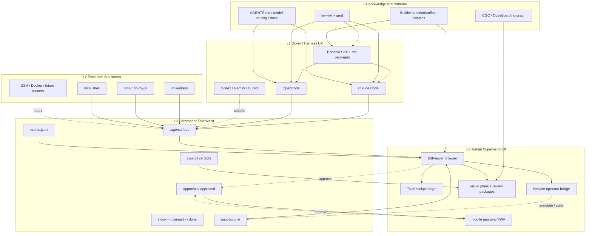
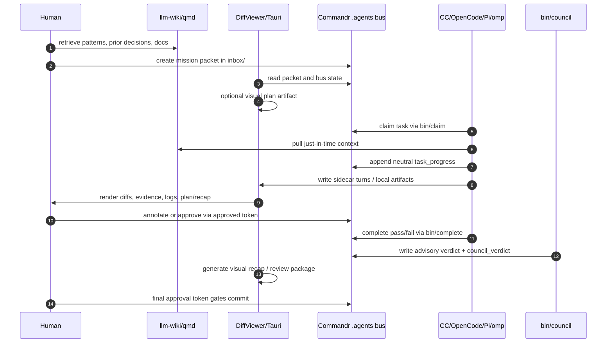

# Desktop AI Agent Control Plane — Architecture Synthesis

The long-horizon product vision: a local-first desktop app for supervising AI agents across tasks, repos, terminals, machines, logs, approvals, and review packages. This page synthesizes the current state of [Commandr](/entities/commandr) and [DiffViewer](/entities/diffviewer), how they map to the product vision, where [omp (oh-my-pi)](/entities/omp) and Conductor fit, and the path to the Tauri desktop app.

**⚠ Local-only document.** This synthesis contains project strategy, competitive positioning, and product roadmap. It should not be published to any public-facing docs site.

---

## Core Thesis

AI agents are workers. The product is the supervisor.

The problem has shifted from "can the AI write code?" to "how do I safely supervise many AI-driven tasks across repos, machines, commands, logs, approvals, and deliverables?" This product is built around the second problem.

---

## The 5-Layer Model (Current Architecture)

The architecture is already designed and partially built. It is **not** a monolith — it is a thin-waist stack where every layer is swappable.

```
L1  Driver     Claude Code, OpenCode, skills       harness UX + reusable instruction/workflow packages
L2  Execution  omp, Pi, local shell, SSH/Docker     workers, runners, pueue, subprocesses
L3  Bus        Commandr (.agents/)                  task queue + approvals + events ← thin waist
L4  Knowledge  llm-wiki, qmd, CGC, SKILL.md libs    retrieval + durable workflow knowledge
L5  UI         DiffViewer → Tauri cockpit           actions, approvals, evidence, review packages
```



**The thin waist**: L1/L2/L5 communicate exclusively through the `.agents/` filesystem contract defined in `Commandr/protocol/SPEC.md`. A harness (L1), a worker (L2), or a UI (L5) interoperates without knowing what's on the other side. Changing from Claude Code to OpenCode doesn't require changing DiffViewer. Changing from Pi to omp doesn't require changing Commandr.

This is the same architecture principle as TCP/IP: a narrow stable protocol layer lets both ends evolve independently.

Three recent sources strengthen the model without changing the layer boundaries:

- [Agent-Native](/entities/agent-native) informs **L5 action design**: UI and agents should share one action vocabulary, but the product should not adopt Agent-Native's SQL runtime as the bus.
- Builderio Skills informs **L1/L4 workflow packaging**: reusable capabilities should ship as portable `SKILL.md` packages, not live only in prompts.
- [omp (oh-my-pi)](/entities/omp) and [LSP as Agent Baseline](/concepts/lsp-agent-baseline) inform **L2 execution quality**: use high-quality runners for edits, LSP/DAP, subagents, diagnostics, and tool schemas; do not let a runner own lifecycle state.
- [Neovim AI Operator Workflow](/syntheses/neovim-ai-operator-workflow) informs the **human operator lane**: Neovim + Mason + nvim-dap remain the hands-on IDE/debug surface while agents run as supervised workers.

**Invariant**: none of these replace [Commandr](/entities/commandr). Commandr remains L3, the stable lifecycle/audit contract.

### Current Task Lifecycle



---

## What's Already Built

### Phase 0–1 (complete): Commandr as the bus

`Commandr/protocol/SPEC.md` v0.3 is live with 28 conformance tests, 0 failures:

- Task queue: `inbox/` → `claimed/` → `done/` via atomic POSIX `mv`
- Approval gate: `approvals/<task-id>.approved` + harness-independent git pre-commit hook
- Event log: `events.jsonl` append-only
- Council quality gate: `bin/council`, 3 Haiku evaluators, majority vote
- Index fold: `bin/index` → `~/.agents/index.json` cross-repo cache
- Annotation loop: `bin/annotate-write` → per-turn human notes injected as next-prompt context
- Both CC and OpenCode adapters conformance-validated

### Phase 1–2 (in progress): DiffViewer as L5

DiffViewer is currently the browser UI layer:

- Real-time diff cards via SSE (Claude Code hooks or OpenCode plugin)
- Neovim Lua plugin with statusline badge and keyboard-driven review
- **Pi extension**: blocks Pi workers mid-turn, interactive Accept/Edit/Deny per file
- **Mobile companion MVP-0**: phone PWA approval loop via Tailscale; writes bus approval tokens
- Architecture tab backed by CodeBoarding artifacts
- Steer injection: clipboard (v1) or direct OpenCode HTTP API (v2)

The re-homing of DiffViewer from CC-hook-driven to bus-watching (reading `.agents/` and `.diffviewer/turns/` sidecars) is the Phase 2 gate.

---

## The Product Vision: Tauri Desktop App

Phase 5 in the Unification Blueprint. DiffViewer's browser server becomes a Tauri v2 desktop app.

### Recommended Stack

| Layer | Choice | Why |
|---|---|---|
| Desktop shell | Tauri v2 | Small/fast native app; system access without Electron overhead |
| Frontend | SvelteKit (static adapter) | Clean app structure; fast UI; good for dense dashboards |
| Language | TypeScript + Rust | Rust for process/fs/ssh/db; TS for UI state |
| Styling | Tailwind CSS + shadcn-svelte + Bits UI | Component system for dashboard UX |
| Local DB | SQLite | Persistent task/session/log/approval state; opens offline |
| Secrets | Tauri Stronghold / OS keychain | Credential storage without external services |
| Realtime | Tauri events + channels | Bus watching → UI updates |

**Critical SvelteKit rule**: use static adapter, disable SSR, treat Rust/Tauri as the backend. Expose native actions through Tauri commands; stream state back through Tauri events. Do not rely on SvelteKit server routes.

### Rust owns

Process spawning, agent runner lifecycle, SSH orchestration, filesystem access, log streaming, SQLite persistence, credential handling, workspace creation, git operations, event emission, permission enforcement, bus watching.

### TypeScript/Svelte owns

UI state, taskboard UX, forms, workflow screens, review panels, local UI stores, command palette, visualization, user interaction.

---

## Primary UI Screens (Cockpit)

The main UI is an **operations cockpit**, not a chat window:

| Screen | Content |
|---|---|
| Taskboard | Kanban: Backlog / Running / Waiting-Approval / Review / Done / Failed |
| Session list | Active sessions, runner type, machine, last activity, current command |
| Live logs | Streamed stdout/stderr, searchable, pinable, mark-as-evidence |
| Approval queue | Pending risky actions with risk explanation and approve/deny/note |
| Evidence viewer | Artifacts: diffs, logs, reports, screenshots, command output, scan results |
| Machine inventory | Local + SSH targets; health status; auth profiles |
| Review package | End-of-task: summary, commands, diff, pinned evidence, approvals, next step |
| Architecture tab | CodeBoarding-backed component graph for the active repo |
| Neovim bridge | Open file/line in Neovim; ingest selected code/context, LSP diagnostics, DAP evidence |

---

## Core Data Model

The Tauri app persists everything locally in SQLite, supplementing the bus's filesystem state:

| Entity | Key fields |
|---|---|
| **Task** | id, project_id, title, description, status, assigned_runner, workspace_id, machine_id |
| **Session** | id, task_id, runner_type, command, cwd, machine_id, process_id, status, exit_code |
| **LogEvent** | id, session_id, timestamp, stream, content, level, pinned, artifact_id |
| **Approval** | id, task_id, session_id, action_type, command, risk_level, decision, reviewer_note |
| **Artifact** | id, task_id, session_id, type (diff/log/report/screenshot/scan_result), path, summary |
| **Machine** | id, name, type (local/ssh/container), host, tags, auth_profile, health_status |

Task statuses mirror the Commandr bus: backlog → ready → running → waiting_for_approval → review → done / failed.

---

## Runner Adapter System

The desktop app does not build its own coding agent. It supervises existing runners via adapters:

| Runner | Status | Notes |
|---|---|---|
| Local shell | MVP | Any shell command |
| Claude Code CLI | MVP | `claude --bg`; hooks already wired |
| OpenCode | MVP | `opencode run` headless mode |
| Pi | MVP | `pi -p` subprocess |
| omp (oh-my-pi) | Near-term | `omp -p`; see below |
| SSH | Phase 3 | Remote command via SSH adapter |
| Docker | Phase 3+ | Container worker |
| Goose / OpenHands | Later | Additional open-source runners |

Every runner produces: stdout/stderr stream, exit code, file diffs (via git), and bus events.

### LSP baseline for code runners

Language servers should be treated as baseline capability for code-changing runners, not as global always-on background noise. LSP gives agents IDE-grade facts: symbol lookup, go-to-definition, references, diagnostics, hover/type information, and safe rename support.

Placement:

| Layer | Policy |
|---|---|
| L1 driver | May expose LSP tools/plugins to a session when project profile selects them. |
| L2 runner | Best home for warm language servers; `omp` is reference implementation because LSP/DAP are built in. |
| L3 bus | Store only neutral progress or artifact references, never LSP caches or raw server state. |
| L5 UI | Display diagnostics and symbol/blast-radius evidence in review packages. |

Startup rule: lazy per-project LSP, not global always-on. Detect stack from project profile/files, enable only matching servers, start on first code task, reuse per workspace/worktree, and clean up with runner/session lifecycle.

When the human uses Neovim as IDE replacement, split the lanes: Mason/lspconfig/nvim-dap own the human operator LSP/DAP surface, while agent runners own autonomous LSP usage. The control plane should not duplicate Mason by starting all LSPs globally. Instead, it should import or display operator evidence: diagnostics summaries, diffview review state, debug reproduction notes, and file/line selections.

LSP is not enough by itself. The verification ladder stays: LSP diagnostics → typecheck/compiler → tests → diff review/human approval.

### omp integration ladder

| Level | Shape | When |
|---|---|---|
| 0 | Subprocess: Tauri runs `omp -p "<task packet>"` and captures stdout/stderr | First smoke test |
| 1 | `commandr-omp-runner`: claim task, create workspace, run omp, stream logs, emit progress, complete/fail | MVP runner |
| 2 | omp custom tools: `commandr_progress`, `commandr_request_approval`, `commandr_emit_artifact`, `commandr_complete` | True bus-aware worker |
| 3 | omp extension: intercept tool calls/events, write turn snapshots, request approvals, emit structured artifacts | Later, after runner contract stabilizes |

Do not start at Level 3. The useful bootstrap is Level 1: a bus-aware runner wrapper.

---

## Where omp Fits

omp (`can1357/oh-my-pi`) is a batteries-included Pi fork — 32 tools, hashline editing, LSP/DAP wired in, 40+ providers. See [omp (oh-my-pi)](/entities/omp) and [Our Stack vs omp](/comparisons/our-stack-vs-omp) for the full feature gap.

In the 5-layer model, omp is an **L2 execution substrate** — same slot as Pi, with better tool quality:

- **Why it matters**: omp's hashline editing eliminates the edit retry loops that cause spurious `session_end` events and failed tasks on the bus. Better tool quality at L2 = cleaner bus events at L3.
- **DiffViewer integration**: omp's first-class `task` tool (worktree-isolated, typed schema results) already generates the same kinds of turn snapshots that DiffViewer renders. An omp adapter to DiffViewer is simpler than Pi extension because omp's subagent model is structured.
- **Council**: omp's 40+ providers are the multi-vendor adversarial review substrate. `bin/council` could route to omp instead of raw `claude -p` subprocess calls.
- **Replacement or complement**: omp can run alongside Pi (Pi for long-horizon pueue workflows; omp for interactive sessions where LSP/DAP matter) — both write to the same `.agents/` bus.

omp's YOLO-by-default posture (no permission dialogs) aligns with the bus's explicit approval gate model: the Commandr pre-commit gate and the DiffViewer approval loop ARE the permission system.

---

## Where Conductor Fits

Conductor (macOS) is a parallel coding agent workspace manager. Its core object is the **workspace** (branch + worktree + diff + PR). Philosophy: "agents are junior engineers — give each task an isolated workspace, review the diff, merge."

This product's core object is the **task/session** within an operations cockpit. Philosophy: "agents are workers — supervise them, capture evidence, enforce approvals, generate review packages."

| Dimension | Conductor | This Product |
|---|---|---|
| Primary object | Workspace (branch/worktree/diff/PR) | Task / session / control plane |
| Main workflow | Code task → branch → diff → PR | Task → agent → logs → approvals → evidence → review |
| Execution scope | Local Mac workspaces | Local, SSH, containers, runners |
| Review | Code diff + PR | Diff + logs + commands + artifacts + approvals |
| Philosophy | Parallel coding workspaces | Human-supervised AI operations |
| Risk model | Development isolation | Permissioned action supervision + audit |
| Target user | Developer running parallel coding agents | Developer, security tester, DevOps, QA |
| Differentiator | Simple parallel coding workflow | Multi-machine, evidence-first, approval-first cockpit |

**Decision**: do not compete head-on with Conductor. Borrow the useful concept of isolated task workspaces (already in the bus model via worktrees), but apply it to the broader cockpit. Conductor is a potential integration target — it could be a runner type in the adapter system.

---

## Product Positioning

**Bad positioning**: "Conductor but cross-platform", "a GUI for Claude Code", "a better terminal agent", "a Tauri alternative to Cursor."

**Right positioning**: A local-first desktop AI operations cockpit for supervising agents, tasks, terminals, machines, logs, approvals, and review packages.

**Sharpest initial wedge**: AI-assisted security testing + engineering operations.

Why: founder-market fit (security background), natural need for audit trails and evidence, approval gates are critical (not nice-to-have), less direct competition with pure coding-agent products, expands naturally into general engineering operations.

---

## Agent-Native Action Registry

Borrow the Agent-Native idea that UI and agent share actions, but keep Commandr as the bus. The Tauri cockpit needs a local action registry: every meaningful UI operation should also be requestable by an agent, and every agent action should be displayable, approvable, auditable, replayable, or reversible in the UI.

Initial action vocabulary:

| Area | Actions |
|---|---|
| Tasks | `task.create`, `task.claim`, `task.progress`, `task.complete` |
| Sessions | `session.start`, `session.cancel` |
| Approvals | `approval.request`, `approval.approve`, `approval.deny` |
| Artifacts | `artifact.create`, `evidence.pin`, `review.generate` |
| Runners | `runner.start`, `runner.stop`, `runner.install` |
| Machines | `machine.connect` |

Each action should define:

| Field | Purpose |
|---|---|
| `name` | Stable action identifier |
| `schema` | Zod/JSON-schema input contract |
| `actor` | `human`, `agent`, or `system` |
| `risk` | `low`, `medium`, or `high` |
| `requiresApproval` | Whether UI/human approval is required before side effect |
| `handler` | Tauri command or Commandr subprocess |
| `auditEvent` | SQLite row + optional `.agents/events.jsonl` event |

This gives the Agent-Native benefit — one shared action/state language — without replacing `.agents/` with a SaaS-style shared SQL model.

---

## Feature Gaps Between Current Tools and Tauri Target

| Feature | Now | Tauri Target |
|---|---|---|
| Taskboard | Commandr `bin/` + kanban-status skill | Native visual board; drag-to-status |
| Log streaming | DiffViewer SSE browser | Native log panel with search + pin |
| Diff review | DiffViewer browser + Neovim plugin | Native diff panel (same diff2html, native window) |
| Approval gate | Mobile PWA + Commandr pre-commit hook | Native approval queue + desktop notification |
| Machine inventory | None | SSH profile management |
| Artifact store | None (bus files only) | SQLite-backed artifact viewer |
| Review package | None (manual) | Auto-generated on task completion |
| Multi-machine | Phase 5 (git-ref claim) | Native multi-machine coordination |
| Session replay | None | Artifact store + log replay |
| Runner management | Manual CLI | Native runner status + cancel/retry |

---

## Evidence Capture as Differentiator

Every action should produce evidence. This is what makes the cockpit useful for security testing, DevOps, QA, and regulated workflows — not just for coding:

- Command history with timestamps and host metadata
- stdout/stderr per command
- File diffs per turn (already in DiffViewer)
- Pinned log lines marked as evidence
- Screenshots (via MCP Playwright or native screenshot)
- Approval decisions with reviewer notes
- Council verdicts
- Final task summary

The Commandr `events.jsonl` + DiffViewer `TurnSnapshot` already capture most of this. The Tauri app makes it queryable and visualizable.

---

## Build Phases for the Tauri App

### Phase A: Foundation (MVP)
- Tauri + SvelteKit shell
- SQLite schema (task/session/log/approval/artifact/machine)
- Bus watcher (reads `.agents/` events.jsonl + claimed/done dirs)
- Cockpit action registry (`task.*`, `session.*`, `approval.*`, `artifact.*`, `runner.*`, `machine.*`)
- Taskboard (Kanban columns from bus state)
- Live log viewer (stream from runner subprocess)
- Approval queue (reads from bus + native UI to write approval token)
- Local shell + CC CLI runner adapters
- `commandr-omp-runner` Level 1 wrapper once shell/CC adapter shape is stable
- Project-scoped LSP capability metadata on runner sessions (`ts`, `py`, `go`, `rs`, etc.), shown in UI but not stored as bus state

### Phase B: Review + Evidence
- DiffViewer rendered natively in Tauri (replaces Node server)
- Review package generator (auto on task completion)
- Artifact store (SQLite-backed, file-linked)
- Evidence pinning + annotation (replaces `bin/annotate-write`)
- Architecture tab (CodeBoarding artifact → Mermaid → native render)
- LSP evidence panel: diagnostics clean/dirty, changed exported symbols, references/callers for risky diffs
- Neovim bridge: file/line deep links, selection-to-annotation, diffview refresh hooks, DAP evidence import

### Phase C: Remote + Security Workflow
- SSH machine profiles + remote runner adapter
- Credential store (Tauri Stronghold)
- Security workflow templates (recon, endpoint test, web app test, evidence collection)
- Approval classification (risky action detection per command pattern)
- Multi-machine claim (Phase 5 git-ref race)

### Phase D: omp + Council Integration
- omp as a first-class L2 runner (hashline edit quality + LSP-aware diffs)
- `bin/council` wired into approval queue as automated quality gate
- Cross-session Hindsight memory viewer (omp's SQLite memory as inspection surface)

---

## Related Pages

- [Commandr](/entities/commandr) — L3 bus entity; SPEC v0.3; bin/ tools; adapter details
- [DiffViewer](/entities/diffviewer) — L5 UI entity; architecture; Pi extension; mobile companion
- [omp (oh-my-pi)](/entities/omp) — L2 execution option; feature reference
- [LSP as Agent Baseline](/concepts/lsp-agent-baseline) — LSP as lazy project-scoped agent capability, not bus state
- [Neovim AI Operator Workflow](/syntheses/neovim-ai-operator-workflow) — Neovim/Mason/nvim-dap as human operator IDE lane
- [Agent-Native](/entities/agent-native) — action/state philosophy for the Tauri cockpit
- Builderio Skills — skill packaging inspiration for workflow distribution
- [Pi Agent (pi-mono)](/entities/pi-agent) — current L2 substrate; council subprocess; pueue
- [Our Stack vs omp](/comparisons/our-stack-vs-omp) — current CC+Pi stack vs omp; hard gaps; migration path
- [Control Plane Expansion Plan — Gap Analysis and Phase 0.5 Roadmap](/syntheses/control-plane-expansion-plan) — earlier gap analysis (pre-Unification Blueprint; partially superseded by this synthesis and by Commandr UNIFICATION-BLUEPRINT.md)
- [Agent Diff Viewer — Real-Time Code Review Tool](/syntheses/agent-diff-viewer) — earlier DiffViewer synthesis (pre-bus-watching, pre-mobile; partially superseded by [DiffViewer](/entities/diffviewer))
- [Lean Agentic Coding Workflow](/syntheses/lean-agentic-workflow) — the current operational workflow using these tools
- [Agent Harness](/concepts/agent-harness) — harness engineering framing; thin waist pattern


<iframe srcDoc="<!doctype html><html><head><meta charset=&quot;utf-8&quot;><style>
html,body{margin:0;height:100%;background:#0f1117;overflow:hidden;font-family:ui-sans-serif,system-ui,-apple-system,sans-serif}
#g{width:100%;height:100%}
#hd{position:absolute;top:0;left:0;right:30px;height:22px;display:flex;align-items:center;gap:6px;padding:0 10px;color:#aeb3c2;font-size:10px;letter-spacing:.08em;text-transform:uppercase;z-index:6;cursor:move;user-select:none;touch-action:none;background:linear-gradient(#0f1117cc,#0f111700)}
#gear{position:absolute;top:5px;right:7px;z-index:7;cursor:pointer;color:#aeb3c2;background:#1b1e27;border:1px solid #2b2f3a;border-radius:6px;width:22px;height:22px;display:flex;align-items:center;justify-content:center;font-size:12px;user-select:none}
#panel{position:absolute;top:31px;right:7px;z-index:7;background:rgba(22,25,34,.96);border:1px solid #2b2f3a;border-radius:8px;padding:6px 9px 9px;display:none;width:150px;color:#c9cdd8;font-size:10px}
#panel.open{display:block}
#panel label{display:flex;justify-content:space-between;margin:7px 0 1px;color:#9aa0b0}
#panel input[type=range]{width:100%;margin:0}
#panel .row{display:flex;align-items:center;gap:6px;margin-top:8px;color:#c9cdd8}
</style><script src=&quot;https://cdn.jsdelivr.net/npm/force-graph@1.51.4/dist/force-graph.min.js&quot; integrity=&quot;sha384-Hm6GpQcTNI5VqGgGS7lLxTGtEFcxu/kOVV0B7ozIZRu9blWVvigv5httJQZ2qZmY&quot; crossorigin=&quot;anonymous&quot;></script></head>
<body><div id=&quot;hd&quot;>Graph</div><div id=&quot;gear&quot;>⚙</div>
<div id=&quot;panel&quot;>
<label>Node size<span id=&quot;vns&quot;></span></label><input id=&quot;ns&quot; type=&quot;range&quot; min=&quot;0.6&quot; max=&quot;6&quot; step=&quot;0.2&quot;>
<label>Link width<span id=&quot;vlw&quot;></span></label><input id=&quot;lw&quot; type=&quot;range&quot; min=&quot;0&quot; max=&quot;3&quot; step=&quot;0.1&quot;>
<label>Label size<span id=&quot;vts&quot;></span></label><input id=&quot;ts&quot; type=&quot;range&quot; min=&quot;0&quot; max=&quot;8&quot; step=&quot;0.5&quot;>
<label>Label opacity<span id=&quot;vto&quot;></span></label><input id=&quot;to&quot; type=&quot;range&quot; min=&quot;0&quot; max=&quot;1&quot; step=&quot;0.05&quot;>
<div id=&quot;depthRow&quot;><label>Depth<span id=&quot;vd&quot;></span></label><input id=&quot;dp&quot; type=&quot;range&quot; min=&quot;1&quot; max=&quot;5&quot; step=&quot;1&quot;></div>
<div class=&quot;row&quot;><input id=&quot;ar&quot; type=&quot;checkbox&quot;><span>Directional arrows</span></div>
</div>
<div id=&quot;g&quot;></div>
<script>
const NODES=[{&quot;id&quot;:&quot;syntheses/desktop-control-plane&quot;,&quot;label&quot;:&quot;Desktop AI Agent Control Plane — Architecture Synthesis&quot;,&quot;group&quot;:&quot;syntheses&quot;,&quot;val&quot;:4.60555127546399},{&quot;id&quot;:&quot;concepts/agent-harness&quot;,&quot;label&quot;:&quot;Agent Harness&quot;,&quot;group&quot;:&quot;concepts&quot;,&quot;val&quot;:7.48074069840786},{&quot;id&quot;:&quot;syntheses/lean-agentic-workflow&quot;,&quot;label&quot;:&quot;Lean Agentic Coding Workflow&quot;,&quot;group&quot;:&quot;syntheses&quot;,&quot;val&quot;:5.795831523312719},{&quot;id&quot;:&quot;entities/pi-agent&quot;,&quot;label&quot;:&quot;Pi Agent (pi-mono)&quot;,&quot;group&quot;:&quot;entities&quot;,&quot;val&quot;:5.123105625617661},{&quot;id&quot;:&quot;syntheses/control-plane-expansion-plan&quot;,&quot;label&quot;:&quot;Control Plane Expansion Plan — Gap Analysis and Phase 0.5 Roadmap&quot;,&quot;group&quot;:&quot;syntheses&quot;,&quot;val&quot;:4.3166247903554},{&quot;id&quot;:&quot;entities/commandr&quot;,&quot;label&quot;:&quot;Commandr&quot;,&quot;group&quot;:&quot;entities&quot;,&quot;val&quot;:4},{&quot;id&quot;:&quot;entities/omp&quot;,&quot;label&quot;:&quot;omp (oh-my-pi)&quot;,&quot;group&quot;:&quot;entities&quot;,&quot;val&quot;:4},{&quot;id&quot;:&quot;comparisons/our-stack-vs-omp&quot;,&quot;label&quot;:&quot;Our Stack vs omp&quot;,&quot;group&quot;:&quot;comparisons&quot;,&quot;val&quot;:4},{&quot;id&quot;:&quot;entities/diffviewer&quot;,&quot;label&quot;:&quot;DiffViewer&quot;,&quot;group&quot;:&quot;entities&quot;,&quot;val&quot;:3.6457513110645907},{&quot;id&quot;:&quot;entities/agent-native&quot;,&quot;label&quot;:&quot;Agent-Native&quot;,&quot;group&quot;:&quot;entities&quot;,&quot;val&quot;:3.6457513110645907},{&quot;id&quot;:&quot;syntheses/agent-diff-viewer&quot;,&quot;label&quot;:&quot;Agent Diff Viewer — Real-Time Code Review Tool&quot;,&quot;group&quot;:&quot;syntheses&quot;,&quot;val&quot;:3.23606797749979},{&quot;id&quot;:&quot;syntheses/builderio-control-plane-integration&quot;,&quot;label&quot;:&quot;Builder.io Patterns for Commandr + DiffViewer&quot;,&quot;group&quot;:&quot;syntheses&quot;,&quot;val&quot;:3.23606797749979},{&quot;id&quot;:&quot;concepts/lsp-agent-baseline&quot;,&quot;label&quot;:&quot;LSP as Agent Baseline&quot;,&quot;group&quot;:&quot;concepts&quot;,&quot;val&quot;:2.732050807568877},{&quot;id&quot;:&quot;syntheses/neovim-ai-operator-workflow&quot;,&quot;label&quot;:&quot;Neovim AI Operator Workflow&quot;,&quot;group&quot;:&quot;syntheses&quot;,&quot;val&quot;:2.414213562373095},{&quot;id&quot;:&quot;concepts/context-compression&quot;,&quot;label&quot;:&quot;Context Compression Strategies&quot;,&quot;group&quot;:&quot;concepts&quot;,&quot;val&quot;:6},{&quot;id&quot;:&quot;concepts/agent-skills&quot;,&quot;label&quot;:&quot;Agent Skills&quot;,&quot;group&quot;:&quot;concepts&quot;,&quot;val&quot;:5.69041575982343},{&quot;id&quot;:&quot;entities/opencode&quot;,&quot;label&quot;:&quot;OpenCode&quot;,&quot;group&quot;:&quot;entities&quot;,&quot;val&quot;:5.358898943540674},{&quot;id&quot;:&quot;concepts/verification-pipeline&quot;,&quot;label&quot;:&quot;Verification Pipeline&quot;,&quot;group&quot;:&quot;concepts&quot;,&quot;val&quot;:5.358898943540674},{&quot;id&quot;:&quot;concepts/agent-self-correction&quot;,&quot;label&quot;:&quot;Agent Self-Correction&quot;,&quot;group&quot;:&quot;concepts&quot;,&quot;val&quot;:5.123105625617661},{&quot;id&quot;:&quot;concepts/agent-context-instructions&quot;,&quot;label&quot;:&quot;Agent Context Instructions&quot;,&quot;group&quot;:&quot;concepts&quot;,&quot;val&quot;:4.872983346207417},{&quot;id&quot;:&quot;concepts/multi-vendor-adversarial-review&quot;,&quot;label&quot;:&quot;Multi-Vendor Adversarial Review&quot;,&quot;group&quot;:&quot;concepts&quot;,&quot;val&quot;:4.872983346207417},{&quot;id&quot;:&quot;concepts/ralph-loop&quot;,&quot;label&quot;:&quot;Ralph Loop&quot;,&quot;group&quot;:&quot;concepts&quot;,&quot;val&quot;:4.872983346207417},{&quot;id&quot;:&quot;concepts/agent-subagents&quot;,&quot;label&quot;:&quot;Agent Subagents&quot;,&quot;group&quot;:&quot;concepts&quot;,&quot;val&quot;:4.741657386773941},{&quot;id&quot;:&quot;concepts/worktree-isolation&quot;,&quot;label&quot;:&quot;Worktree Isolation&quot;,&quot;group&quot;:&quot;concepts&quot;,&quot;val&quot;:4.60555127546399},{&quot;id&quot;:&quot;concepts/agentic-cicd&quot;,&quot;label&quot;:&quot;Agentic CI/CD&quot;,&quot;group&quot;:&quot;concepts&quot;,&quot;val&quot;:4.60555127546399},{&quot;id&quot;:&quot;concepts/context-degradation&quot;,&quot;label&quot;:&quot;Context Degradation Patterns&quot;,&quot;group&quot;:&quot;concepts&quot;,&quot;val&quot;:4.60555127546399},{&quot;id&quot;:&quot;syntheses/agent-primitive-selection&quot;,&quot;label&quot;:&quot;Agent Primitive Selection&quot;,&quot;group&quot;:&quot;syntheses&quot;,&quot;val&quot;:4.464101615137754},{&quot;id&quot;:&quot;concepts/agentic-sandbox-controls&quot;,&quot;label&quot;:&quot;Agentic Sandbox Controls&quot;,&quot;group&quot;:&quot;concepts&quot;,&quot;val&quot;:4.464101615137754},{&quot;id&quot;:&quot;concepts/context-engineering&quot;,&quot;label&quot;:&quot;Context Engineering&quot;,&quot;group&quot;:&quot;concepts&quot;,&quot;val&quot;:4.464101615137754},{&quot;id&quot;:&quot;comparisons/spec-driven-frameworks-vs-native&quot;,&quot;label&quot;:&quot;Spec-Driven Frameworks vs Native Claude Code&quot;,&quot;group&quot;:&quot;comparisons&quot;,&quot;val&quot;:4.3166247903554},{&quot;id&quot;:&quot;systems/ai-ml&quot;,&quot;label&quot;:&quot;AI and ML Engineering&quot;,&quot;group&quot;:&quot;systems&quot;,&quot;val&quot;:4.3166247903554},{&quot;id&quot;:&quot;concepts/tool-design-for-agents&quot;,&quot;label&quot;:&quot;Tool Design for Agents&quot;,&quot;group&quot;:&quot;concepts&quot;,&quot;val&quot;:4.16227766016838},{&quot;id&quot;:&quot;concepts/agent-teams&quot;,&quot;label&quot;:&quot;Agent Teams&quot;,&quot;group&quot;:&quot;concepts&quot;,&quot;val&quot;:4.16227766016838},{&quot;id&quot;:&quot;entities/dangeresque&quot;,&quot;label&quot;:&quot;Dangeresque&quot;,&quot;group&quot;:&quot;entities&quot;,&quot;val&quot;:4.16227766016838},{&quot;id&quot;:&quot;entities/sandcastle&quot;,&quot;label&quot;:&quot;SandCastle&quot;,&quot;group&quot;:&quot;entities&quot;,&quot;val&quot;:4.16227766016838},{&quot;id&quot;:&quot;concepts/self-healing-loop&quot;,&quot;label&quot;:&quot;Self-Healing Loop&quot;,&quot;group&quot;:&quot;concepts&quot;,&quot;val&quot;:4.16227766016838},{&quot;id&quot;:&quot;concepts/council-pattern&quot;,&quot;label&quot;:&quot;Council Pattern&quot;,&quot;group&quot;:&quot;concepts&quot;,&quot;val&quot;:4},{&quot;id&quot;:&quot;concepts/shared-task-queue&quot;,&quot;label&quot;:&quot;Shared Task Queue (Cross-Worktree)&quot;,&quot;group&quot;:&quot;concepts&quot;,&quot;val&quot;:4},{&quot;id&quot;:&quot;concepts/rules-vs-hooks&quot;,&quot;label&quot;:&quot;Rules vs. Hooks&quot;,&quot;group&quot;:&quot;concepts&quot;,&quot;val&quot;:4},{&quot;id&quot;:&quot;concepts/memory-bank-pattern&quot;,&quot;label&quot;:&quot;Memory Bank Pattern&quot;,&quot;group&quot;:&quot;concepts&quot;,&quot;val&quot;:4},{&quot;id&quot;:&quot;comparisons/claude-code-vs-opencode-plugins&quot;,&quot;label&quot;:&quot;Claude Code vs OpenCode Plugin Systems&quot;,&quot;group&quot;:&quot;comparisons&quot;,&quot;val&quot;:3.8284271247461903},{&quot;id&quot;:&quot;entities/agentops&quot;,&quot;label&quot;:&quot;AgentOps (boshu2)&quot;,&quot;group&quot;:&quot;entities&quot;,&quot;val&quot;:3.8284271247461903},{&quot;id&quot;:&quot;concepts/branch-strategy-for-agents&quot;,&quot;label&quot;:&quot;Branch Strategy for Agents&quot;,&quot;group&quot;:&quot;concepts&quot;,&quot;val&quot;:3.8284271247461903},{&quot;id&quot;:&quot;concepts/model-tier-routing&quot;,&quot;label&quot;:&quot;Model Tier Routing&quot;,&quot;group&quot;:&quot;concepts&quot;,&quot;val&quot;:3.6457513110645907}],LINKS=[{&quot;source&quot;:&quot;concepts/agent-context-instructions&quot;,&quot;target&quot;:&quot;concepts/rules-vs-hooks&quot;},{&quot;source&quot;:&quot;concepts/agent-context-instructions&quot;,&quot;target&quot;:&quot;concepts/memory-bank-pattern&quot;},{&quot;source&quot;:&quot;concepts/agent-harness&quot;,&quot;target&quot;:&quot;concepts/ralph-loop&quot;},{&quot;source&quot;:&quot;concepts/agent-harness&quot;,&quot;target&quot;:&quot;concepts/context-degradation&quot;},{&quot;source&quot;:&quot;concepts/agent-harness&quot;,&quot;target&quot;:&quot;concepts/context-compression&quot;},{&quot;source&quot;:&quot;concepts/agent-harness&quot;,&quot;target&quot;:&quot;concepts/agent-context-instructions&quot;},{&quot;source&quot;:&quot;concepts/agent-harness&quot;,&quot;target&quot;:&quot;concepts/agentic-sandbox-controls&quot;},{&quot;source&quot;:&quot;concepts/agent-harness&quot;,&quot;target&quot;:&quot;concepts/tool-design-for-agents&quot;},{&quot;source&quot;:&quot;concepts/agent-harness&quot;,&quot;target&quot;:&quot;syntheses/agent-diff-viewer&quot;},{&quot;source&quot;:&quot;concepts/agent-self-correction&quot;,&quot;target&quot;:&quot;concepts/verification-pipeline&quot;},{&quot;source&quot;:&quot;concepts/agent-self-correction&quot;,&quot;target&quot;:&quot;concepts/agent-harness&quot;},{&quot;source&quot;:&quot;concepts/agent-self-correction&quot;,&quot;target&quot;:&quot;concepts/model-tier-routing&quot;},{&quot;source&quot;:&quot;concepts/agent-self-correction&quot;,&quot;target&quot;:&quot;syntheses/agent-primitive-selection&quot;},{&quot;source&quot;:&quot;concepts/agent-self-correction&quot;,&quot;target&quot;:&quot;concepts/context-compression&quot;},{&quot;source&quot;:&quot;concepts/agent-self-correction&quot;,&quot;target&quot;:&quot;syntheses/lean-agentic-workflow&quot;},{&quot;source&quot;:&quot;concepts/agent-self-correction&quot;,&quot;target&quot;:&quot;concepts/multi-vendor-adversarial-review&quot;},{&quot;source&quot;:&quot;concepts/agent-self-correction&quot;,&quot;target&quot;:&quot;concepts/branch-strategy-for-agents&quot;},{&quot;source&quot;:&quot;concepts/agent-self-correction&quot;,&quot;target&quot;:&quot;entities/opencode&quot;},{&quot;source&quot;:&quot;concepts/agent-self-correction&quot;,&quot;target&quot;:&quot;concepts/context-engineering&quot;},{&quot;source&quot;:&quot;concepts/agent-self-correction&quot;,&quot;target&quot;:&quot;concepts/rules-vs-hooks&quot;},{&quot;source&quot;:&quot;concepts/agent-skills&quot;,&quot;target&quot;:&quot;concepts/multi-vendor-adversarial-review&quot;},{&quot;source&quot;:&quot;concepts/agent-skills&quot;,&quot;target&quot;:&quot;concepts/model-tier-routing&quot;},{&quot;source&quot;:&quot;concepts/agent-skills&quot;,&quot;target&quot;:&quot;concepts/agent-harness&quot;},{&quot;source&quot;:&quot;concepts/agent-skills&quot;,&quot;target&quot;:&quot;concepts/agent-subagents&quot;},{&quot;source&quot;:&quot;concepts/agent-skills&quot;,&quot;target&quot;:&quot;concepts/agent-teams&quot;},{&quot;source&quot;:&quot;concepts/agent-subagents&quot;,&quot;target&quot;:&quot;concepts/agent-teams&quot;},{&quot;source&quot;:&quot;concepts/agent-subagents&quot;,&quot;target&quot;:&quot;concepts/agent-skills&quot;},{&quot;source&quot;:&quot;concepts/agent-subagents&quot;,&quot;target&quot;:&quot;concepts/agent-harness&quot;},{&quot;source&quot;:&quot;concepts/agent-subagents&quot;,&quot;target&quot;:&quot;concepts/context-compression&quot;},{&quot;source&quot;:&quot;concepts/agent-subagents&quot;,&quot;target&quot;:&quot;concepts/context-degradation&quot;},{&quot;source&quot;:&quot;concepts/agent-subagents&quot;,&quot;target&quot;:&quot;syntheses/agent-primitive-selection&quot;},{&quot;source&quot;:&quot;concepts/agent-teams&quot;,&quot;target&quot;:&quot;concepts/agent-subagents&quot;},{&quot;source&quot;:&quot;concepts/agent-teams&quot;,&quot;target&quot;:&quot;concepts/agent-harness&quot;},{&quot;source&quot;:&quot;concepts/agent-teams&quot;,&quot;target&quot;:&quot;concepts/context-degradation&quot;},{&quot;source&quot;:&quot;concepts/agent-teams&quot;,&quot;target&quot;:&quot;concepts/worktree-isolation&quot;},{&quot;source&quot;:&quot;concepts/agent-teams&quot;,&quot;target&quot;:&quot;concepts/shared-task-queue&quot;},{&quot;source&quot;:&quot;concepts/agentic-cicd&quot;,&quot;target&quot;:&quot;concepts/self-healing-loop&quot;},{&quot;source&quot;:&quot;concepts/agentic-cicd&quot;,&quot;target&quot;:&quot;concepts/verification-pipeline&quot;},{&quot;source&quot;:&quot;concepts/agentic-cicd&quot;,&quot;target&quot;:&quot;concepts/agentic-sandbox-controls&quot;},{&quot;source&quot;:&quot;concepts/agentic-cicd&quot;,&quot;target&quot;:&quot;concepts/worktree-isolation&quot;},{&quot;source&quot;:&quot;concepts/agentic-cicd&quot;,&quot;target&quot;:&quot;concepts/ralph-loop&quot;},{&quot;source&quot;:&quot;concepts/agentic-cicd&quot;,&quot;target&quot;:&quot;syntheses/lean-agentic-workflow&quot;},{&quot;source&quot;:&quot;concepts/agentic-sandbox-controls&quot;,&quot;target&quot;:&quot;entities/dangeresque&quot;},{&quot;source&quot;:&quot;concepts/agentic-sandbox-controls&quot;,&quot;target&quot;:&quot;entities/sandcastle&quot;},{&quot;source&quot;:&quot;concepts/agentic-sandbox-controls&quot;,&quot;target&quot;:&quot;concepts/self-healing-loop&quot;},{&quot;source&quot;:&quot;concepts/agentic-sandbox-controls&quot;,&quot;target&quot;:&quot;concepts/agentic-cicd&quot;},{&quot;source&quot;:&quot;concepts/branch-strategy-for-agents&quot;,&quot;target&quot;:&quot;entities/sandcastle&quot;},{&quot;source&quot;:&quot;concepts/branch-strategy-for-agents&quot;,&quot;target&quot;:&quot;entities/dangeresque&quot;},{&quot;source&quot;:&quot;concepts/branch-strategy-for-agents&quot;,&quot;target&quot;:&quot;concepts/agent-harness&quot;},{&quot;source&quot;:&quot;concepts/branch-strategy-for-agents&quot;,&quot;target&quot;:&quot;concepts/ralph-loop&quot;},{&quot;source&quot;:&quot;concepts/branch-strategy-for-agents&quot;,&quot;target&quot;:&quot;concepts/verification-pipeline&quot;},{&quot;source&quot;:&quot;concepts/context-compression&quot;,&quot;target&quot;:&quot;comparisons/claude-code-vs-opencode-plugins&quot;},{&quot;source&quot;:&quot;concepts/context-compression&quot;,&quot;target&quot;:&quot;concepts/context-degradation&quot;},{&quot;source&quot;:&quot;concepts/context-compression&quot;,&quot;target&quot;:&quot;concepts/agent-harness&quot;},{&quot;source&quot;:&quot;concepts/context-compression&quot;,&quot;target&quot;:&quot;concepts/ralph-loop&quot;},{&quot;source&quot;:&quot;concepts/context-degradation&quot;,&quot;target&quot;:&quot;concepts/context-compression&quot;},{&quot;source&quot;:&quot;concepts/context-degradation&quot;,&quot;target&quot;:&quot;concepts/agent-harness&quot;},{&quot;source&quot;:&quot;concepts/context-degradation&quot;,&quot;target&quot;:&quot;concepts/ralph-loop&quot;},{&quot;source&quot;:&quot;concepts/context-engineering&quot;,&quot;target&quot;:&quot;concepts/tool-design-for-agents&quot;},{&quot;source&quot;:&quot;concepts/context-engineering&quot;,&quot;target&quot;:&quot;concepts/agent-subagents&quot;},{&quot;source&quot;:&quot;concepts/context-engineering&quot;,&quot;target&quot;:&quot;concepts/agent-harness&quot;},{&quot;source&quot;:&quot;concepts/context-engineering&quot;,&quot;target&quot;:&quot;concepts/context-degradation&quot;},{&quot;source&quot;:&quot;concepts/context-engineering&quot;,&quot;target&quot;:&quot;concepts/context-compression&quot;},{&quot;source&quot;:&quot;concepts/council-pattern&quot;,&quot;target&quot;:&quot;concepts/multi-vendor-adversarial-review&quot;},{&quot;source&quot;:&quot;concepts/council-pattern&quot;,&quot;target&quot;:&quot;entities/agentops&quot;},{&quot;source&quot;:&quot;concepts/council-pattern&quot;,&quot;target&quot;:&quot;entities/pi-agent&quot;},{&quot;source&quot;:&quot;concepts/council-pattern&quot;,&quot;target&quot;:&quot;syntheses/agent-primitive-selection&quot;},{&quot;source&quot;:&quot;concepts/lsp-agent-baseline&quot;,&quot;target&quot;:&quot;entities/omp&quot;},{&quot;source&quot;:&quot;concepts/lsp-agent-baseline&quot;,&quot;target&quot;:&quot;syntheses/neovim-ai-operator-workflow&quot;},{&quot;source&quot;:&quot;concepts/memory-bank-pattern&quot;,&quot;target&quot;:&quot;concepts/rules-vs-hooks&quot;},{&quot;source&quot;:&quot;concepts/memory-bank-pattern&quot;,&quot;target&quot;:&quot;concepts/context-compression&quot;},{&quot;source&quot;:&quot;concepts/memory-bank-pattern&quot;,&quot;target&quot;:&quot;concepts/agent-context-instructions&quot;},{&quot;source&quot;:&quot;concepts/model-tier-routing&quot;,&quot;target&quot;:&quot;syntheses/agent-primitive-selection&quot;},{&quot;source&quot;:&quot;concepts/model-tier-routing&quot;,&quot;target&quot;:&quot;concepts/agent-subagents&quot;},{&quot;source&quot;:&quot;concepts/model-tier-routing&quot;,&quot;target&quot;:&quot;concepts/agent-self-correction&quot;},{&quot;source&quot;:&quot;concepts/multi-vendor-adversarial-review&quot;,&quot;target&quot;:&quot;entities/dangeresque&quot;},{&quot;source&quot;:&quot;concepts/multi-vendor-adversarial-review&quot;,&quot;target&quot;:&quot;concepts/council-pattern&quot;},{&quot;source&quot;:&quot;concepts/multi-vendor-adversarial-review&quot;,&quot;target&quot;:&quot;entities/agentops&quot;},{&quot;source&quot;:&quot;concepts/multi-vendor-adversarial-review&quot;,&quot;target&quot;:&quot;entities/pi-agent&quot;},{&quot;source&quot;:&quot;concepts/multi-vendor-adversarial-review&quot;,&quot;target&quot;:&quot;concepts/verification-pipeline&quot;},{&quot;source&quot;:&quot;concepts/multi-vendor-adversarial-review&quot;,&quot;target&quot;:&quot;syntheses/agent-primitive-selection&quot;},{&quot;source&quot;:&quot;concepts/ralph-loop&quot;,&quot;target&quot;:&quot;concepts/agent-harness&quot;},{&quot;source&quot;:&quot;concepts/rules-vs-hooks&quot;,&quot;target&quot;:&quot;concepts/memory-bank-pattern&quot;},{&quot;source&quot;:&quot;concepts/rules-vs-hooks&quot;,&quot;target&quot;:&quot;concepts/agent-context-instructions&quot;},{&quot;source&quot;:&quot;concepts/rules-vs-hooks&quot;,&quot;target&quot;:&quot;concepts/agent-self-correction&quot;},{&quot;source&quot;:&quot;concepts/rules-vs-hooks&quot;,&quot;target&quot;:&quot;entities/opencode&quot;},{&quot;source&quot;:&quot;concepts/self-healing-loop&quot;,&quot;target&quot;:&quot;concepts/ralph-loop&quot;},{&quot;source&quot;:&quot;concepts/self-healing-loop&quot;,&quot;target&quot;:&quot;concepts/agent-harness&quot;},{&quot;source&quot;:&quot;concepts/self-healing-loop&quot;,&quot;target&quot;:&quot;concepts/agentic-cicd&quot;},{&quot;source&quot;:&quot;concepts/self-healing-loop&quot;,&quot;target&quot;:&quot;concepts/verification-pipeline&quot;},{&quot;source&quot;:&quot;concepts/self-healing-loop&quot;,&quot;target&quot;:&quot;concepts/agentic-sandbox-controls&quot;},{&quot;source&quot;:&quot;concepts/self-healing-loop&quot;,&quot;target&quot;:&quot;concepts/worktree-isolation&quot;},{&quot;source&quot;:&quot;concepts/shared-task-queue&quot;,&quot;target&quot;:&quot;concepts/agent-skills&quot;},{&quot;source&quot;:&quot;concepts/shared-task-queue&quot;,&quot;target&quot;:&quot;concepts/worktree-isolation&quot;},{&quot;source&quot;:&quot;concepts/shared-task-queue&quot;,&quot;target&quot;:&quot;concepts/ralph-loop&quot;},{&quot;source&quot;:&quot;concepts/shared-task-queue&quot;,&quot;target&quot;:&quot;entities/sandcastle&quot;},{&quot;source&quot;:&quot;concepts/tool-design-for-agents&quot;,&quot;target&quot;:&quot;concepts/agent-harness&quot;},{&quot;source&quot;:&quot;concepts/verification-pipeline&quot;,&quot;target&quot;:&quot;concepts/agent-harness&quot;},{&quot;source&quot;:&quot;concepts/verification-pipeline&quot;,&quot;target&quot;:&quot;concepts/ralph-loop&quot;},{&quot;source&quot;:&quot;concepts/verification-pipeline&quot;,&quot;target&quot;:&quot;concepts/agentic-sandbox-controls&quot;},{&quot;source&quot;:&quot;concepts/worktree-isolation&quot;,&quot;target&quot;:&quot;concepts/context-compression&quot;},{&quot;source&quot;:&quot;concepts/worktree-isolation&quot;,&quot;target&quot;:&quot;concepts/branch-strategy-for-agents&quot;},{&quot;source&quot;:&quot;concepts/worktree-isolation&quot;,&quot;target&quot;:&quot;concepts/agentic-sandbox-controls&quot;},{&quot;source&quot;:&quot;concepts/worktree-isolation&quot;,&quot;target&quot;:&quot;entities/dangeresque&quot;},{&quot;source&quot;:&quot;concepts/worktree-isolation&quot;,&quot;target&quot;:&quot;entities/sandcastle&quot;},{&quot;source&quot;:&quot;concepts/worktree-isolation&quot;,&quot;target&quot;:&quot;concepts/agent-subagents&quot;},{&quot;source&quot;:&quot;concepts/worktree-isolation&quot;,&quot;target&quot;:&quot;concepts/shared-task-queue&quot;},{&quot;source&quot;:&quot;systems/ai-ml&quot;,&quot;target&quot;:&quot;concepts/context-engineering&quot;},{&quot;source&quot;:&quot;systems/ai-ml&quot;,&quot;target&quot;:&quot;concepts/agent-harness&quot;},{&quot;source&quot;:&quot;systems/ai-ml&quot;,&quot;target&quot;:&quot;concepts/ralph-loop&quot;},{&quot;source&quot;:&quot;systems/ai-ml&quot;,&quot;target&quot;:&quot;concepts/context-degradation&quot;},{&quot;source&quot;:&quot;systems/ai-ml&quot;,&quot;target&quot;:&quot;concepts/agent-skills&quot;},{&quot;source&quot;:&quot;systems/ai-ml&quot;,&quot;target&quot;:&quot;concepts/agent-subagents&quot;},{&quot;source&quot;:&quot;systems/ai-ml&quot;,&quot;target&quot;:&quot;concepts/agent-teams&quot;},{&quot;source&quot;:&quot;systems/ai-ml&quot;,&quot;target&quot;:&quot;concepts/verification-pipeline&quot;},{&quot;source&quot;:&quot;syntheses/agent-diff-viewer&quot;,&quot;target&quot;:&quot;entities/diffviewer&quot;},{&quot;source&quot;:&quot;syntheses/agent-diff-viewer&quot;,&quot;target&quot;:&quot;syntheses/desktop-control-plane&quot;},{&quot;source&quot;:&quot;syntheses/agent-diff-viewer&quot;,&quot;target&quot;:&quot;concepts/agent-harness&quot;},{&quot;source&quot;:&quot;syntheses/agent-diff-viewer&quot;,&quot;target&quot;:&quot;concepts/tool-design-for-agents&quot;},{&quot;source&quot;:&quot;syntheses/agent-diff-viewer&quot;,&quot;target&quot;:&quot;concepts/agent-skills&quot;},{&quot;source&quot;:&quot;syntheses/agent-primitive-selection&quot;,&quot;target&quot;:&quot;concepts/agent-skills&quot;},{&quot;source&quot;:&quot;syntheses/agent-primitive-selection&quot;,&quot;target&quot;:&quot;concepts/agent-subagents&quot;},{&quot;source&quot;:&quot;syntheses/agent-primitive-selection&quot;,&quot;target&quot;:&quot;concepts/agent-teams&quot;},{&quot;source&quot;:&quot;syntheses/agent-primitive-selection&quot;,&quot;target&quot;:&quot;concepts/multi-vendor-adversarial-review&quot;},{&quot;source&quot;:&quot;syntheses/agent-primitive-selection&quot;,&quot;target&quot;:&quot;concepts/agent-harness&quot;},{&quot;source&quot;:&quot;syntheses/agent-primitive-selection&quot;,&quot;target&quot;:&quot;concepts/verification-pipeline&quot;},{&quot;source&quot;:&quot;syntheses/builderio-control-plane-integration&quot;,&quot;target&quot;:&quot;entities/commandr&quot;},{&quot;source&quot;:&quot;syntheses/builderio-control-plane-integration&quot;,&quot;target&quot;:&quot;entities/diffviewer&quot;},{&quot;source&quot;:&quot;syntheses/builderio-control-plane-integration&quot;,&quot;target&quot;:&quot;syntheses/desktop-control-plane&quot;},{&quot;source&quot;:&quot;syntheses/builderio-control-plane-integration&quot;,&quot;target&quot;:&quot;concepts/agent-skills&quot;},{&quot;source&quot;:&quot;syntheses/builderio-control-plane-integration&quot;,&quot;target&quot;:&quot;concepts/tool-design-for-agents&quot;},{&quot;source&quot;:&quot;syntheses/control-plane-expansion-plan&quot;,&quot;target&quot;:&quot;concepts/council-pattern&quot;},{&quot;source&quot;:&quot;syntheses/control-plane-expansion-plan&quot;,&quot;target&quot;:&quot;entities/agent-native&quot;},{&quot;source&quot;:&quot;syntheses/control-plane-expansion-plan&quot;,&quot;target&quot;:&quot;entities/omp&quot;},{&quot;source&quot;:&quot;syntheses/control-plane-expansion-plan&quot;,&quot;target&quot;:&quot;concepts/shared-task-queue&quot;},{&quot;source&quot;:&quot;syntheses/control-plane-expansion-plan&quot;,&quot;target&quot;:&quot;concepts/worktree-isolation&quot;},{&quot;source&quot;:&quot;syntheses/control-plane-expansion-plan&quot;,&quot;target&quot;:&quot;concepts/agent-teams&quot;},{&quot;source&quot;:&quot;syntheses/control-plane-expansion-plan&quot;,&quot;target&quot;:&quot;concepts/rules-vs-hooks&quot;},{&quot;source&quot;:&quot;syntheses/control-plane-expansion-plan&quot;,&quot;target&quot;:&quot;concepts/agentic-cicd&quot;},{&quot;source&quot;:&quot;syntheses/desktop-control-plane&quot;,&quot;target&quot;:&quot;entities/commandr&quot;},{&quot;source&quot;:&quot;syntheses/desktop-control-plane&quot;,&quot;target&quot;:&quot;entities/diffviewer&quot;},{&quot;source&quot;:&quot;syntheses/desktop-control-plane&quot;,&quot;target&quot;:&quot;entities/omp&quot;},{&quot;source&quot;:&quot;syntheses/desktop-control-plane&quot;,&quot;target&quot;:&quot;entities/agent-native&quot;},{&quot;source&quot;:&quot;syntheses/desktop-control-plane&quot;,&quot;target&quot;:&quot;concepts/lsp-agent-baseline&quot;},{&quot;source&quot;:&quot;syntheses/desktop-control-plane&quot;,&quot;target&quot;:&quot;syntheses/neovim-ai-operator-workflow&quot;},{&quot;source&quot;:&quot;syntheses/desktop-control-plane&quot;,&quot;target&quot;:&quot;comparisons/our-stack-vs-omp&quot;},{&quot;source&quot;:&quot;syntheses/desktop-control-plane&quot;,&quot;target&quot;:&quot;entities/pi-agent&quot;},{&quot;source&quot;:&quot;syntheses/desktop-control-plane&quot;,&quot;target&quot;:&quot;syntheses/control-plane-expansion-plan&quot;},{&quot;source&quot;:&quot;syntheses/desktop-control-plane&quot;,&quot;target&quot;:&quot;syntheses/agent-diff-viewer&quot;},{&quot;source&quot;:&quot;syntheses/desktop-control-plane&quot;,&quot;target&quot;:&quot;syntheses/lean-agentic-workflow&quot;},{&quot;source&quot;:&quot;syntheses/desktop-control-plane&quot;,&quot;target&quot;:&quot;concepts/agent-harness&quot;},{&quot;source&quot;:&quot;syntheses/lean-agentic-workflow&quot;,&quot;target&quot;:&quot;concepts/verification-pipeline&quot;},{&quot;source&quot;:&quot;syntheses/lean-agentic-workflow&quot;,&quot;target&quot;:&quot;concepts/agent-skills&quot;},{&quot;source&quot;:&quot;syntheses/lean-agentic-workflow&quot;,&quot;target&quot;:&quot;entities/dangeresque&quot;},{&quot;source&quot;:&quot;syntheses/lean-agentic-workflow&quot;,&quot;target&quot;:&quot;comparisons/spec-driven-frameworks-vs-native&quot;},{&quot;source&quot;:&quot;syntheses/lean-agentic-workflow&quot;,&quot;target&quot;:&quot;concepts/worktree-isolation&quot;},{&quot;source&quot;:&quot;syntheses/lean-agentic-workflow&quot;,&quot;target&quot;:&quot;concepts/multi-vendor-adversarial-review&quot;},{&quot;source&quot;:&quot;syntheses/lean-agentic-workflow&quot;,&quot;target&quot;:&quot;concepts/council-pattern&quot;},{&quot;source&quot;:&quot;syntheses/lean-agentic-workflow&quot;,&quot;target&quot;:&quot;entities/opencode&quot;},{&quot;source&quot;:&quot;syntheses/lean-agentic-workflow&quot;,&quot;target&quot;:&quot;concepts/context-compression&quot;},{&quot;source&quot;:&quot;syntheses/lean-agentic-workflow&quot;,&quot;target&quot;:&quot;concepts/agent-self-correction&quot;},{&quot;source&quot;:&quot;syntheses/lean-agentic-workflow&quot;,&quot;target&quot;:&quot;concepts/rules-vs-hooks&quot;},{&quot;source&quot;:&quot;syntheses/lean-agentic-workflow&quot;,&quot;target&quot;:&quot;entities/agentops&quot;},{&quot;source&quot;:&quot;syntheses/lean-agentic-workflow&quot;,&quot;target&quot;:&quot;concepts/memory-bank-pattern&quot;},{&quot;source&quot;:&quot;syntheses/lean-agentic-workflow&quot;,&quot;target&quot;:&quot;syntheses/agent-primitive-selection&quot;},{&quot;source&quot;:&quot;syntheses/lean-agentic-workflow&quot;,&quot;target&quot;:&quot;syntheses/control-plane-expansion-plan&quot;},{&quot;source&quot;:&quot;comparisons/claude-code-vs-opencode-plugins&quot;,&quot;target&quot;:&quot;concepts/context-compression&quot;},{&quot;source&quot;:&quot;comparisons/claude-code-vs-opencode-plugins&quot;,&quot;target&quot;:&quot;entities/opencode&quot;},{&quot;source&quot;:&quot;comparisons/claude-code-vs-opencode-plugins&quot;,&quot;target&quot;:&quot;concepts/agent-harness&quot;},{&quot;source&quot;:&quot;comparisons/our-stack-vs-omp&quot;,&quot;target&quot;:&quot;entities/commandr&quot;},{&quot;source&quot;:&quot;comparisons/our-stack-vs-omp&quot;,&quot;target&quot;:&quot;concepts/multi-vendor-adversarial-review&quot;},{&quot;source&quot;:&quot;comparisons/our-stack-vs-omp&quot;,&quot;target&quot;:&quot;entities/omp&quot;},{&quot;source&quot;:&quot;comparisons/our-stack-vs-omp&quot;,&quot;target&quot;:&quot;entities/pi-agent&quot;},{&quot;source&quot;:&quot;comparisons/our-stack-vs-omp&quot;,&quot;target&quot;:&quot;comparisons/claude-code-vs-opencode-plugins&quot;},{&quot;source&quot;:&quot;comparisons/our-stack-vs-omp&quot;,&quot;target&quot;:&quot;concepts/agent-harness&quot;},{&quot;source&quot;:&quot;comparisons/our-stack-vs-omp&quot;,&quot;target&quot;:&quot;syntheses/lean-agentic-workflow&quot;},{&quot;source&quot;:&quot;comparisons/spec-driven-frameworks-vs-native&quot;,&quot;target&quot;:&quot;concepts/agent-harness&quot;},{&quot;source&quot;:&quot;comparisons/spec-driven-frameworks-vs-native&quot;,&quot;target&quot;:&quot;concepts/agentic-sandbox-controls&quot;},{&quot;source&quot;:&quot;comparisons/spec-driven-frameworks-vs-native&quot;,&quot;target&quot;:&quot;concepts/context-compression&quot;},{&quot;source&quot;:&quot;comparisons/spec-driven-frameworks-vs-native&quot;,&quot;target&quot;:&quot;concepts/memory-bank-pattern&quot;},{&quot;source&quot;:&quot;comparisons/spec-driven-frameworks-vs-native&quot;,&quot;target&quot;:&quot;concepts/rules-vs-hooks&quot;},{&quot;source&quot;:&quot;comparisons/spec-driven-frameworks-vs-native&quot;,&quot;target&quot;:&quot;entities/dangeresque&quot;},{&quot;source&quot;:&quot;comparisons/spec-driven-frameworks-vs-native&quot;,&quot;target&quot;:&quot;entities/sandcastle&quot;},{&quot;source&quot;:&quot;comparisons/spec-driven-frameworks-vs-native&quot;,&quot;target&quot;:&quot;concepts/multi-vendor-adversarial-review&quot;},{&quot;source&quot;:&quot;comparisons/spec-driven-frameworks-vs-native&quot;,&quot;target&quot;:&quot;concepts/branch-strategy-for-agents&quot;},{&quot;source&quot;:&quot;entities/agent-native&quot;,&quot;target&quot;:&quot;concepts/agent-harness&quot;},{&quot;source&quot;:&quot;entities/agent-native&quot;,&quot;target&quot;:&quot;concepts/tool-design-for-agents&quot;},{&quot;source&quot;:&quot;entities/agent-native&quot;,&quot;target&quot;:&quot;concepts/agent-context-instructions&quot;},{&quot;source&quot;:&quot;entities/agentops&quot;,&quot;target&quot;:&quot;concepts/multi-vendor-adversarial-review&quot;},{&quot;source&quot;:&quot;entities/agentops&quot;,&quot;target&quot;:&quot;entities/dangeresque&quot;},{&quot;source&quot;:&quot;entities/agentops&quot;,&quot;target&quot;:&quot;concepts/agent-context-instructions&quot;},{&quot;source&quot;:&quot;entities/agentops&quot;,&quot;target&quot;:&quot;syntheses/lean-agentic-workflow&quot;},{&quot;source&quot;:&quot;entities/commandr&quot;,&quot;target&quot;:&quot;syntheses/desktop-control-plane&quot;},{&quot;source&quot;:&quot;entities/commandr&quot;,&quot;target&quot;:&quot;entities/agent-native&quot;},{&quot;source&quot;:&quot;entities/commandr&quot;,&quot;target&quot;:&quot;syntheses/builderio-control-plane-integration&quot;},{&quot;source&quot;:&quot;entities/commandr&quot;,&quot;target&quot;:&quot;entities/omp&quot;},{&quot;source&quot;:&quot;entities/commandr&quot;,&quot;target&quot;:&quot;entities/diffviewer&quot;},{&quot;source&quot;:&quot;entities/commandr&quot;,&quot;target&quot;:&quot;entities/pi-agent&quot;},{&quot;source&quot;:&quot;entities/commandr&quot;,&quot;target&quot;:&quot;concepts/agent-harness&quot;},{&quot;source&quot;:&quot;entities/commandr&quot;,&quot;target&quot;:&quot;syntheses/control-plane-expansion-plan&quot;},{&quot;source&quot;:&quot;entities/dangeresque&quot;,&quot;target&quot;:&quot;entities/sandcastle&quot;},{&quot;source&quot;:&quot;entities/dangeresque&quot;,&quot;target&quot;:&quot;concepts/agentic-sandbox-controls&quot;},{&quot;source&quot;:&quot;entities/dangeresque&quot;,&quot;target&quot;:&quot;concepts/multi-vendor-adversarial-review&quot;},{&quot;source&quot;:&quot;entities/dangeresque&quot;,&quot;target&quot;:&quot;entities/agentops&quot;},{&quot;source&quot;:&quot;entities/dangeresque&quot;,&quot;target&quot;:&quot;concepts/agent-harness&quot;},{&quot;source&quot;:&quot;entities/dangeresque&quot;,&quot;target&quot;:&quot;concepts/ralph-loop&quot;},{&quot;source&quot;:&quot;entities/dangeresque&quot;,&quot;target&quot;:&quot;syntheses/lean-agentic-workflow&quot;},{&quot;source&quot;:&quot;entities/diffviewer&quot;,&quot;target&quot;:&quot;syntheses/desktop-control-plane&quot;},{&quot;source&quot;:&quot;entities/diffviewer&quot;,&quot;target&quot;:&quot;entities/commandr&quot;},{&quot;source&quot;:&quot;entities/diffviewer&quot;,&quot;target&quot;:&quot;syntheses/builderio-control-plane-integration&quot;},{&quot;source&quot;:&quot;entities/diffviewer&quot;,&quot;target&quot;:&quot;entities/omp&quot;},{&quot;source&quot;:&quot;entities/diffviewer&quot;,&quot;target&quot;:&quot;entities/agent-native&quot;},{&quot;source&quot;:&quot;entities/diffviewer&quot;,&quot;target&quot;:&quot;syntheses/agent-diff-viewer&quot;},{&quot;source&quot;:&quot;entities/diffviewer&quot;,&quot;target&quot;:&quot;concepts/agent-harness&quot;},{&quot;source&quot;:&quot;entities/omp&quot;,&quot;target&quot;:&quot;entities/commandr&quot;},{&quot;source&quot;:&quot;entities/omp&quot;,&quot;target&quot;:&quot;entities/pi-agent&quot;},{&quot;source&quot;:&quot;entities/omp&quot;,&quot;target&quot;:&quot;comparisons/our-stack-vs-omp&quot;},{&quot;source&quot;:&quot;entities/omp&quot;,&quot;target&quot;:&quot;entities/diffviewer&quot;},{&quot;source&quot;:&quot;entities/omp&quot;,&quot;target&quot;:&quot;concepts/agent-harness&quot;},{&quot;source&quot;:&quot;entities/omp&quot;,&quot;target&quot;:&quot;comparisons/claude-code-vs-opencode-plugins&quot;},{&quot;source&quot;:&quot;entities/opencode&quot;,&quot;target&quot;:&quot;comparisons/claude-code-vs-opencode-plugins&quot;},{&quot;source&quot;:&quot;entities/opencode&quot;,&quot;target&quot;:&quot;concepts/context-compression&quot;},{&quot;source&quot;:&quot;entities/opencode&quot;,&quot;target&quot;:&quot;concepts/agent-harness&quot;},{&quot;source&quot;:&quot;entities/pi-agent&quot;,&quot;target&quot;:&quot;entities/omp&quot;},{&quot;source&quot;:&quot;entities/pi-agent&quot;,&quot;target&quot;:&quot;comparisons/our-stack-vs-omp&quot;},{&quot;source&quot;:&quot;entities/pi-agent&quot;,&quot;target&quot;:&quot;concepts/model-tier-routing&quot;},{&quot;source&quot;:&quot;entities/pi-agent&quot;,&quot;target&quot;:&quot;concepts/multi-vendor-adversarial-review&quot;},{&quot;source&quot;:&quot;entities/pi-agent&quot;,&quot;target&quot;:&quot;comparisons/claude-code-vs-opencode-plugins&quot;},{&quot;source&quot;:&quot;entities/pi-agent&quot;,&quot;target&quot;:&quot;entities/opencode&quot;},{&quot;source&quot;:&quot;entities/pi-agent&quot;,&quot;target&quot;:&quot;concepts/agent-self-correction&quot;},{&quot;source&quot;:&quot;entities/sandcastle&quot;,&quot;target&quot;:&quot;concepts/branch-strategy-for-agents&quot;},{&quot;source&quot;:&quot;entities/sandcastle&quot;,&quot;target&quot;:&quot;entities/dangeresque&quot;},{&quot;source&quot;:&quot;entities/sandcastle&quot;,&quot;target&quot;:&quot;syntheses/lean-agentic-workflow&quot;},{&quot;source&quot;:&quot;entities/sandcastle&quot;,&quot;target&quot;:&quot;concepts/agent-harness&quot;},{&quot;source&quot;:&quot;entities/sandcastle&quot;,&quot;target&quot;:&quot;concepts/ralph-loop&quot;},{&quot;source&quot;:&quot;entities/sandcastle&quot;,&quot;target&quot;:&quot;concepts/verification-pipeline&quot;}],CUR=&quot;syntheses/desktop-control-plane&quot;,MAXD=3;
const C={concepts:'#8B7CF6',patterns:'#0D9373',systems:'#E0567C',syntheses:'#E2A03F',comparisons:'#3B82F6',entities:'#14B8A6',guides:'#9CA3AF'};
function lid(x){return (x&amp;&amp;x.id!==undefined)?x.id:x;}
const ADJ=new Map(NODES.map(function(n){return [n.id,new Set()];}));
LINKS.forEach(function(l){var s=lid(l.source),t=lid(l.target);if(ADJ.has(s)&amp;&amp;ADJ.has(t)){ADJ.get(s).add(t);ADJ.get(t).add(s);}});
var opt={ns:1.8,lw:0.6,ts:3.5,to:0.75,dp:2,ar:false};
function visible(){
 if(!CUR)return {nodes:NODES,links:LINKS};
 var dist=new Map([[CUR,0]]),fr=[CUR];
 for(var d=1;d<=opt.dp;d++){var nx=[];fr.forEach(function(u){(ADJ.get(u)||[]).forEach(function(v){if(!dist.has(v)){dist.set(v,d);nx.push(v);}});});fr=nx;}
 var keep=new Set(dist.keys());
 return {nodes:NODES.filter(function(n){return keep.has(n.id);}),links:LINKS.filter(function(l){return keep.has(lid(l.source))&amp;&amp;keep.has(lid(l.target));})};
}
var el=document.getElementById('g');
var G=ForceGraph()(el).backgroundColor('#0f1117').nodeId('id')
 .warmupTicks(24).cooldownTicks(70).autoPauseRedraw(true)
 .nodeColor(function(n){return C[n.group]||'#9CA3AF';}).nodeLabel('label').nodeVal(function(n){return n.val;})
 .linkColor(function(){return 'rgba(255,255,255,0.12)';})
 .nodeRelSize(opt.ns).linkWidth(opt.lw)
 .linkDirectionalArrowLength(0).linkDirectionalArrowRelPos(1).linkDirectionalArrowColor(function(){return 'rgba(255,255,255,0.4)';})
 .nodeCanvasObjectMode(function(){return 'after';})
 .nodeCanvasObject(function(n,ctx,scale){var r=opt.ns*Math.sqrt(n.val||1);
  if(n.id===CUR){ctx.beginPath();ctx.arc(n.x,n.y,r+1.6,0,6.283);ctx.strokeStyle='#fff';ctx.lineWidth=1.2/scale;ctx.stroke();}
  if(opt.to>0&amp;&amp;opt.ts>0){var t=n.label.length>28?n.label.slice(0,26)+'…':n.label;ctx.globalAlpha=opt.to;ctx.font=((n.id===CUR?opt.ts+1:opt.ts))+'px ui-sans-serif,sans-serif';ctx.fillStyle=(n.id===CUR)?'#ffffff':'#aab0c0';ctx.textAlign='center';ctx.textBaseline='top';ctx.fillText(t,n.x,n.y+r+1.5);ctx.globalAlpha=1;}})
 .onNodeClick(function(n){if(window.top){window.top.location.href='/'+n.id;}});
G.graphData(visible());G.d3VelocityDecay(0.4);
function fit(){G.zoomToFit(400,20);}
setTimeout(fit,350);setTimeout(fit,1100);
// Stop the render/sim loop while idle so the fixed widget never repaints during
// parent-page scroll; resume only while the pointer is over the widget.
var pt;function pause(){G.pauseAnimation();}function resume(){G.resumeAnimation();}
function idle(ms){clearTimeout(pt);pt=setTimeout(pause,ms);}
document.body.addEventListener('pointerenter',function(){clearTimeout(pt);resume();});
document.body.addEventListener('pointerleave',function(){idle(250);});
addEventListener('resize',function(){resume();G.zoomToFit(0,20);idle(700);});
idle(2000);
function apply(re){resume();G.nodeRelSize(opt.ns).linkWidth(opt.lw).linkDirectionalArrowLength(opt.ar?2.6:0);if(re){G.graphData(visible());setTimeout(fit,450);}idle(re?2200:1400);}
function bind(id,key,fmt,re){var e=document.getElementById(id),o=document.getElementById('v'+id);e.value=opt[key];if(o)o.textContent=fmt(opt[key]);e.addEventListener('input',function(){opt[key]=parseFloat(e.value);if(o)o.textContent=fmt(opt[key]);apply(re);});}
bind('ns','ns',function(v){return v.toFixed(1);},false);
bind('lw','lw',function(v){return v.toFixed(1);},false);
bind('ts','ts',function(v){return v.toFixed(1);},false);
bind('to','to',function(v){return v.toFixed(2);},false);
var dE=document.getElementById('dp'),dO=document.getElementById('vd');dE.max=MAXD;dE.value=opt.dp;dO.textContent=opt.dp;dE.addEventListener('input',function(){opt.dp=parseInt(dE.value,10);dO.textContent=opt.dp;apply(true);});
if(!CUR)document.getElementById('depthRow').style.display='none';
var aE=document.getElementById('ar');aE.checked=opt.ar;aE.addEventListener('change',function(){opt.ar=aE.checked;apply(false);});
document.getElementById('gear').addEventListener('click',function(){document.getElementById('panel').classList.toggle('open');});
var hd=document.getElementById('hd');hd.textContent='⠿  '+(CUR?'Local graph':'Knowledge graph');
// free-form placement: drag by the header. Default is bottom-right (inline style);
// a moved position is saved per parent-origin and restored on every page.
function clampPos(fe,l,t){var TW=(window.top||window),r=fe.getBoundingClientRect();return [Math.min(Math.max(0,l),Math.max(0,TW.innerWidth-r.width)),Math.min(Math.max(0,t),Math.max(0,TW.innerHeight-r.height))];}
function place(fe,l,t){var p=clampPos(fe,l,t);fe.style.left=p[0]+'px';fe.style.top=p[1]+'px';fe.style.right='auto';fe.style.bottom='auto';}
try{var sp=JSON.parse(localStorage.getItem('llmwiki_graph_pos'));if(sp&amp;&amp;window.frameElement)place(window.frameElement,sp.l,sp.t);}catch(e){if(window.console)console.debug('graph: saved position unavailable',e);}
hd.addEventListener('pointerdown',function(e){var fe=window.frameElement;if(!fe)return;var rect=fe.getBoundingClientRect();var sx=e.screenX,sy=e.screenY,L=rect.left,T=rect.top;place(fe,L,T);hd.setPointerCapture(e.pointerId);
 function mv(ev){place(fe,L+ev.screenX-sx,T+ev.screenY-sy);}
 function up(){if(hd.hasPointerCapture(e.pointerId))hd.releasePointerCapture(e.pointerId);hd.removeEventListener('pointermove',mv);hd.removeEventListener('pointerup',up);try{localStorage.setItem('llmwiki_graph_pos',JSON.stringify({l:parseFloat(fe.style.left),t:parseFloat(fe.style.top)}));}catch(e2){if(window.console)console.debug('graph: could not persist position',e2);}}
 hd.addEventListener('pointermove',mv);hd.addEventListener('pointerup',up);e.preventDefault();});
</script></body></html>" title="Knowledge graph" loading="lazy" style={{position:"fixed",right:"18px",bottom:"18px",width:"320px",height:"340px",border:0,borderRadius:"14px",boxShadow:"0 6px 28px rgba(0,0,0,0.38)",zIndex:50,background:"#0f1117"}} />
