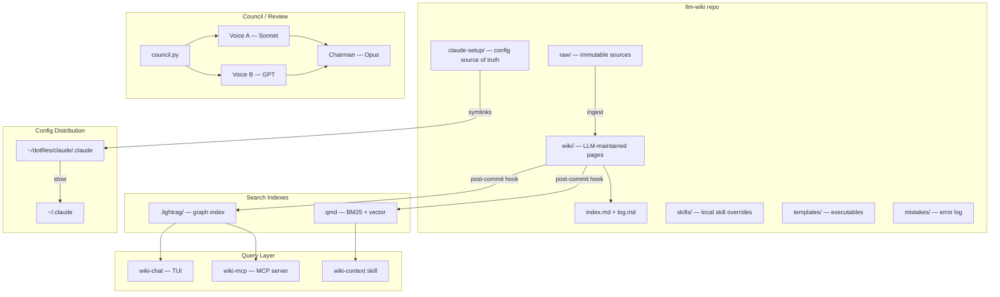
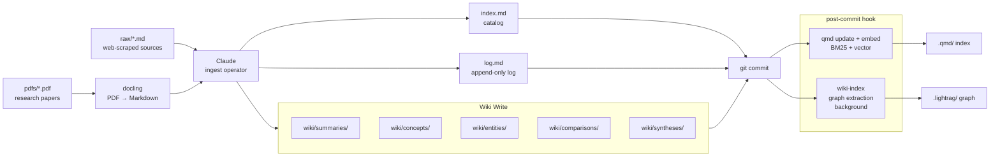
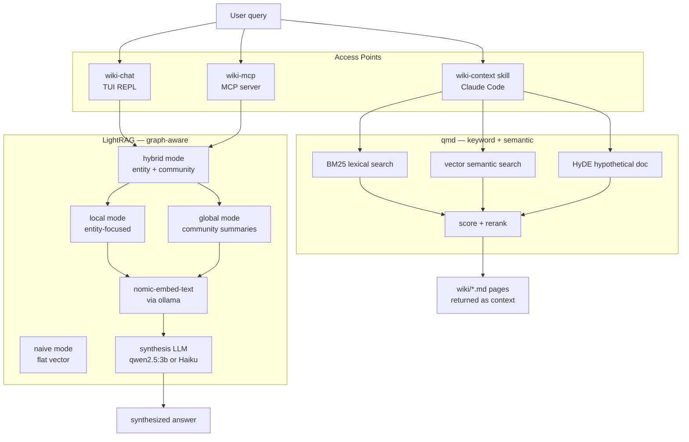
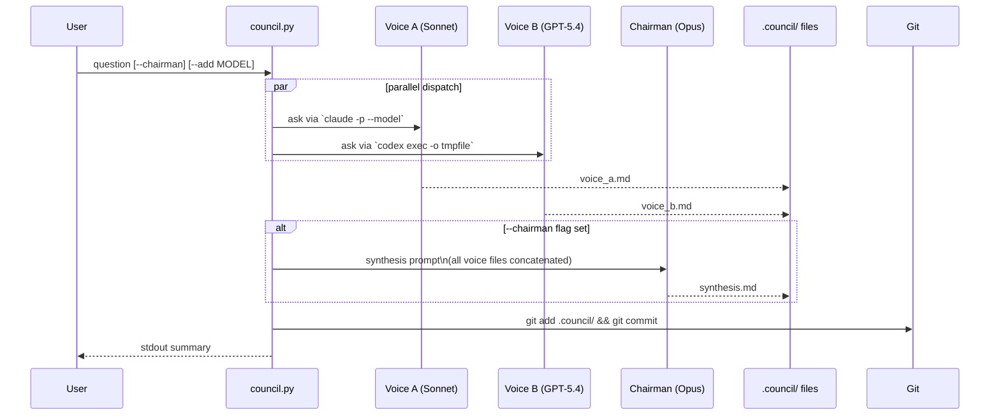
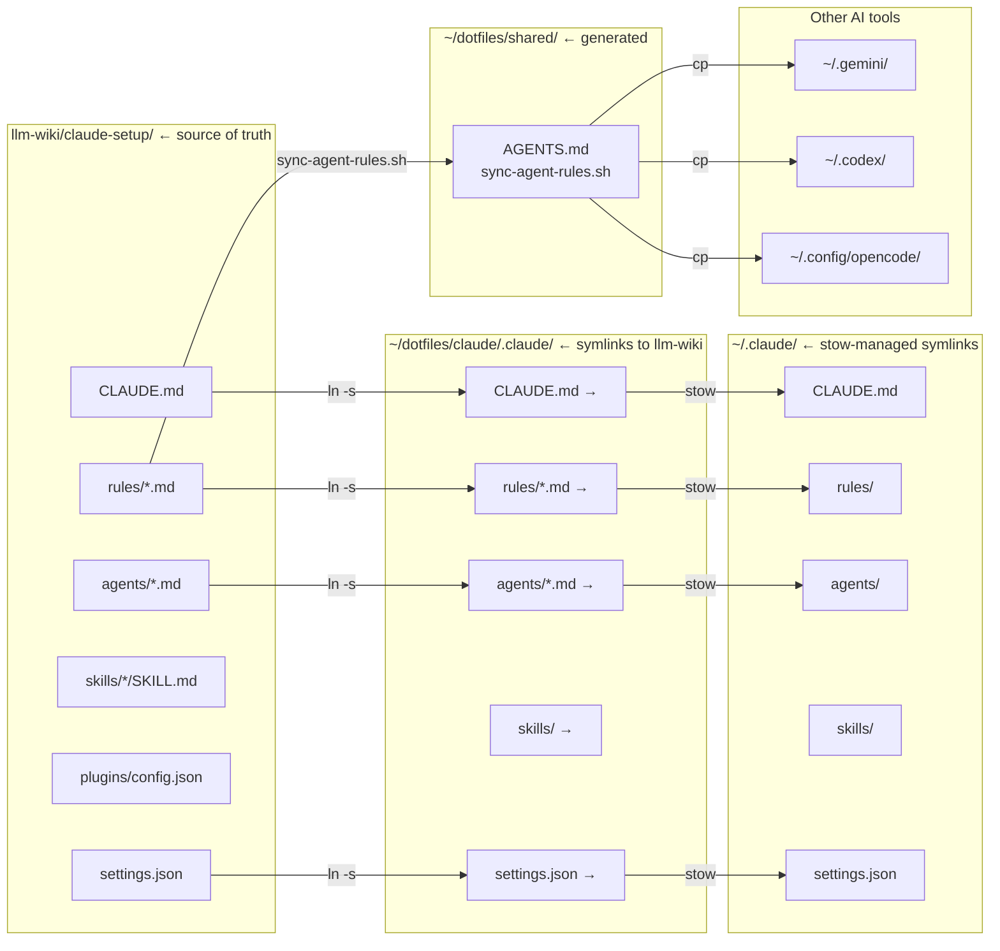
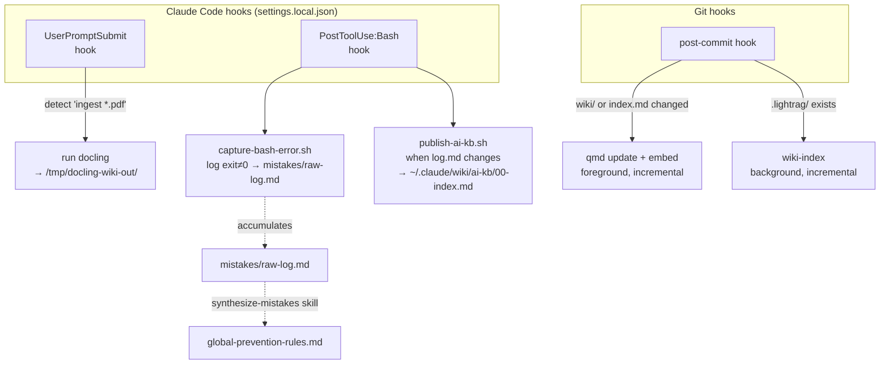
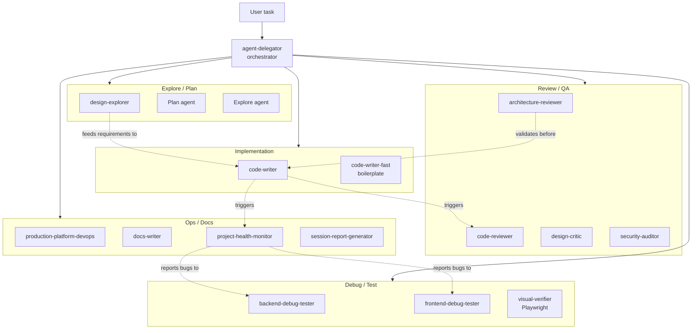

# llm-wiki Architecture

## Chart 1 — System Overview

---

## Chart 2 — Knowledge Ingestion Pipeline

---

## Chart 3 — Retrieval Stack

---

## Chart 4 — Council System

---

## Chart 5 — Config Distribution (Source of Truth)

---

## Chart 6 — Hooks / Automation

---

## Chart 7 — Agent Fleet

