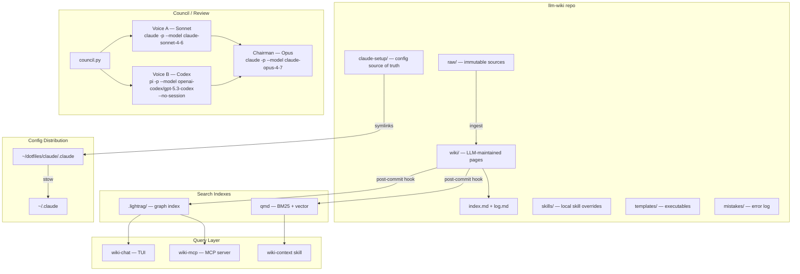
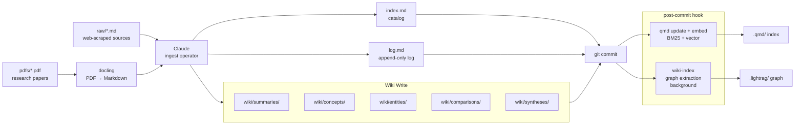
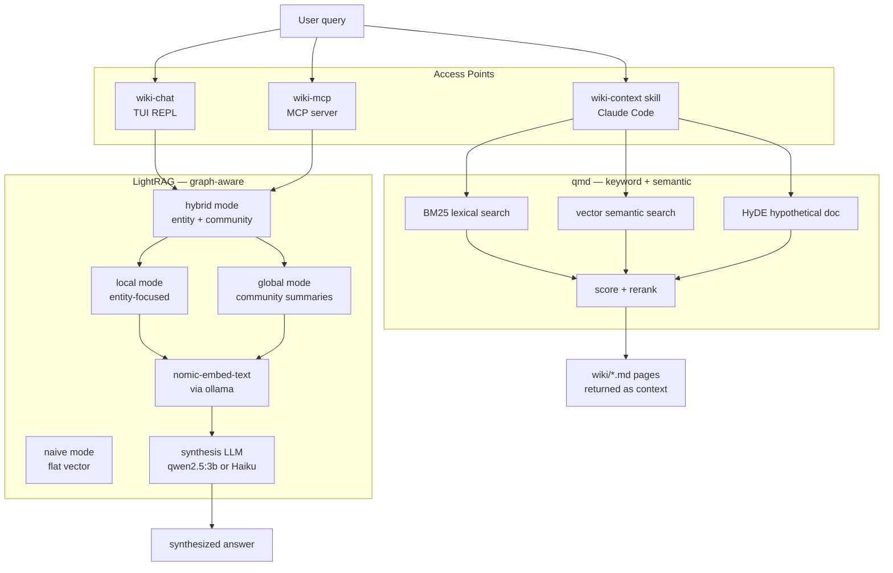
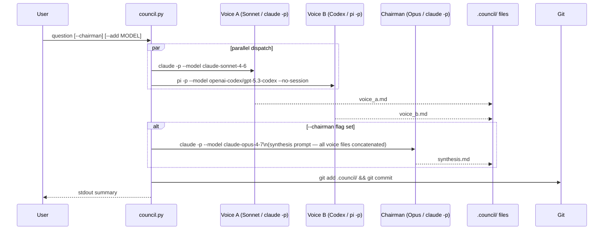
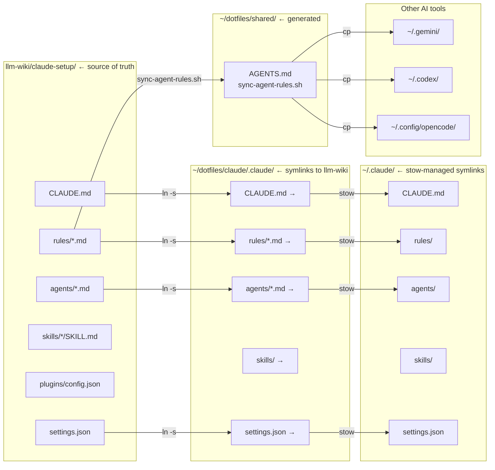
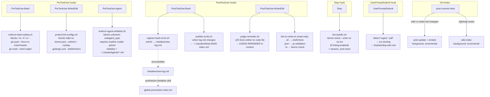
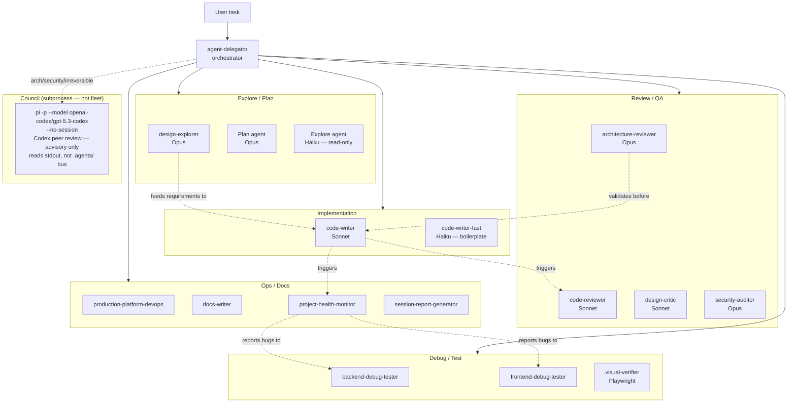

# llm-wiki Architecture

## Chart 1 — System Overview



---

## Chart 2 — Knowledge Ingestion Pipeline



---

## Chart 3 — Retrieval Stack



---

## Chart 4 — Council System



**Voice B is a Pi subprocess** — `pi -p --no-session` produces clean stdout. `opencode run` also writes response to stdout but with a 3-line ANSI header; strip it with:
```bash
opencode run "question" -m github-copilot/gpt-5.2-codex 2>/dev/null \
  | sed 's/\x1b\[[0-9;]*m//g' | grep -v "^>" | grep -v "^[[:space:]]*$"
```

**Quick council (no council.py):**
```bash
# Voice B — Pi (GPT-5.3-codex, clean stdout)
pi -p "peer review: [question]" --model openai-codex/gpt-5.3-codex --no-session --no-extensions --no-skills

# Voice C — OpenCode run (GPT-5.2-codex via Copilot, filterable stdout)
opencode run "peer review: [question]" -m github-copilot/gpt-5.2-codex 2>/dev/null \
  | sed 's/\x1b\[[0-9;]*m//g' | grep -v "^>" | grep -v "^[[:space:]]*$"
```

**Provider status (validated):**
- `openai-codex/` via Pi → ✅ clean stdout (ChatGPT Team subscription)
- `github-copilot/gpt-5.2-codex` via `opencode run` → ✅ filterable stdout (Copilot subscription)
- `github-copilot/claude-sonnet-4.5` via `opencode run` → ❌ model_not_supported (Claude via Copilot unsupported in run mode)
- `opencode/` via Pi → ⏳ add payment method at opencode.ai/workspace billing to unlock

---

## Chart 5 — Config Distribution (Source of Truth)



---

## Chart 6 — Hooks / Automation



**Hook enforcement layer** (deterministic — shell exit code, not model reasoning):
- `exit 2` = block the tool call entirely (bash safety, agent whitelist, lint protection)
- `exit 0` = allow, with optional stdout message to model context (judge reminder, lint report)
- Stop hook fires at end of every turn regardless of tool calls

---

## Chart 7 — Agent Fleet



**Pi is not in the agent fleet.** It is a thin subprocess called via Bash when a Codex second opinion is needed. It does not share the Claude Code hooks system, `.agents/` coordination bus, or skill invocation contract.
